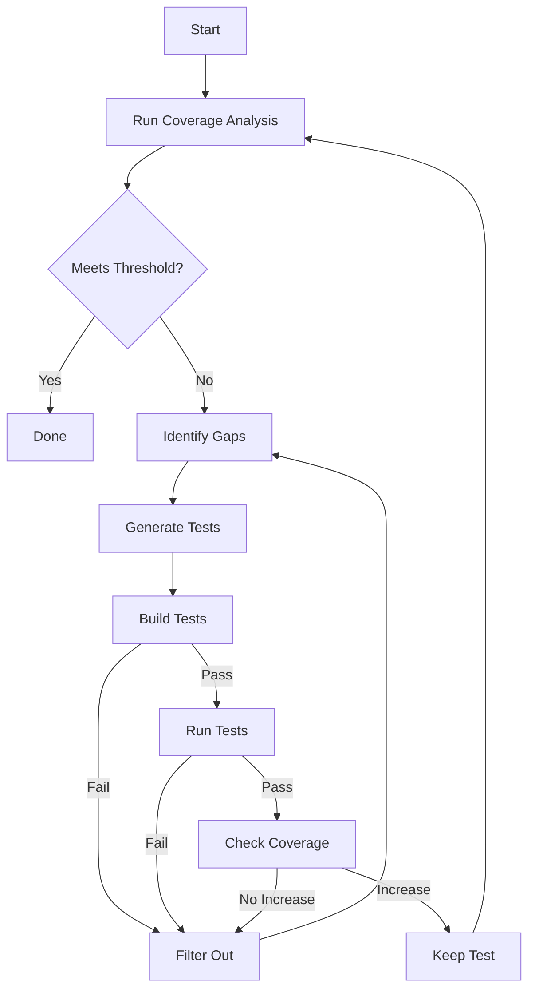

# Jest Coverage Automation Skill

AI-powered automated test generation and coverage improvement for JavaScript/TypeScript projects using Jest, with specialized support for unit and integration tests.

## Table of Contents

- [Overview](#overview)
- [Architecture](#architecture)
- [Prerequisites](#prerequisites)
- [Workflow](#workflow)
- [Agent System](#agent-system)
- [Best Practices](#best-practices)
- [Coverage Strategies](#coverage-strategies)
- [Testing Patterns](#testing-patterns)
- [References](#references)

## Overview

This skill implements an iterative, AI-driven approach to achieving and maintaining test coverage thresholds inspired by [Meta's TestGen-LLM](https://arxiv.org/pdf/2402.09171) and modern LLM-based test generation strategies.

### Key Capabilities

- **Automated Test Generation**: Generate unit and integration tests for uncovered code
- **Coverage-Guided Iteration**: Continuously analyze coverage gaps and generate targeted tests
- **Quality Filtering**: Validate generated tests (build, run, pass, increase coverage)
- **Type-Safe Testing**: Full TypeScript support with proper type inference
- **Framework Agnostic**: Works with NestJS, Express, React, and vanilla TypeScript/JavaScript
- **HTTP Testing**: Specialized support for API testing with Supertest and Axios mocking

### Success Metrics

Based on Meta's research:

- **75%** of generated test cases build correctly
- **57%** of tests pass reliably
- **25%** measurably increase coverage
- **73%** acceptance rate for production deployment

## Architecture

### Three-Agent System

The skill uses a specialized agent architecture for optimal results:

1. **Test Analyzer Agent** (`agents/test-analyzer.md`)
   - Analyzes code structure and existing tests
   - Identifies coverage gaps using Jest coverage reports
   - Prioritizes untested code paths by criticality
   - Provides context for test generation

2. **Test Writer Agent** (`agents/test-writer.md`)
   - Generates unit and integration tests
   - Implements proper mocking strategies
   - Follows project-specific patterns
   - Creates type-safe TypeScript tests

3. **Coverage Orchestrator Agent** (`agents/coverage-orchestrator.md`)
   - Coordinates the test-analyze-generate loop
   - Runs tests and validates coverage improvements
   - Implements filtering (build → run → pass → coverage)
   - Manages iteration until thresholds are met

## Prerequisites

### Required Dependencies

```bash
# Core testing
npm install --save-dev jest ts-jest @types/jest

# TypeScript support
npm install --save-dev typescript ts-node

# Integration testing
npm install --save-dev supertest @types/supertest

# For NestJS projects
npm install --save-dev @nestjs/testing

# Coverage reporting
npm install --save-dev @jest/coverage-maps
```

### Jest Configuration

Your `jest.config.js` should include:

```javascript
module.exports = {
  preset: 'ts-jest',
  testEnvironment: 'node',

  // Test file patterns
  testMatch: ['**/__tests__/**/*.ts', '**/?(*.)+(spec|test).ts'],

  // Coverage configuration
  collectCoverageFrom: [
    'src/**/*.ts',
    '!src/**/*.spec.ts',
    '!src/**/*.test.ts',
    '!src/**/index.ts'
  ],

  // Coverage thresholds
  coverageThreshold: {
    global: {
      branches: 80,
      functions: 80,
      lines: 80,
      statements: 80
    }
  },

  // Coverage reporters
  coverageReporters: ['text', 'lcov', 'json-summary'],

  // Module path mapping (if using path aliases)
  moduleNameMapper: {
    '^@/(.*)$': '<rootDir>/src/$1',
    '^@modules/(.*)$': '<rootDir>/src/modules/$1'
  }
};
```

## Workflow

### High-Level Process



### Detailed Steps

#### 1. Initial Coverage Analysis

```bash
# Run coverage with JSON summary
npm test -- --coverage --coverageReporters=json-summary
```

The analyzer agent reads `coverage/coverage-summary.json` to identify:

- Current coverage percentages (lines, statements, branches, functions)
- Uncovered files
- Partially covered files
- Critical paths with low coverage

#### 2. Gap Prioritization

Priority order for test generation:

1. **Critical Business Logic** (100% coverage target)
   - Authentication/authorization
   - Payment processing
   - Data validation
   - Security-sensitive code

2. **Core Functionality** (90% coverage target)
   - Main application features
   - API endpoints
   - Service layer logic

3. **Utilities and Helpers** (80% coverage target)
   - Helper functions
   - Formatters/validators
   - Common utilities

4. **Edge Cases** (70% coverage target)
   - Error handlers
   - Fallback logic
   - Rare code paths

#### 3. Test Generation

For each uncovered code segment:

**Unit Test Generation:**

- Mock all external dependencies
- Test one function/method at a time
- Use AAA pattern (Arrange-Act-Assert)
- Cover happy path + edge cases + error cases

**Integration Test Generation:**

- Use real implementations where possible
- Mock only external services (APIs, databases)
- Test component interactions
- Verify end-to-end workflows

#### 4. Quality Filtering

Generated tests must pass all filters:

```typescript
// Filter 1: Build Check
npx tsc --noEmit

// Filter 2: Run Check
npm test -- <test-file>

// Filter 3: Pass Check
// Exit code 0 from above

// Filter 4: Coverage Check
npm test -- --coverage --collectCoverageFrom=<target-file>
// Compare before/after coverage percentages
```

#### 5. Iteration

Repeat steps 1-4 until:

- All coverage thresholds are met, OR
- No new tests increase coverage (local maximum), OR
- Maximum iterations reached (default: 10)

## Agent System

### Invoking Agents

Agents are invoked via the agent group system:

```bash
# From Claude Code
/agents quality-assurance test-analyzer
/agents quality-assurance test-writer --type=unit
/agents quality-assurance coverage-orchestrator
```

### Agent Communication

Agents communicate via structured JSON:

```typescript
// Analyzer → Orchestrator
interface AnalysisResult {
  currentCoverage: CoverageMetrics;
  gaps: CoverageGap[];
  prioritizedFiles: PrioritizedFile[];
}

// Orchestrator → Writer
interface GenerationRequest {
  file: string;
  uncoveredLines: number[];
  context: CodeContext;
  testType: 'unit' | 'integration';
}

// Writer → Orchestrator
interface GeneratedTest {
  filePath: string;
  testCode: string;
  targetFile: string;
  coverageTarget: string[];
}
```

### Agent Best Practices

See individual agent files:

- [Test Analyzer Agent](agents/test-analyzer.md)
- [Test Writer Agent](agents/test-writer.md)
- [Coverage Orchestrator Agent](agents/coverage-orchestrator.md)

## Best Practices

### Test Organization

**Co-location Pattern** (Recommended for small-medium projects):

```
src/
  modules/
    auth/
      auth.service.ts
      auth.service.spec.ts      # Unit tests
      auth.controller.ts
      auth.controller.spec.ts
```

**Mirror Pattern** (Recommended for large projects):

```
src/
  modules/
    auth/
      auth.service.ts
      auth.controller.ts
test/
  unit/
    modules/
      auth/
        auth.service.spec.ts
  integration/
    modules/
      auth/
        auth.controller.spec.ts
```

### Naming Conventions

- **Unit tests**: `*.spec.ts` (e.g., `user.service.spec.ts`)
- **Integration tests**: `*.integration.spec.ts` or `*.e2e.spec.ts`
- **Test suites**: `describe('<ClassName> - <methodName>', () => {})`
- **Test cases**: `it('should <expected behavior>', () => {})`

### AAA Pattern

```typescript
it('should return user by id', async () => {
  // Arrange
  const userId = '123';
  const expectedUser = { id: userId, name: 'John' };
  mockRepository.findById.mockResolvedValue(expectedUser);

  // Act
  const result = await userService.getUserById(userId);

  // Assert
  expect(result).toEqual(expectedUser);
  expect(mockRepository.findById).toHaveBeenCalledWith(userId);
});
```

### Single Responsibility per Test

```typescript
// ✅ Good - tests one thing
it('should throw error when user not found', async () => {
  mockRepository.findById.mockResolvedValue(null);
  await expect(userService.getUserById('123')).rejects.toThrow(
    'User not found'
  );
});

// ❌ Bad - tests multiple things
it('should handle various error cases', async () => {
  // Tests not found, invalid id, database error...
  // Split into separate tests!
});
```

## Coverage Strategies

### Threshold Configuration

**Gradual Implementation**:

```javascript
// Month 1
coverageThreshold: { global: { lines: 60, branches: 55, functions: 60, statements: 60 } }

// Month 2
coverageThreshold: { global: { lines: 70, branches: 65, functions: 70, statements: 70 } }

// Month 3
coverageThreshold: { global: { lines: 80, branches: 75, functions: 80, statements: 80 } }
```

**Critical Path Focus**:

```javascript
coverageThreshold: {
  global: { lines: 80, branches: 75, functions: 80, statements: 80 },
  './src/modules/auth/**/*.ts': { lines: 100, branches: 100, functions: 100, statements: 100 },
  './src/modules/payment/**/*.ts': { lines: 100, branches: 95, functions: 100, statements: 100 },
  './src/utils/**/*.ts': { lines: 70, branches: 65, functions: 70, statements: 70 }
}
```

### Coverage Metrics Explained

- **Lines**: Percentage of executable lines run during tests
- **Statements**: Percentage of statements executed (can differ from lines)
- **Branches**: Percentage of if/else, switch, ternary branches taken
- **Functions**: Percentage of functions/methods called

## Testing Patterns

### Unit Testing Patterns

See [Unit Testing Patterns](references/unit-testing-patterns.md)

### Integration Testing Patterns

See [Integration Testing Patterns](references/integration-testing-patterns.md)

### Mocking Strategies

See [Mocking Strategies](references/mocking-strategies.md)

## References

- [Unit Testing Patterns](references/unit-testing-patterns.md)
- [Integration Testing Patterns](references/integration-testing-patterns.md)
- [Mocking Strategies](references/mocking-strategies.md)
- [Coverage Analysis](references/coverage-analysis.md)
- [TypeScript Testing Guide](references/typescript-testing-guide.md)

## External Resources

### Research Papers

- [Automated Unit Test Improvement using Large Language Models at Meta](https://arxiv.org/pdf/2402.09171)
- [TestART: Improving LLM-based Unit Testing](https://arxiv.org/abs/2408.03095)
- [Enhancing LLM-Based Test Generation](https://arxiv.org/html/2602.21997)

### Tools

- [Jest Documentation](https://jestjs.io/)
- [Supertest](https://www.npmjs.com/package/supertest)
- [ts-jest](https://kulshekhar.github.io/ts-jest/)

### Articles

- [Jest Mocking Best Practices - Microsoft](https://devblogs.microsoft.com/ise/jest-mocking-best-practices/)
- [Testing TypeScript Apps with Jest - LogRocket](https://blog.logrocket.com/testing-typescript-apps-using-jest/)
- [NestJS E2E Testing with Supertest](https://dev.to/grocstock/nestjs-unit-and-e2e-testing-7pb)

## Skill Invocation

This skill activates when users request:

- "improve test coverage"
- "generate Jest tests"
- "reach 80% coverage"
- "write unit tests"
- "write integration tests"
- "automate test creation"
- "analyze coverage gaps"
