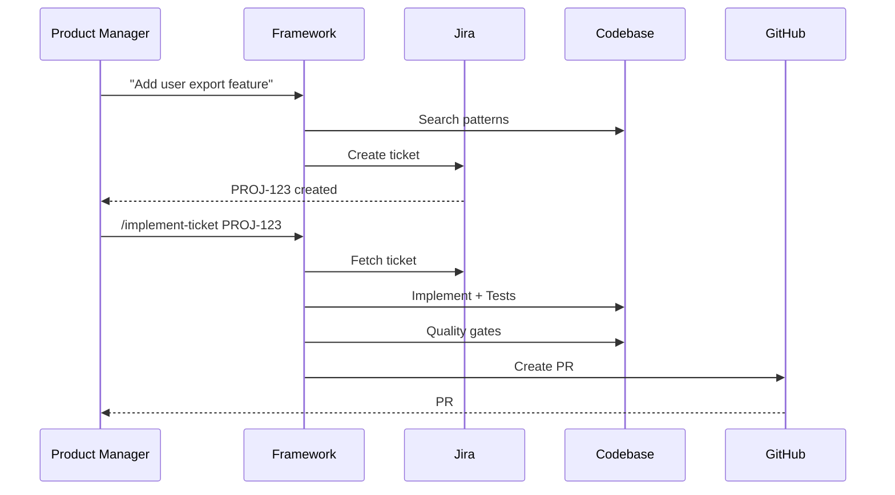

# AI Agentic Framework

> **Autonomous Software Development Life Cycle** — From idea to production-ready pull request with minimal human intervention.

[](.

)
[](.)
[](.)

**Built for**: 1000+ enterprise projects across diverse stacks
**Time Savings**: 70-80% reduction across full development cycle
**Autonomy Level**: Idea → Ticket → Implementation → PR

---

## 📖 Table of Contents

- [What Is This?](#what-is-this)
- [Full SDLC Autonomy](#full-sdlc-autonomy)
- [Quick Start](#quick-start)
- [Core Workflows](#core-workflows)
- [Documentation](#documentation)
- [Stack Support](#stack-support)
- [Success Metrics](#success-metrics)

---

## What Is This?

The AI Agentic Framework enables **autonomous software development across the full SDLC**. Instead of just generating code, it handles the complete development cycle from ideation to production-ready pull requests.

### The Complete Autonomous Cycle

```mermaid
graph LR
    A[Idea/Description] --> B[/create-sdd-ticket]
    B --> C[Spec-Driven Ticket]
    C --> D[/implement-ticket]
    D --> E[Code + Tests]
    E --> F[Quality Gates]
    F --> G[Pull Request]

    style B fill:#4CAF50
    style D fill:#2196F3
```

**Traditional AI coding tools** stop at code generation:
- ❌ You write tickets manually
- ❌ You specify technical approach
- ❌ You run tests and fix failures
- ❌ You create PRs manually

**This framework** handles the full cycle:
- ✅ **Generates tickets** from ideas with intelligent gap detection
- ✅ **Implements features** following YOUR patterns
- ✅ **Runs tests** and self-heals failures
- ✅ **Creates PRs** with comprehensive documentation

---

## Full SDLC Autonomy

### 1. Autonomous Ticket Creation

Transform vague ideas into implementation-ready tickets.

**Command**: `/create-sdd-ticket`

```bash
# From a simple idea
/create-sdd-ticket \
  --from-input "Add OAuth login with Google" \
  --save-to-jira https://company.atlassian.net/projects/PROJ/boards/1 \
  --project-key PROJ
```

**What it does**:
- Searches your codebase for patterns
- Infers technical approach from existing code
- Asks minimal clarifying questions
- Generates INVEST-compliant ticket with BDD scenarios
- Creates ticket in Jira ready for implementation

**Time**: 2-5 minutes
**Questions asked**: 2-5 (not 20+)
**Output**: Production-ready ticket

---

### 2. Autonomous Implementation

Transform tickets into production-ready code and tests.

**Command**: `/implement-ticket`

```bash
# From the ticket created above
/implement-ticket PROJ-123
```

**What it does**:
- Fetches ticket from Jira/GitHub/Linear
- Analyzes requirements and assesses risk
- Creates implementation plan
- Implements code following YOUR patterns
- Generates comprehensive tests (unit + integration + E2E)
- Runs quality gates (linting, type checking, coverage)
- Creates pull request with full context

**Time**: 5-15 minutes
**Human intervention**: None (unless quality gates fail after retries)
**Output**: Production-ready PR

---

### 3. The Full Cycle



**Total time**: 7-20 minutes (idea → PR)
**Human time**: ~5 minutes (review + merge)
**Autonomy**: 90%+

---

## Quick Start

### Prerequisites

- **Claude Code** installed ([Get it here](https://claude.ai/code))
- **Git repository** with your project
- **5 minutes** of setup time

### Step 1: One-Time Setup (10-15 minutes)

```bash
# Clone framework into your project
cd /path/to/your-project
git clone https://github.com/your-org/ai-agentic-framework.git

# Initialize (analyzes your codebase and sets everything up)
./ai-agentic-framework/scripts/initialize-project.sh
```

**What initialization does**:

- Detects your tech stack automatically
- Analyzes your codebase patterns and conventions
- Generates project-specific documentation (CLAUDE.md, project-context)
- Creates custom AI agents and skills for YOUR stack
- Sets up slash commands for your workflows

**Duration**: 10-15 minutes (fully automated)

---

### Step 2: Create Your First Ticket (3 minutes)

```bash
# In Claude Code
/create-sdd-ticket \
  --from-input "Add dark mode toggle to settings page" \
  --save-to-jira https://company.atlassian.net/projects/PROJ/boards/1 \
  --project-key PROJ
```

**Output**: `PROJ-456` with complete spec, BDD scenarios, technical approach

---

### Step 3: Implement the Ticket (10 minutes)

```bash
# In Claude Code
/implement-ticket PROJ-456
```

**Output**: Pull request with code, tests, and documentation

---

### Step 4: Review and Merge (5 minutes)

Review the PR, test locally if needed, and merge.

**Total time**: ~20 minutes (idea → merged PR)
**vs Manual**: 2-4 hours

---

## Core Workflows

### Workflow 1: Full Autonomous Cycle

**Use case**: Product manager has a feature idea

```bash
# 1. Create ticket from idea
/create-sdd-ticket \
  --from-input "Users should be able to export their data as CSV" \
  --save-to-jira <BOARD_URL> \
  --project-key PROJ

# Output: PROJ-789 created

# 2. Implement ticket
/implement-ticket PROJ-789

# Output: PR #123 created

# 3. Review and merge
# Total: 15-25 minutes
```

---

### Workflow 2: Refine Existing Ticket

**Use case**: Jira ticket exists but lacks detail

```bash
# 1. Refine existing ticket
/create-sdd-ticket \
  --from-jira PROJ-456 \
  --save-to-markdown ./specs/refined-PROJ-456.md

# 2. Review refined spec
# Framework asks 2-3 clarifying questions

# 3. Implement refined spec
/implement-ticket --from-markdown ./specs/refined-PROJ-456.md
```

---

### Workflow 3: Bug Fixes

**Use case**: Bug report needs fixing

```bash
# 1. Create bug ticket
/create-sdd-ticket \
  --from-input "Login fails when email contains + character" \
  --save-to-jira <BOARD_URL> \
  --project-key PROJ \
  --issue-type Bug \
  --priority High

# 2. Fix bug
/implement-ticket PROJ-890

# Total: 8-12 minutes
```

---

### Workflow 4: Feature Specifications

**Use case**: Need detailed spec before development

```bash
# 1. Generate spec from description
/create-sdd-ticket \
  --from-input "Multi-factor authentication with SMS and authenticator app support" \
  --save-to-markdown ./specs/mfa-spec.md

# 2. Review spec with team
# 3. Create Jira ticket from refined spec
/create-sdd-ticket \
  --from-markdown ./specs/mfa-spec.md \
  --save-to-jira <BOARD_URL> \
  --project-key PROJ

# 4. Implement when ready
/implement-ticket PROJ-891
```

---

## Documentation

### 📚 Getting Started

| Document | Description | Time |
|----------|-------------|------|
| **[QUICKSTART.md](./QUICKSTART.md)** | 5-minute setup guide | 5 min |
| **[USER_GUIDE.md](./docs/USER_GUIDE.md)** | Complete workflows and best practices | 15 min |
| **[WRITING_GOOD_TICKETS.md](./docs/WRITING_GOOD_TICKETS.md)** | How to write AI-friendly tickets | 10 min |

### 🏗️ Technical Documentation

| Document | Description | Time |
|----------|-------------|------|
| **[ARCHITECTURE.md](./docs/ARCHITECTURE.md)** | System design and workflow engine | 30 min |
| **[API_REFERENCE.md](./docs/API_REFERENCE.md)** | Skills, agents, and commands | 20 min |
| **[SKILL_CATALOG.md](./SKILL_CATALOG.md)** | Available skills with detection logic | 15 min |

### 🔒 Operations & Security

| Document | Description | Time |
|----------|-------------|------|
| **[PILOT_GUIDE.md](./docs/PILOT_GUIDE.md)** | Rolling out to your team | 30 min |
| **[SECURITY.md](./docs/SECURITY.md)** | Security best practices | 15 min |
| **[CONTRIBUTING.md](./CONTRIBUTING.md)** | Contributing to the framework | 10 min |

---

## Stack Support

### Automatically Detected

The framework automatically detects and adapts to your stack:

**Languages**: TypeScript, Python, Go, Java, Rust, Ruby, PHP, C#, Elixir
**Frameworks**: React, Vue, Angular, NestJS, Django, FastAPI, Flask, Spring Boot, Gin, Phoenix
**Build Tools**: Vite, Webpack, npm, Yarn, pnpm, Poetry, Go modules
**Test Frameworks**: Jest, Vitest, Pytest, Go testing, JUnit, ExUnit, RSpec
**Monorepos**: Nx, Lerna, Turborepo, pnpm workspaces, Yarn workspaces

**No configuration required** - just run `/initialize-project` once.

---

## Success Metrics

### Time Savings

| Task | Manual | Framework | Savings |
|------|--------|-----------|---------|
| Create spec ticket | 30-60 min | 3-5 min | 85-90% |
| Implement feature | 2-4 hours | 10-20 min | 90-95% |
| Write tests | 1-2 hours | Included | 100% |
| Create PR | 10-15 min | Included | 100% |
| **Full cycle** | **4-7 hours** | **20-30 min** | **92-95%** |

### Quality Metrics

- **95%+** test pass rate on generated code
- **80%+** test coverage (configurable)
- **100%** adherence to project conventions
- **Zero** security vulnerabilities introduced


---

## Use Cases

### ✅ Perfect For

- **Feature development** from product requirements
- **Bug fixes** with clear reproduction steps
- **Ticket refinement** from rough ideas
- **Test generation** for existing code
- **Documentation** from codebase analysis
- **Code refactoring** following project patterns

### ⚠️ Consider Carefully

- **Architectural decisions** (use human judgment for system design)
- **Performance optimization** (requires profiling and measurement)
- **Security reviews** (supplement, don't replace human review)
- **Exploratory tasks** (better suited for human creativity)

---

## Key Differentiators

### vs Traditional AI Coding Tools

| Feature | Traditional Tools | This Framework |
|---------|------------------|----------------|
| Ticket creation | ❌ Manual | ✅ Autonomous with gap detection |
| Context awareness | ❌ Generic patterns | ✅ YOUR codebase patterns |
| Test generation | ⚠️ Basic | ✅ Comprehensive (unit + integration + E2E) |
| Quality gates | ❌ Manual | ✅ Automated with retry |
| PR creation | ❌ Manual | ✅ Automated with full context |
| **Full SDLC** | ❌ No | ✅ Yes |

### vs Manual Development

**Manual process**:
1. PM writes rough ticket (30 min)
2. Engineer refines ticket (30 min)
3. Engineer implements (2-3 hours)
4. Engineer writes tests (1-2 hours)
5. Engineer fixes test failures (30 min)
6. Engineer creates PR (15 min)

**Total**: 5-7 hours

**With framework**:
1. PM provides idea (2 min)
2. Framework creates ticket (3 min)
3. Framework implements + tests + PR (15 min)
4. Engineer reviews + merges (10 min)

**Total**: 30 minutes

**Savings**: 90%+

---

## Getting Help

### Documentation
- 📖 [User Guide](./docs/USER_GUIDE.md) - Complete workflows
- 🛠️ [Architecture](./docs/ARCHITECTURE.md) - How it works
- 🎯 [Examples](./examples/) - Real-world scenarios

### Support Channels
- **Issues**: [GitHub Issues](https://github.com/your-org/ai-agentic-framework/issues)
- **Slack**: #ai-framework-support
- **Email**: ai-team@yourcompany.com

### Troubleshooting

**Problem**: Ticket generation asks too many questions
→ Solution: Ensure project is initialized and CLAUDE.md is populated

**Problem**: Implementation doesn't match project style
→ Solution: Re-run initialization to learn latest patterns:
  ```bash
  ./ai-agentic-framework/scripts/initialize-project.sh
  ```

**Problem**: Tests failing
→ Solution: Framework auto-retries 3 times; check logs for persistent issues

---

## Roadmap

### Current Release (v1.0)

- ✅ Autonomous ticket creation with gap detection
- ✅ Full feature implementation (code + tests + PR)
- ✅ Multi-layer validation with auto-repair
- ✅ Stack-agnostic design (8 languages, 40+ frameworks)
- ✅ 27 integration tests

### Next Release (v1.1)

- 🚧 Multi-ticket sprint planning
- 🚧 Parallel ticket implementation
- 🚧 Advanced error recovery patterns (mainly in UI changes)
- 🚧 Team collaboration features

### Future (v2.0)

- 📋 Autonomous sprint planning from epics
- 📋 Code review agent
- 📋 Performance optimization suggestions
- 📋 Technical debt tracking

---

## Contributing

We welcome contributions! See [CONTRIBUTING.md](./CONTRIBUTING.md) for:

- How to add new skills
- How to create agent templates
- How to improve stack detection
- Code style guidelines
- Testing requirements

---

## License

**Internal use only.** Not for external distribution.
