# COMPREHENSIVE REFACTOR PLAN: AI Agentic Framework Architecture Redesign

## Executive Summary

This refactor plan addresses critical architecture issues in the AI agentic framework, specifically:
1. **Agent/Skill Duplication** - 4 capabilities exist in both agents and skills
2. **Two Competing implement-ticket Specifications** - command vs skill versions
3. **Missing PR Review Integration** - pr-reviewer skill exists but not integrated
4. **Non-Deterministic Flow** - implement-ticket lacks clear TodoWrite progression

The plan establishes a **Skill-First Architecture** where skills are the single source of truth, agents are generated for stack-specific execution, and implement-ticket becomes a deterministic 10-phase orchestrator with clear TodoWrite integration.

---

## 1. DUPLICATION RESOLUTION MATRIX

### 1.1 E2E Testing: `tester-e2e` Agent vs `playwright-e2e-automation` Skill

| Aspect | Current State | Decision |
|--------|---------------|----------|
| **Agent** | `agents/templates/tester-e2e.template.md` - Generated per stack, spawned by implement-ticket Phase 5 | **DELETE** |
| **Skill** | `skills/030-quality-assurance/playwright-e2e-automation/SKILL.md` - Comprehensive Playwright patterns, auto-init, context | **KEEP + ENHANCE** |

**Rationale:**
- The skill provides comprehensive context (patterns, flows, MCP integration)
- The agent template is thin (just spawning logic and variable substitution)
- Skills should own the knowledge; agents should only execute

**Migration Path:**
1. Merge useful tester-e2e template content into skill's execution section
2. Update implement-ticket to invoke `/playwright-e2e-automation` skill directly
3. Delete `agents/templates/tester-e2e.template.md`
4. Update `utils/agent-generation.js` to remove `generateTesterE2E` function

**Code to Delete:**
```
agents/templates/tester-e2e.template.md
```

**Code to Update:**
```
utils/agent-generation.js
  - Remove generateTesterAgents E2E portion (lines ~556-584)
  - Remove tester-e2e-* from template filename mappings (lines ~970-972)
```

---

### 1.2 Unit Testing: `tester-unit` Agent vs `jest-coverage-automation` Skill

| Aspect | Current State | Decision |
|--------|---------------|----------|
| **Agent** | `agents/templates/tester-unit.template.md` - Generated per stack for unit tests | **DELETE** |
| **Skill** | `skills/030-quality-assurance/jest-coverage-automation/SKILL.md` - Jest/Vitest patterns, coverage gates | **KEEP + ENHANCE** |

**Rationale:**
- Same as E2E - skill has the comprehensive knowledge
- Agent template adds minimal value beyond spawning

**Migration Path:**
1. Add pytest-patterns skill invocation for Python (parallel to jest-coverage-automation)
2. Update implement-ticket to invoke `/jest-coverage-automation` or `/pytest-patterns` based on stack
3. Delete `agents/templates/tester-unit.template.md`
4. Update `utils/agent-generation.js`

**Code to Delete:**
```
agents/templates/tester-unit.template.md
```

---

### 1.3 Documentation Updates: `doc-updater` Agent vs `update-project-context` Skill

| Aspect | Current State | Decision |
|--------|---------------|----------|
| **Agent** | `agents/templates/doc-updater.template.md` - Spawned in Phase 7 for CLAUDE.md and project-context | **DELETE** |
| **Skill** | `skills/010-foundation/update-project-context/SKILL.md` - Re-runs analysis, preserves custom sections | **KEEP + ENHANCE** |

**Rationale:**
- The skill has sophisticated logic for backup, diff generation, and engineer approval
- The agent template is simpler and duplicates capability

**Migration Path:**
1. Enhance skill to handle both CLAUDE.md and project-context updates
2. Add "lightweight update" mode for minor changes (vs full re-analysis)
3. Update implement-ticket Phase 7 to invoke `/update-project-context`
4. Delete `doc-updater.template.md`

**Code to Delete:**
```
agents/templates/doc-updater.template.md
```

---

### 1.4 Security Review: `security-reviewer` Agent vs `security-review` Skill

| Aspect | Current State | Decision |
|--------|---------------|----------|
| **Agent** | `agents/templates/security-reviewer.template.md` - Generated per primary language | **DELETE** |
| **Skill** | `skills/030-quality-assurance/security-review/SKILL.md` - OWASP Top 10, language detection, structured JSON output | **KEEP (already comprehensive)** |

**Rationale:**
- The skill is already V2 with structured JSON output for Phase 9 integration
- The agent template is redundant

**Migration Path:**
1. Verify skill handles all languages (TypeScript, Python, Go, etc.)
2. Update implement-ticket to invoke `/security-review` directly
3. Delete `security-reviewer.template.md`

**Code to Delete:**
```
agents/templates/security-reviewer.template.md
```

---

### 1.5 Summary: Agents to Keep

After cleanup, only these agent templates remain:

| Agent Template | Purpose | Spawned By |
|----------------|---------|------------|
| `planner.template.md` | Architecture-aware planning with all language skills | implement-ticket Phase 2 |
| `implementer.template.md` | Stack-specific code implementation | implement-ticket Phase 4 |
| `visual-verifier.template.md` | Screenshot comparison and UI diff (frontend only) | implement-ticket Phase 6 |

**Removed:** `tester-e2e`, `tester-unit`, `doc-updater`, `security-reviewer`

---

## 2. NEW IMPLEMENT-TICKET ARCHITECTURE

### 2.1 Resolution: Command vs Skill

**Problem:** Two competing versions:
- `commands/implement-ticket.md` (7-phase, simpler)
- `skills/020-development-workflow/implement-ticket/SKILL.md` (10-phase, comprehensive)

**Decision:** **KEEP the Skill version as canonical, DELETE the command version**

**Rationale:**
- The skill version has 10 phases with visual verification, documentation updates, and review loop
- The skill has detailed bash scripts and orchestration logic
- Commands should be thin wrappers, not compete with skills

**Migration:**
1. Update `commands/implement-ticket.md` to be a simple redirect:
   ```markdown
   ---
   name: implement-ticket
   description: Redirect to implement-ticket skill
   ---

   This command invokes the `/implement-ticket` skill. See skill documentation for full details.

   ```bash
   /implement-ticket [INPUT] [OPTIONS]
   ```

   The full workflow is documented in `.claude/skills/020-development-workflow/implement-ticket/SKILL.md`
   ```

2. Or delete command entirely and let skill be the single entry point

---

### 2.2 Deterministic 10-Phase Workflow with TodoWrite Integration

The refactored implement-ticket MUST use TodoWrite to show exact progress. Here is the deterministic flow:

```
PHASE 0: Pre-Flight Validation
  TodoWrite: "Validating git status and environment"
  - Check git clean
  - Check tests passing
  - Check build passing
  - Check Docker (if applicable)
  - Create artifact directories
  TodoWrite: COMPLETE "Pre-flight validation complete"

PHASE 1: Context Gathering
  TodoWrite: "Gathering context from Jira/Markdown"
  - Fetch Jira ticket OR read markdown spec
  - Fetch linked Notion/Confluence/Figma docs
  - Compile full-context.md
  TodoWrite: COMPLETE "Context gathered: X lines"

PHASE 2: Planning & Architecture
  TodoWrite: "Creating implementation plan"
  - Invoke /analyze-requirements skill
  - Generate implementation-plan.md
  - Extract test-plan.json
  - Extract env-requirements.json
  TodoWrite: COMPLETE "Plan created: X files to modify"

PHASE 3: Environment Setup
  TodoWrite: "Setting up isolated environment"
  - Allocate unique port range
  - Create docker-compose override (if needed)
  - Capture "before" screenshots (if frontend)
  TodoWrite: COMPLETE "Environment ready on ports X-Y"

PHASE 4: Implementation
  TodoWrite: "Implementing code changes"
  - Spawn implementer-{stack} agent
  - Execute each step from plan
  - Log decisions to decisions/{JIRA_KEY}.md
  TodoWrite: COMPLETE "Implementation done: X files changed"

PHASE 5: Testing
  TodoWrite: "Running tests (Unit > Integration > E2E)"

  5a. Unit Tests
    TodoWrite: "Running unit tests"
    - Invoke /jest-coverage-automation OR /pytest-patterns skill
    - Iterate up to 3x if coverage < 80%
    TodoWrite: COMPLETE or FAIL "Unit tests: X% coverage"

  5b. Integration Tests
    TodoWrite: "Running integration tests"
    - Verify 100% endpoint coverage
    TodoWrite: COMPLETE or FAIL "Integration: X endpoints covered"

  5c. E2E Tests (frontend only)
    TodoWrite: "Running E2E tests"
    - Invoke /playwright-e2e-automation skill
    - Collect artifacts (videos, screenshots, traces)
    TodoWrite: COMPLETE or FAIL "E2E: X scenarios passed"

PHASE 6: Visual Verification (frontend only)
  TodoWrite: "Verifying visual changes"
  - Capture "after" screenshots
  - Compare with "before" screenshots
  - Spawn visual-verifier agent if diff > 5%
  - Iterate up to 5x
  TodoWrite: COMPLETE "Visual verification: X% diff"

PHASE 7: Documentation Update
  TodoWrite: "Updating documentation"
  - Invoke /update-project-context skill (lightweight mode)
  - Update CLAUDE.md if architectural changes
  TodoWrite: COMPLETE "Documentation updated"

PHASE 8: PR Creation
  TodoWrite: "Creating Pull Request"
  - Create feature branch
  - Commit with conventional message
  - Push to remote
  - Create PR with:
    - Summary from plan
    - Testing evidence
    - Security results
    - Screenshots (if UI)
    - Decision log
  TodoWrite: COMPLETE "PR created: [URL]"

PHASE 9: Review Loop
  TodoWrite: "Running PR review loop"
  - Invoke /pr-reviewer skill
  - Check review-results.json
  - IF blocking issues:
    - Apply fix instructions
    - Re-run tests
    - Re-review (max 3 iterations)
  TodoWrite: COMPLETE "Review passed (iteration X)"

PHASE 10: Cleanup
  TodoWrite: "Cleaning up environment"
  - Tear down Docker compose override
  - Archive artifacts
  - Update Jira status (if configured)
  TodoWrite: COMPLETE "Implementation complete!"
```

---

### 2.3 Mermaid Call Stack Diagram

```mermaid
flowchart TB
    subgraph UserEntry["User Entry Point"]
        CMD["/implement-ticket PROJ-123"]
    end

    subgraph Phase0["Phase 0: Pre-Flight"]
        P0[Check git/tests/build]
        P0A[Create artifact dirs]
    end

    subgraph Phase1["Phase 1: Context"]
        P1A[Fetch Jira ticket]
        P1B[Fetch linked docs]
        P1C[Compile context]
    end

    subgraph Phase2["Phase 2: Planning"]
        P2A["/analyze-requirements skill"]
        P2B[Generate plan]
        P2C[Extract test plan]
    end

    subgraph Phase3["Phase 3: Environment"]
        P3A[Allocate ports]
        P3B[Docker override]
        P3C[Before screenshots]
    end

    subgraph Phase4["Phase 4: Implementation"]
        P4A["implementer-{stack} agent"]
        P4B[Execute steps]
        P4C[Log decisions]
    end

    subgraph Phase5["Phase 5: Testing"]
        P5U["/jest-coverage-automation skill"]
        P5I[Integration tests]
        P5E["/playwright-e2e-automation skill"]
    end

    subgraph Phase6["Phase 6: Visual"]
        P6A[After screenshots]
        P6B[Compare diffs]
        P6C["visual-verifier agent"]
    end

    subgraph Phase7["Phase 7: Documentation"]
        P7A["/update-project-context skill"]
        P7B[Update CLAUDE.md]
    end

    subgraph Phase8["Phase 8: PR"]
        P8A[Create branch]
        P8B[Commit & push]
        P8C[Create PR]
    end

    subgraph Phase9["Phase 9: Review Loop"]
        P9A["/pr-reviewer skill"]
        P9B{Blocking issues?}
        P9C[Apply fixes]
        P9D[Re-run tests]
        P9E{Max iterations?}
    end

    subgraph Phase10["Phase 10: Cleanup"]
        P10A[Teardown]
        P10B[Archive]
        P10C[Update Jira]
    end

    CMD --> P0
    P0 --> P0A --> P1A
    P1A --> P1B --> P1C --> P2A
    P2A --> P2B --> P2C --> P3A
    P3A --> P3B --> P3C --> P4A
    P4A --> P4B --> P4C --> P5U
    P5U --> P5I --> P5E --> P6A
    P6A --> P6B --> P6C --> P7A
    P7A --> P7B --> P8A
    P8A --> P8B --> P8C --> P9A
    P9A --> P9B
    P9B -->|Yes| P9C --> P9D --> P9E
    P9E -->|No| P9A
    P9E -->|Yes| ManualReview[Manual Review Required]
    P9B -->|No| P10A
    P10A --> P10B --> P10C --> Done[COMPLETE]

    style Phase0 fill:#ffebee
    style Phase1 fill:#e3f2fd
    style Phase2 fill:#e8f5e9
    style Phase3 fill:#fff3e0
    style Phase4 fill:#fce4ec
    style Phase5 fill:#f3e5f5
    style Phase6 fill:#e0f2f1
    style Phase7 fill:#fff8e1
    style Phase8 fill:#e8eaf6
    style Phase9 fill:#fafafa
    style Phase10 fill:#e1f5fe
```



---

## 3. PR REVIEW LOOP DESIGN

### 3.1 Integration Point

**Where:** Phase 9 of implement-ticket, AFTER PR creation (Phase 8)

**Why after PR creation:**
- PR is created with initial implementation
- Review happens on the PR itself
- Fixes are committed as additional commits to the same PR
- Maintains clean commit history

### 3.2 Iteration Strategy

```javascript
// Review Loop Constants
const MAX_ITERATIONS = 3;
const BLOCKING_TRIGGERS_LOOP = true;  // Only blocking issues trigger iteration
const MAJOR_REQUIRE_MANUAL = false;   // Major issues don't block, just warn

// Review Loop Logic
function reviewLoop(jiraKey, iteration = 1) {
  // 1. Invoke pr-reviewer skill
  invokeSkill('/pr-reviewer', {
    prUrl: readArtifact(`${jiraKey}/pr/pr-url.txt`),
    jiraKey: jiraKey,
    mode: 'automated'
  });

  // 2. Read review results
  const results = readJSON(`${jiraKey}/pr/review/review-results.json`);

  // 3. Decision logic
  if (results.findings.blocking.length === 0) {
    // SUCCESS: No blocking issues
    return { status: 'APPROVED', iteration };
  }

  if (iteration >= MAX_ITERATIONS) {
    // MAX ITERATIONS: Require manual review
    return { status: 'MANUAL_REVIEW_REQUIRED', iteration, reason: 'Max iterations reached' };
  }

  // 4. Apply fixes from blocking issues
  for (const finding of results.findings.blocking) {
    applyFix(finding.fixInstructions);
  }

  // 5. Re-run tests
  runTests(jiraKey);

  // 6. Commit fixes
  commitFixes(jiraKey, `fix: address review feedback (iteration ${iteration})`);

  // 7. Push to PR
  pushToPR(jiraKey);

  // 8. Recurse
  return reviewLoop(jiraKey, iteration + 1);
}
```

### 3.3 Success Criteria

| Criteria | Threshold | Action on Failure |
|----------|-----------|-------------------|
| Blocking issues | 0 | Trigger fix iteration |
| Major issues | Any | Post as PR comments, proceed |
| Minor issues | Any | Post as PR comments, proceed |
| Max iterations | 3 | Stop, require manual review |
| Fix convergence | Issues decreasing | Continue iterations |
| Fix divergence | Issues increasing | Stop, require manual review |

---

## 4. CODE DELETION PLAN

### 4.1 Agent Templates to Delete

| File | Reason |
|------|--------|
| `agents/templates/tester-e2e.template.md` | Replaced by playwright-e2e-automation skill |
| `agents/templates/tester-unit.template.md` | Replaced by jest-coverage-automation skill |
| `agents/templates/doc-updater.template.md` | Replaced by update-project-context skill |
| `agents/templates/security-reviewer.template.md` | Replaced by security-review skill |

### 4.2 Agent Generation Code to Update

**File:** `utils/agent-generation.js`

**Functions to remove:**
- `generateTesterAgents()` - E2E portion
- `generateSecurityReviewerAgent()`
- `generateDocUpdaterAgent()`
- Template filename mappings for deleted agents

**Functions to update:**
- `generateAgents()` - Remove calls to deleted generators
- `generateAgentsWithTracking()` - Update category assignments
- `regenerateSingleAgent()` - Remove cases for deleted agent types

### 4.3 Commands to Delete/Update

| File | Action |
|------|--------|
| `commands/implement-ticket.md` | DELETE or convert to redirect |

---

## 5. NEW DOCUMENTATION STRUCTURE

### 5.1 README.md (Main)

**Location:** `README.md`

**Contents:**
```markdown
# AI Agentic Framework

An autonomous AI framework for implementing tickets end-to-end with quality gates.

## Quick Start

1. Initialize a project:
   ```bash
   ./scripts/initialize-project.sh /path/to/project
   ```

2. Create a detailed ticket:
   ```bash
   /create-sdd-ticket "Feature description"
   ```

3. Implement the ticket:
   ```bash
   /implement-ticket --from-jira PROJ-123 --no-stop
   ```

## Architecture

The framework uses a **Skill-First Architecture**:

- **Skills** = Single source of truth for capabilities
- **Agents** = Stack-specific executors generated from templates
- **Commands** = User entry points that invoke skills

### Three Core Entry Points

1. `scripts/initialize-project.sh` - Initial project setup
2. `/create-sdd-ticket` - Create detailed specification tickets
3. `/implement-ticket` - End-to-end ticket implementation

### 10-Phase Workflow

See docs/IMPLEMENT_TICKET.md for complete flow documentation.

## Skills

| Category | Skills |
|----------|--------|
| Foundation | initialize-project, start-task, update-project-context |
| Development | implement-ticket, analyze-requirements, code-implementation, create-pr |
| Quality | jest-coverage-automation, playwright-e2e-automation, pr-reviewer, security-review |
| Integrations | jira, github, confluence, notion |

## Generated Agents

Only 3 agent templates remain (stack-specific):
- `planner` - Architecture-aware planning
- `implementer-{stack}` - Code implementation
- `visual-verifier` - UI screenshot comparison

All testing, documentation, and security functions are handled by skills.
```

### 5.2 docs/IMPLEMENT_TICKET.md

**New comprehensive documentation** with:
- Full 10-phase workflow
- Mermaid call stack diagram
- Skills invoked per phase
- Agents spawned per phase
- TodoWrite integration
- Quality gates

### 5.3 docs/CREATE_SDD_TICKET.md

**New documentation** with:
- Workflow overview
- Call stack diagram
- Output structure
- Integration with implement-ticket

---

## 6. IMPLEMENTATION STEPS (Ordered)

### Phase A: Preparation (Do First)

1. **Create backup branch**
   ```bash
   git checkout -b refactor/skill-first-architecture
   ```

2. **Document current state**
   - Screenshot of working system
   - List all generated agents in a test project
   - Note any projects already initialized

### Phase B: Skills Enhancement (Before Deleting Agents)

3. **Enhance jest-coverage-automation skill**
   - Add stack detection (if not present)
   - Add TodoWrite integration
   - Verify structured JSON output

4. **Enhance playwright-e2e-automation skill**
   - Add TodoWrite integration
   - Verify MCP integration documented
   - Add auto-initialization logic (from agent)

5. **Enhance update-project-context skill**
   - Add "lightweight" mode for Phase 7
   - Add CLAUDE.md update capability
   - Add TodoWrite integration

6. **Verify security-review skill**
   - Already V2 with JSON output
   - Verify Phase 9 integration documented

7. **Verify pr-reviewer skill**
   - Already V2 with JSON output
   - Verify integration with review-loop-orchestrator

### Phase C: Implement-Ticket Refactor

8. **Consolidate implement-ticket**
   - Delete `commands/implement-ticket.md` (or convert to redirect)
   - Update skill version with deterministic TodoWrite flow
   - Add explicit skill invocations for each phase

9. **Create review-loop-orchestrator.js (if not exists)**
   - Implement the logic from Section 3.2
   - Place in `utils/`

10. **Update implement-ticket phases**
    - Phase 5: Invoke testing skills instead of spawning agents
    - Phase 7: Invoke update-project-context skill
    - Phase 9: Add PR review loop with pr-reviewer + security-review

### Phase D: Agent Cleanup

11. **Update agent-generation.js**
    - Remove `generateTesterAgents` E2E logic
    - Remove `generateSecurityReviewerAgent`
    - Remove `generateDocUpdaterAgent`
    - Update `getTemplateFilename` mappings

12. **Delete agent templates**
    - `tester-e2e.template.md`
    - `tester-unit.template.md`
    - `doc-updater.template.md`
    - `security-reviewer.template.md`

13. **Update SKILLS_AND_AGENTS_MAP.md**
    - Remove references to deleted agents
    - Update diagrams
    - Update skill-agent relationships

### Phase E: Documentation

14. **Create docs/IMPLEMENT_TICKET.md**
    - Full 10-phase documentation
    - Mermaid call stack diagram

15. **Create docs/CREATE_SDD_TICKET.md**
    - Workflow documentation
    - Mermaid diagram

16. **Update README.md**
    - New architecture overview
    - Updated quick start

17. **Update SKILL_CATALOG.md**
    - Verify all skills listed
    - Remove references to deleted agents

### Phase F: Testing

18. **Test on fresh project**
    ```bash
    ./scripts/initialize-project.sh /tmp/test-project
    cd /tmp/test-project
    /implement-ticket --from-markdown ./test-ticket.md --no-stop
    ```

19. **Verify backward compatibility**
    - Test on existing initialized project
    - Verify no breaking changes to skill invocations

20. **Commit and merge**
    ```bash
    git add .
    git commit -m "refactor: implement skill-first architecture

    - Remove duplicated agent/skill capabilities
    - Consolidate implement-ticket to single skill version
    - Add PR review loop with pr-reviewer skill integration
    - Add deterministic TodoWrite flow
    - Update documentation with call stack diagrams"
    git checkout development
    git merge refactor/skill-first-architecture
    ```

---

## 7. TESTING STRATEGY

### 7.1 Unit Tests for Refactored Code

| Component | Test Focus |
|-----------|------------|
| `agent-generation.js` | Only generates planner, implementer, visual-verifier |
| `review-loop-orchestrator.js` | Max iterations, convergence/divergence detection |
| Skill invocations | Each skill returns expected artifacts |

### 7.2 Integration Tests

| Test Case | Expected Result |
|-----------|-----------------|
| Fresh project initialization | Only 3 agent types generated |
| `/implement-ticket --from-markdown` | Completes all 10 phases |
| PR review loop with blocking issues | Iterates up to 3x, then manual |
| Coverage gate failure | Retries 3x, then fails |

### 7.3 Backward Compatibility Tests

| Scenario | Expected Result |
|----------|-----------------|
| Existing project with old agents | Works, but warns about deprecated agents |
| `/implement-ticket` on existing project | Uses skill versions, not agent versions |
| Direct skill invocation | `/security-review` works standalone |

---

## 8. CRITICAL FILES FOR IMPLEMENTATION

1. `skills/020-development-workflow/implement-ticket/SKILL.md` - **Canonical implement-ticket specification to update**
2. `utils/agent-generation.js` - **Core agent generation logic to modify (remove 4 generators)**
3. `skills/030-quality-assurance/pr-reviewer/SKILL.md` - **PR review skill to integrate into Phase 9**
4. `SKILLS_AND_AGENTS_MAP.md` - **Documentation to update with new architecture**
5. `agents/templates/` - **Directory containing 4 templates to delete**

---

**Version**: 1.0.0
**Created**: 2026-03-12
**Status**: Ready for Implementation
