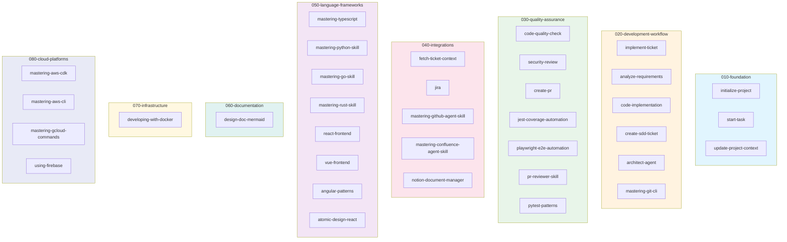
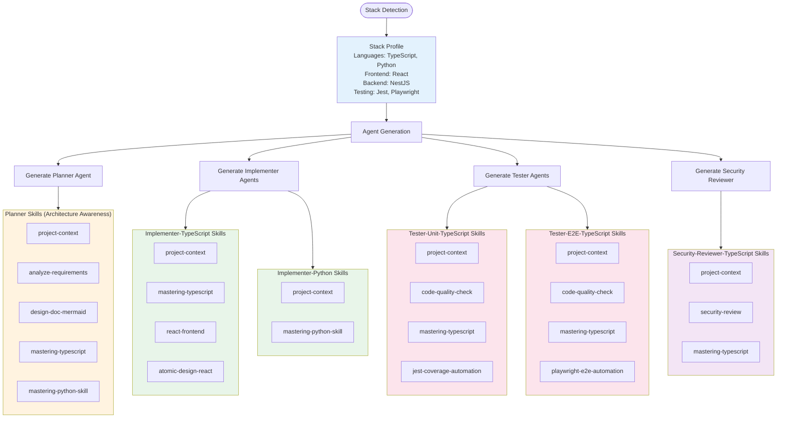
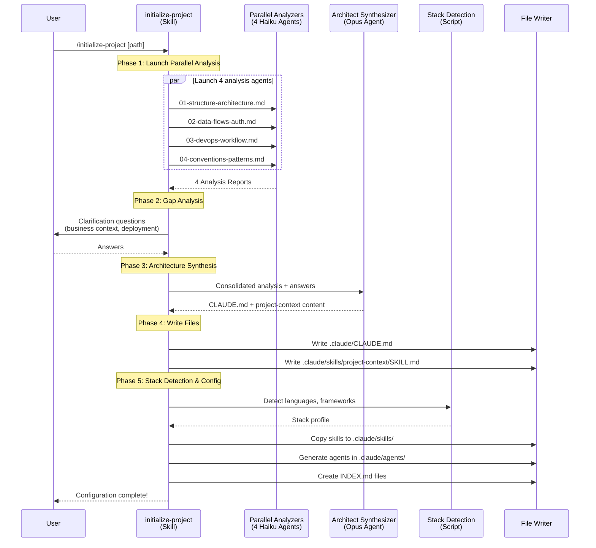
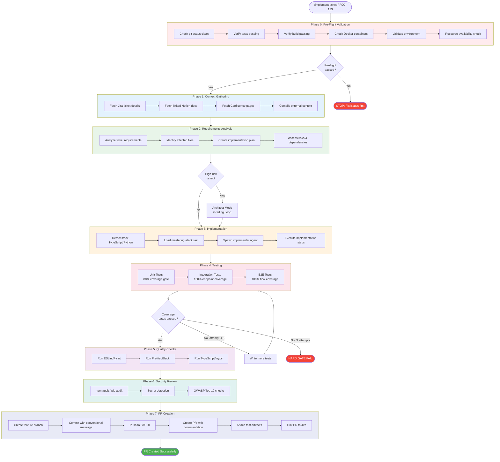
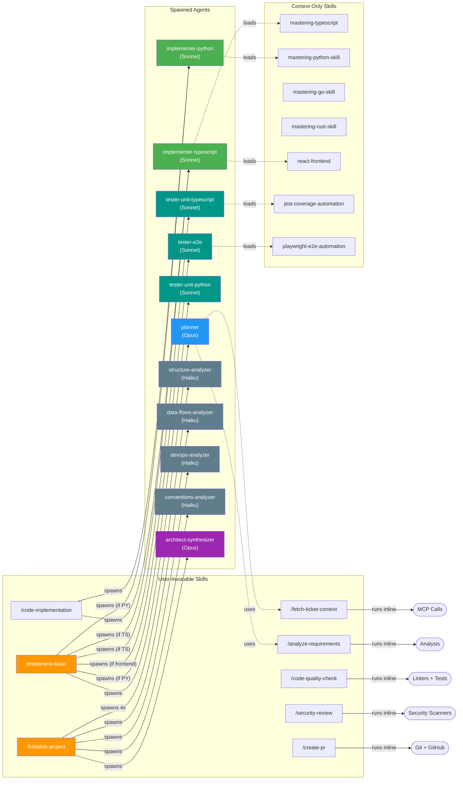

# Skills and Agents Map

**Purpose**: This document clarifies which skills are user-invocable vs context-only, documents the agent spawning hierarchy, and shows the complete execution flow.

---

## Table of Contents

1. [Skills vs Agents](#skills-vs-agents)
2. [User-Invocable Skills](#user-invocable-skills)
3. [Context-Only Skills](#context-only-skills)
4. [Agent Hierarchy](#agent-hierarchy)
5. [Execution Flow Diagrams](#execution-flow-diagrams)
6. [Quick Reference](#quick-reference)

---

## Skills vs Agents

### What is a Skill?

A **skill** is a Claude Code feature that provides:
- Reusable workflows and instructions
- Context for specific tasks
- Can be invoked by users OR loaded as context by other skills/agents

**Skill Metadata**:
```yaml
---
name: skill-name
description: What this skill does
user-invocable: true|false  # Can users invoke this directly?
context: inline             # How is context loaded?
---
```

### What is an Agent?

An **agent** is a specialized Claude instance with:
- Specific role and expertise
- Predefined tools and skills
- Template-based variable substitution
- Spawned by skills to perform sub-tasks

**Agent Metadata**:
```yaml
---
name: agent-name-{{stack}}
description: What this agent does
model: sonnet|haiku|opus
tools: [Read, Write, Edit, Bash, etc.]
skills: {{skills}}
---
```

---

## User-Invocable Skills

These skills can be invoked directly by users via `/skill-name` or the Skill menu.

| Skill | Path | Purpose | Use When |
|-------|------|---------|----------|
| **implement-ticket** | `skills/020-development-workflow/implement-ticket/` | Complete SDLC for Jira ticket | Implementing any Jira ticket end-to-end |
| **fetch-ticket-context** | `skills/010-context-gathering/fetch-ticket-context/` | Gather context from Jira, Notion, Confluence | Need full context for a ticket |
| **analyze-requirements** | `skills/020-development-workflow/analyze-requirements/` | Create implementation plan | Need implementation plan before coding |
| **code-implementation** | `skills/020-development-workflow/code-implementation/` | Implement code following plan | Execute a predefined implementation plan |
| **code-quality-check** | `skills/030-quality-assurance/code-quality-check/` | Run linters, tests, coverage | Verify code quality before PR |
| **security-review** | `skills/030-quality-assurance/security-review/` | Run security scanners | Check for vulnerabilities |
| **create-pr** | `skills/020-development-workflow/create-pr/` | Create GitHub Pull Request | Create PR with full documentation |

**User Invocation**:
```bash
/implement-ticket PROJ-123
/fetch-ticket-context PROJ-456
/code-quality-check
/create-pr
```

---

## Context-Only Skills

These skills are loaded as context by other skills/agents but are NOT directly invocable by users.

| Skill | Path | Purpose | Loaded By |
|-------|------|---------|-----------|
| **mastering-typescript** | `skills/050-language-frameworks/mastering-typescript/` | TypeScript best practices | code-implementation (when stack=typescript) |
| **mastering-python** | `skills/050-language-frameworks/mastering-python/` | Python best practices | code-implementation (when stack=python) |
| **mastering-nestjs** | `skills/050-language-frameworks/mastering-nestjs/` | NestJS patterns | code-implementation (when framework=nestjs) |
| **mastering-fastapi** | `skills/050-language-frameworks/mastering-fastapi/` | FastAPI patterns | code-implementation (when framework=fastapi) |
| **mastering-react** | `skills/050-language-frameworks/mastering-react/` | React best practices | code-implementation (when framework=react) |

**Context Loading** (in skill YAML):
```yaml
---
name: code-implementation
skills:
  - mastering-{{stack}}         # Loaded dynamically based on detected language
  - mastering-{{framework}}     # Loaded if framework detected
---
```

---

## Agent Hierarchy

### Spawning Tree

```
User
│
├─ /implement-ticket (Skill) - 10-Phase Workflow
│  │
│  ├─ Phase 1: Context Gathering
│  │  └─ Spawns: planner (Agent)
│  │     └─ Tools: Read, Grep, Glob, Bash
│  │     └─ Skills: fetch-ticket-context, analyze-requirements
│  │
│  ├─ Phase 4: Implementation
│  │  └─ Spawns: implementer-{{stack}} (Agent)
│  │     └─ Tools: Read, Write, Edit, Bash
│  │     └─ Skills: mastering-{{stack}}, mastering-{{framework}}
│  │
│  ├─ Phase 5: Testing
│  │  ├─ Spawns: tester-unit-{{stack}} (Agent)
│  │  │  └─ Tools: Read, Write, Edit, Bash
│  │  │  └─ Skills: mastering-{{stack}}, testing-patterns
│  │  │
│  │  └─ Spawns: tester-e2e-{{stack}} (Agent)
│  │     └─ Tools: Read, Write, Edit, Bash
│  │     └─ Skills: playwright-patterns (if frontend)
│  │
│  ├─ Phase 6: Visual Verification
│  │  └─ Spawns: visual-verifier (Agent)
│  │     └─ Tools: Read, Grep, Glob, Bash, Edit
│  │     └─ Skills: visual-verification-patterns
│  │     └─ Analyzes screenshot diffs and provides fix suggestions
│  │
│  ├─ Phase 7: Documentation Update
│  │  └─ Spawns: doc-updater (Agent)
│  │     └─ Tools: Read, Grep, Glob, Edit
│  │     └─ Skills: documentation-patterns
│  │     └─ Maintains CLAUDE.md and project-context
│  │
│  └─ Phase 9: Review Loop
│     └─ Uses: review-loop-orchestrator.js (utility)
│        └─ Applies automated fixes from pr-reviewer and security-review
│        └─ Re-runs tests and reviews (max 3 iterations)
│
├─ /code-quality-check (Skill)
│  └─ Runs inline (no agent spawning)
│
└─ /create-pr (Skill)
   └─ Runs inline (no agent spawning)
   └─ Uses: pr-description-generator.js (utility)
```

### Agent Templates

| Agent Template | Purpose | Spawned By | Stack-Specific | Skills Context |
|----------------|---------|------------|----------------|----------------|
| **planner.template.md** | Context gathering + requirements analysis with test planning | implement-ticket (Phase 1) | ❌ No | ALL detected languages (architecture awareness) |
| **implementer.template.md** | Code implementation | implement-ticket (Phase 4) | ✅ Yes (per language) | ONLY specific language + frameworks |
| **tester-unit.template.md** | Unit + integration tests | implement-ticket (Phase 5) | ✅ Yes (per language) | ONLY specific language + test framework |
| **tester-e2e.template.md** | End-to-end tests with auto-initialization | implement-ticket (Phase 5) | ✅ Yes (per language) | ONLY specific language + E2E framework |
| **security-reviewer.template.md** | Security review with OWASP Top 10 checks | implement-ticket (Phase 4/9) | ✅ Yes (primary language) | ONLY primary language + security skills |
| **visual-verifier.template.md** | Visual verification and UI diff analysis | implement-ticket (Phase 6) | ❌ No (frontend-only) | Visual verification patterns |
| **doc-updater.template.md** | Documentation maintenance | implement-ticket (Phase 7) | ❌ No | Documentation patterns |

**Key Features**:
- **visual-verifier**: Analyzes screenshot diffs, provides actionable fix suggestions for UI inconsistencies
- **doc-updater**: Automatically detects when CLAUDE.md or project-context needs updates based on code changes
- **Runtime Variables**: Agents use runtime variable substitution (`{{JIRA_KEY}}`, `{{PROJECT_ROOT}}`, etc.) for ticket-specific customization

**Note**: The framework generates **one agent per detected language** for implementation, testing, and security review. Each agent receives only the skills relevant to its role and language (70-85% context reduction).

### Integration Utilities

Four Node.js utilities orchestrate advanced workflow features:

| Utility | Purpose | Used In | Key Features |
|---------|---------|---------|--------------|
| **doc-change-detector.js** | Detects documentation update triggers | Phase 7 | Pattern-based detection for CLAUDE.md and project-context updates |
| **pr-description-generator.js** | Generates comprehensive PR descriptions | Phase 8 | Template-based markdown generation from all Phase 0-7 artifacts |
| **review-loop-orchestrator.js** | Orchestrates automated fix iterations | Phase 9 | Max 3 iterations, convergence/divergence detection, auto-apply fixes |
| **agent-generation.js** | Generates stack-specific agents | Phase 0 (Setup) | Includes visual-verifier and doc-updater agents |

**Integration Flow**:
```
Phase 7 (Doc Update)
  └─ doc-change-detector.js
     └─ Analyzes git changes against detection rules
     └─ Outputs doc-update-analysis.json
     └─ Spawns: doc-updater agent (if updates needed)

Phase 8 (PR Creation)
  └─ pr-description-generator.js
     └─ Loads all artifacts from Phases 0-7
     └─ Generates pr-description.md with sections:
        - Summary, Visual Changes, Test Results, Security
        - Implementation Details, Files Changed, Decisions
     └─ Used by create-pr skill

Phase 9 (Review Loop)
  └─ review-loop-orchestrator.js
     └─ Reads review-results.json (from pr-reviewer skill)
     └─ Applies fixes (replace, add, delete actions)
     └─ Re-runs tests → Re-triggers review
     └─ Stops on: success, divergence, or max iterations (3)
     └─ Outputs iteration-{N}.json for each cycle
```

---

## Execution Flow Diagrams

### Diagram 1: Skill Category Hierarchy

The framework organizes skills into 8 Johnny Decimal categories:



---

### Diagram 1.5: Context Management System Flow

Shows how the Context Management System intelligently links skills to agents:



**Key Principles**:
1. **Universal Skills**: `project-context` is linked to ALL agents
2. **Planning Skills**: Planner gets mastery for ALL detected languages (architecture awareness)
3. **Language Isolation**: Each implementer gets ONLY its language skills (no cross-language pollution)
4. **Framework Specificity**: React skills ONLY if React detected (not Vue, Angular)
5. **Role-Based Filtering**: Implementers don't get testing skills; testers don't get planning skills

---

### Diagram 2: Initialize-Project Agent Spawning

This sequence diagram shows the flow when a user runs `/initialize-project`:



---

### Diagram 3: Implement-Ticket Execution Flow

The complete 7-phase workflow for implementing a Jira ticket:



---

### Diagram 4: Skill-Agent Relationships

Shows how user-invocable skills spawn agents or run inline:



---

### Flow 1: Complete Ticket Implementation

```
┌─────────────────────────────────────────────────────────────────┐
│ User: /implement-ticket PROJ-123                                │
└────────────────────────────┬────────────────────────────────────┘
                             │
                             ▼
┌─────────────────────────────────────────────────────────────────┐
│ Phase 0: Pre-Flight Validation                                  │
│ - Check git status                                              │
│ - Verify tests passing                                          │
│ - Verify build passing                                          │
└────────────────────────────┬────────────────────────────────────┘
                             │
                             ▼
┌─────────────────────────────────────────────────────────────────┐
│ Phase 1: Context Gathering                                      │
│ Spawns: planner agent                                           │
│ - Fetch Jira ticket                                             │
│ - Fetch Notion docs                                             │
│ - Fetch Confluence pages                                        │
└────────────────────────────┬────────────────────────────────────┘
                             │
                             ▼
┌─────────────────────────────────────────────────────────────────┐
│ Phase 2: Requirements Analysis                                  │
│ (planner agent continues)                                       │
│ - Analyze context                                               │
│ - Create implementation plan                                    │
│ - Identify risks                                                │
└────────────────────────────┬────────────────────────────────────┘
                             │
                             ▼
┌─────────────────────────────────────────────────────────────────┐
│ Phase 3: Code Implementation                                    │
│ Spawns: implementer-{{stack}} agent                             │
│ - Detect language (TypeScript/Python)                           │
│ - Load mastering-{{stack}} skill                                │
│ - Implement each step from plan                                 │
└────────────────────────────┬────────────────────────────────────┘
                             │
                             ▼
┌─────────────────────────────────────────────────────────────────┐
│ Phase 4: Quality Checks                                         │
│ Spawns: tester-unit-{{stack}} agent (for unit tests)            │
│ Spawns: tester-e2e-{{stack}} agent (if frontend)                │
│                                                                 │
│ Unit Tests:                                                     │
│ - Write unit tests (80%+ coverage)                             │
│ - Run tests (max 3 attempts if < 80%)                          │
│ - HARD GATE: Block if coverage < 80%                           │
│                                                                 │
│ Integration Tests:                                              │
│ - Detect all endpoints                                          │
│ - Verify 100% endpoint coverage                                │
│ - HARD GATE: Block if any endpoint missing                     │
│                                                                 │
│ E2E Tests (frontend only):                                      │
│ - Identify critical flows                                      │
│ - Verify 100% flow coverage                                    │
│ - Collect artifacts (videos, screenshots, traces)              │
│ - HARD GATE: Block if any flow missing                         │
│                                                                 │
│ Linting & Type Checking:                                        │
│ - ESLint / Pylint                                               │
│ - Prettier / Black                                              │
│ - TypeScript / mypy                                             │
└────────────────────────────┬────────────────────────────────────┘
                             │
                             ▼
┌─────────────────────────────────────────────────────────────────┐
│ Phase 5: Security Review                                        │
│ - npm audit / pip audit                                         │
│ - Secret detection                                              │
│ - OWASP Top 10 checks                                           │
└────────────────────────────┬────────────────────────────────────┘
                             │
                             ▼
┌─────────────────────────────────────────────────────────────────┐
│ Phase 6: PR Creation                                            │
│ - Create feature branch                                         │
│ - Commit with conventional message                              │
│ - Push to GitHub                                                │
│ - Create PR with documentation                                  │
│ - Attach test artifacts (if E2E ran)                            │
│ - Attach decision log (if autonomous mode)                      │
│ - Link PR to Jira                                               │
└─────────────────────────────────────────────────────────────────┘
```

### Flow 2: Agent Spawning Pattern

```
┌──────────────────────────────────────────────────────────────────┐
│ implement-ticket (Parent Skill)                                  │
└──────────────────────┬───────────────────────────────────────────┘
                       │
       ┌───────────────┼───────────────┐
       │               │               │
       ▼               ▼               ▼
   ┌───────┐      ┌────────┐     ┌──────────┐
   │Planner│      │Implemen│     │Tester    │
   │Agent  │      │ter     │     │Agents    │
   └───┬───┘      │Agent   │     └────┬─────┘
       │          └────┬───┘          │
       │               │              │
       │               │              ├─ tester-unit-{{stack}}
       │               │              │
       │               │              └─ tester-e2e-{{stack}} (frontend only)
       │               │
       │               ├─ Loads: mastering-{{stack}}
       │               └─ Loads: mastering-{{framework}}
       │
       └─ Uses: fetch-ticket-context, analyze-requirements
```

### Flow 3: Coverage Gate Enforcement

```
┌─────────────────────────────────────────────────────────────────┐
│ Phase 4: Quality Checks                                         │
└────────────────────────────┬────────────────────────────────────┘
                             │
              ┌──────────────┼──────────────┐
              │              │              │
              ▼              ▼              ▼
     ┌──────────────┐  ┌──────────┐  ┌──────────┐
     │ Unit Test    │  │Integratio│  │ E2E Test │
     │ Coverage     │  │n Test    │  │ Coverage │
     │ (80% min)    │  │Coverage  │  │(100% flows)│
     └──────┬───────┘  │(100% eps)│  └────┬─────┘
            │          └─────┬────┘       │
            │                │            │
            ▼                ▼            ▼
    ┌───────────────────────────────────────┐
    │ Run tests & calculate coverage        │
    └──────────────┬────────────────────────┘
                   │
                   ▼
           ┌───────────────┐
           │ Coverage OK?  │
           └───┬───────┬───┘
               │       │
          Yes  │       │  No
               │       │
               ▼       ▼
         ┌─────┐  ┌──────────────────┐
         │Pass │  │Write more tests  │
         │Gate │  │(max 3 attempts)  │
         └─────┘  └────────┬─────────┘
                           │
                           ▼
                   ┌───────────────┐
                   │Still failing? │
                   └───┬───────┬───┘
                       │       │
                  Yes  │       │  No (retry)
                       │       │
                       ▼       └─────┐
              ┌────────────────┐     │
              │ HARD GATE FAIL │     │
              │ - Block PR     │     │
              │ - Checkpoint   │     │
              │ - Report gaps  │     │
              └────────────────┘     │
                                     │
                   ┌─────────────────┘
                   │
                   ▼
           (Back to coverage check)
```

---

## Quick Reference

### When to Use User-Invocable Skills

| Use Case | Skill | Example |
|----------|-------|---------|
| Complete ticket implementation | `/implement-ticket` | `/implement-ticket PROJ-123` |
| Just gather context | `/fetch-ticket-context` | `/fetch-ticket-context PROJ-456` |
| Just create implementation plan | `/analyze-requirements` | `/analyze-requirements PROJ-789` |
| Just run quality checks | `/code-quality-check` | `/code-quality-check` |
| Just run security review | `/security-review` | `/security-review` |
| Just create PR | `/create-pr` | `/create-pr PROJ-123` |

### Agent Spawning by Stack

| Stack | Agents Spawned | Skills Per Agent |
|-------|----------------|------------------|
| **TypeScript** | planner → implementer-typescript → tester-unit-typescript → tester-e2e-typescript → security-reviewer-typescript | **Planner**: 5-8 skills (all languages)<br>**Implementer**: 3-5 skills (TS only)<br>**Tester**: 4-5 skills (TS only)<br>**Security**: 3 skills (TS only) |
| **Python** | planner → implementer-python → tester-unit-python → security-reviewer-python | **Planner**: 5-8 skills (all languages)<br>**Implementer**: 2-4 skills (Python only)<br>**Tester**: 4-5 skills (Python only)<br>**Security**: 3 skills (Python only) |
| **Mixed (TS+Python)** | planner → implementer-typescript + implementer-python → tester-unit-typescript + tester-unit-python + tester-e2e-typescript → security-reviewer-typescript | **Planner**: 7-10 skills (TS + Python mastery)<br>**Each Implementer**: 3-5 skills (their language only)<br>**Each Tester**: 4-5 skills (their language only)<br>**Security**: 3 skills (primary language) |

### Context Skills Loaded by Stack (Context Management v1.0)

The Context Management System intelligently links **ONLY** relevant skills to each agent based on role and detected stack.

#### Planner Agent - Architecture Awareness

Planner receives skills for **ALL detected languages** to understand full system architecture:

| Stack | Planner Skills |
|-------|----------------|
| **TypeScript** | project-context, analyze-requirements, design-doc-mermaid, architect-agent, mastering-typescript |
| **TypeScript + React + NestJS** | project-context, analyze-requirements, design-doc-mermaid, architect-agent, mastering-typescript |
| **Python** | project-context, analyze-requirements, design-doc-mermaid, architect-agent, mastering-python-skill |
| **TypeScript + Python** | project-context, analyze-requirements, design-doc-mermaid, architect-agent, mastering-typescript, mastering-python-skill |

#### Implementer Agents - Language + Framework Specific

Each implementer receives **ONLY** skills for its specific language and detected frameworks:

| Agent | Stack | Implementer Skills |
|-------|-------|-------------------|
| **implementer-typescript** | TypeScript only | project-context, mastering-typescript |
| **implementer-typescript** | TypeScript + React | project-context, mastering-typescript, react-frontend, atomic-design-react |
| **implementer-typescript** | TypeScript + NestJS | project-context, mastering-typescript |
| **implementer-python** | Python only | project-context, mastering-python-skill |
| **implementer-python** | Python + FastAPI | project-context, mastering-python-skill |
| **implementer-python** | Python + Django | project-context, mastering-python-skill |

**Key Optimization**: Implementer does NOT receive:
- ❌ Other language skills (Python implementer doesn't get TypeScript)
- ❌ Other framework skills (React implementer doesn't get Vue or Angular)
- ❌ Planning skills (analyze-requirements, design-doc-mermaid)
- ❌ Testing framework skills (Jest, Playwright)

#### Tester Agents - Language + Test Framework Specific

Each tester receives **ONLY** skills for its language and detected test frameworks:

| Agent | Stack | Tester Skills |
|-------|-------|---------------|
| **tester-unit-typescript** | TypeScript + Jest | project-context, code-quality-check, mastering-typescript, jest-coverage-automation |
| **tester-unit-python** | Python + Pytest | project-context, code-quality-check, mastering-python-skill, pytest-patterns |
| **tester-e2e-typescript** | TypeScript + Playwright | project-context, code-quality-check, mastering-typescript, playwright-e2e-automation |

#### Security Reviewer Agent - Primary Language Only

Security reviewer receives skills for **primary language** only:

| Agent | Stack | Security Skills |
|-------|-------|----------------|
| **security-reviewer-typescript** | TypeScript | project-context, security-review, mastering-typescript |
| **security-reviewer-python** | Python | project-context, security-review, mastering-python-skill |

### Context Optimization Metrics

| Agent Type | Before Context Management | After Context Management | Reduction |
|------------|---------------------------|--------------------------|-----------|
| Planner | 22+ skills (all) | 5-8 skills (architecture-aware) | 64-77% |
| Implementer | 22+ skills (all) | 3-5 skills (language+framework) | 77-86% |
| Tester | 22+ skills (all) | 4-5 skills (language+test-framework) | 77-82% |
| Security | 22+ skills (all) | 3 skills (language+security) | 86% |

---

## Debugging Tips

### How to check if a skill is user-invocable?

Read the skill's YAML frontmatter:
```bash
head -20 ai-agentic-framework/skills/path/to/SKILL.md
```

Look for:
```yaml
user-invocable: true   # Can be invoked by user
user-invocable: false  # Context-only
```

### How to see agent spawning in action?

Run with verbose logging:
```bash
CLAUDE_DEBUG=true /implement-ticket PROJ-123
```

Look for:
```
Spawning agent: planner
Spawning agent: implementer-typescript
Spawning agent: tester-unit-typescript
Spawning agent: tester-e2e-typescript
```

### How to see which skills are loaded?

Check the agent template's frontmatter:
```yaml
skills:
  - mastering-{{stack}}
  - mastering-{{framework}}
```

And check console output:
```
Loading skill: mastering-typescript
Loading skill: mastering-nestjs
```

---

## Summary

**Skills** = Reusable workflows (can be user-invocable or context-only)

**Agents** = Specialized Claude instances spawned by skills

**Context Management** = Intelligent skill linking that reduces context bloat by 70-85%

**Hierarchy**:
```
User → Skill → Agent(s) → Context Skills (filtered by role + stack)
```

**Example (TypeScript + React project)**:
```
User → /implement-ticket
    ↓
    planner agent (5 skills: universal + planning + TS mastery)
    ↓
    implementer-typescript agent (4 skills: universal + TS + React)
    ↓
    tester-unit-typescript agent (4 skills: universal + quality + TS + Jest)
    ↓
    tester-e2e-typescript agent (4 skills: universal + quality + TS + Playwright)
    ↓
    security-reviewer-typescript agent (3 skills: universal + security + TS)
```

**Key Optimizations**:
- ✅ Planner gets ALL languages (architecture awareness)
- ✅ Each implementer gets ONLY its language + detected frameworks
- ✅ React OR Vue OR Angular (never all three)
- ✅ 70-85% context reduction (from 22+ skills to 3-5 per agent)
- ❌ No cross-language pollution
- ❌ No irrelevant framework skills

**Coverage Gates** = Hard enforcement at unit (80%), integration (100%), and E2E (100%) levels

**Autonomous Mode** = `--no-stop` flag enables unattended execution with decision logging

**Multi-Language Support** = One agent per detected language (TypeScript, Python, Go, Java, Rust, Ruby)
