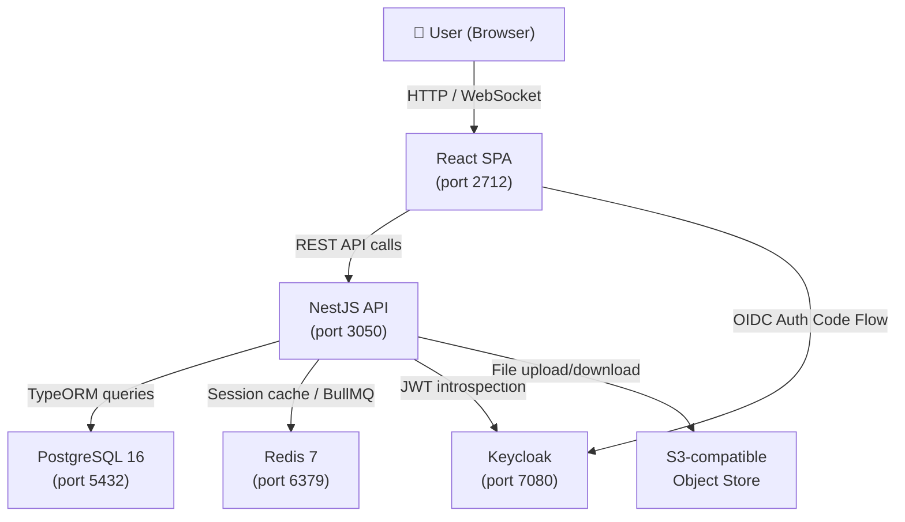
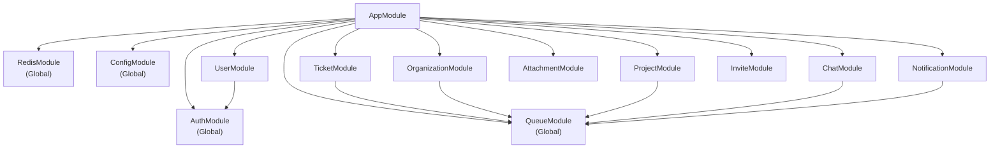
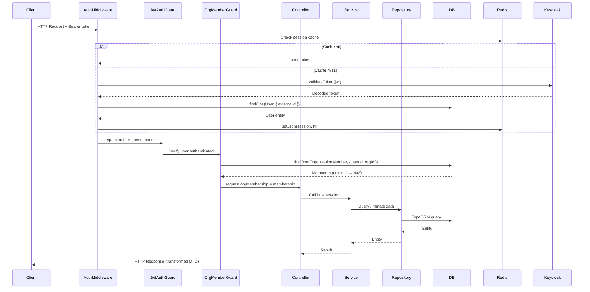
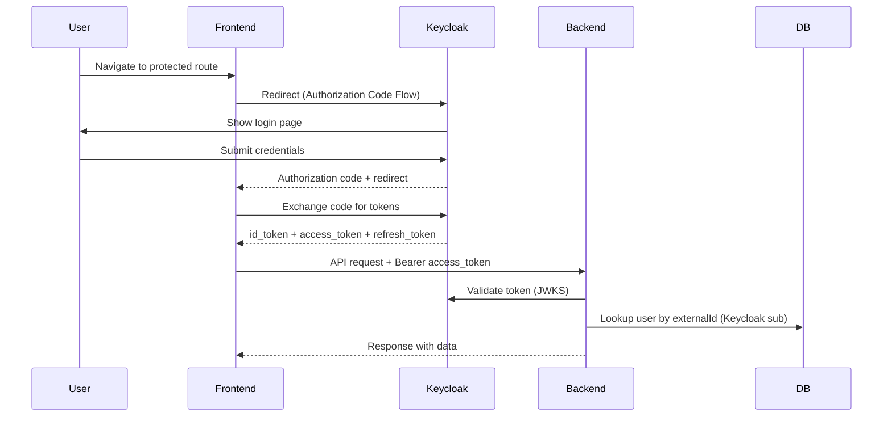
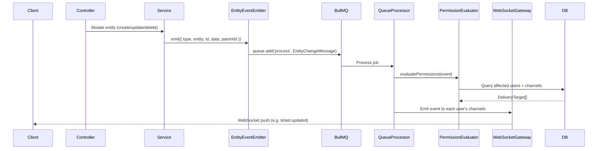
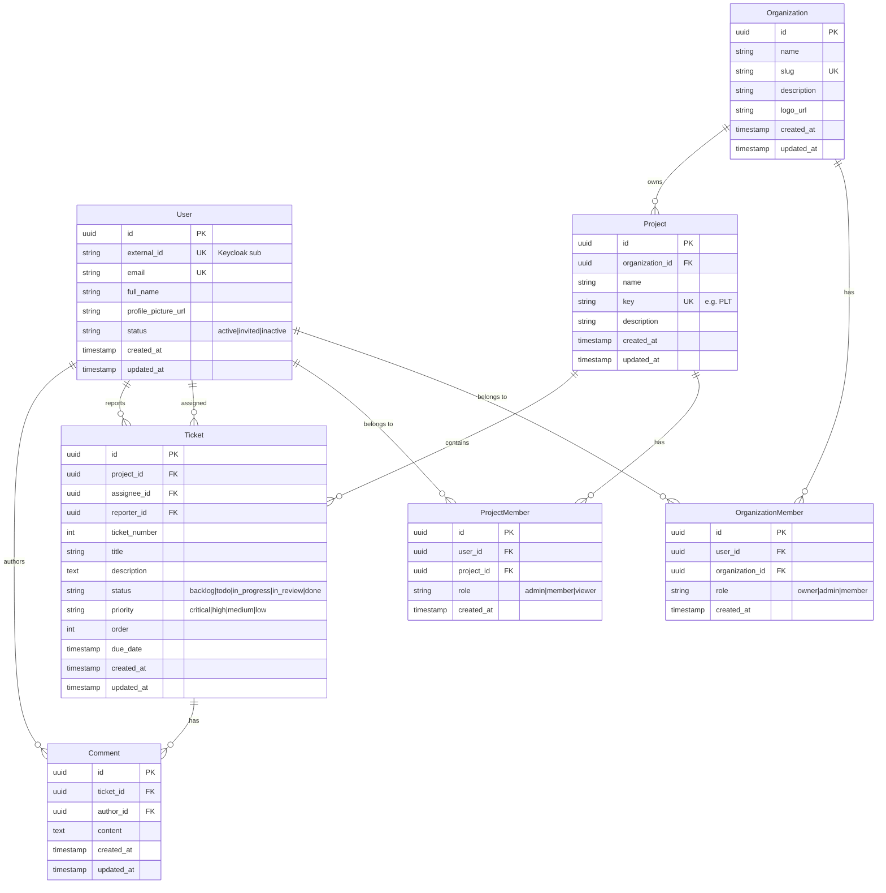
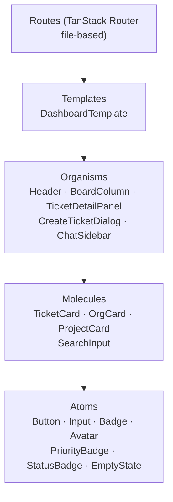
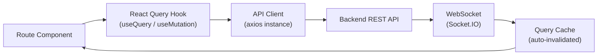

# Architecture

## Overview

Gira is a full-stack monorepo simulating a Jira-like project management board. It is designed to be cloned as a production-ready starting point for new projects. The architecture follows vertical-slice module organization on the backend and atomic design on the frontend, with Keycloak SSO, Redis session caching, and real-time WebSocket updates via BullMQ.

---

## System Context



---

## Repository Structure

```
gira/
├── packages/
│   ├── liveonit/          # Shared tooling configs (ESLint, Prettier, TS, Jest, commitlint)
│   └── shared/          # Shared DTOs, enums, and utilities (@livonit/shared)
│       └── src/
│           ├── dtos/    # Request/Response DTOs per domain
│           ├── enums/   # TicketStatus, Priority, OrgRole, ProjectRole, UserStatus
│           └── utils/   # Shared utility functions
├── services/
│   ├── backend/         # NestJS REST API
│   ├── web-frontend/    # React SPA (Vite + TanStack Router)
│   ├── keycloak/        # IAM realm config, themes, init scripts
│   └── db/              # DB init scripts (PostgreSQL + Keycloak DB)
├── docs/                # Project documentation
└── seeds/               # Database seed scripts
```

---

## Backend Module Dependencies



Each feature module follows this internal structure:

```
<module>/
├── <module>.module.ts          # NestJS module definition
├── presentation/               # Controllers (HTTP layer)
│   └── dto/                    # Request DTOs (class-validator)
├── service/                    # Business logic
├── repository/                 # Data access (TypeORM queries)
└── database/
    ├── models/                 # TypeORM entities
    └── migrations/             # Schema migrations
```

---

## Request Lifecycle



---

## Auth Flow (Keycloak OIDC)



### Three-Layer Authorization

| Layer                   | Source                       | Checked by           |
| ----------------------- | ---------------------------- | -------------------- |
| Keycloak realm roles    | JWT `realm_access.roles`     | `RolesGuard`         |
| Organization membership | `organization_members` table | `OrgMemberGuard`     |
| Project membership      | `project_members` table      | `ProjectMemberGuard` |

---

## WebSocket Event Flow



WebSocket channels follow this naming convention:

| Channel                          | Subscribers         | Events              |
| -------------------------------- | ------------------- | ------------------- |
| `user:{userId}`                  | Individual user     | All personal events |
| `user:{userId}:tickets:assigned` | Assignee only       | Ticket assignments  |
| `project:{projectId}:tickets`    | All project members | Board updates       |
| `project:{projectId}`            | All project members | Project changes     |
| `org:{orgId}`                    | All org members     | Org changes         |

---

## Database Entity Relationships



---

## Frontend Architecture

The frontend follows **Atomic Design** principles:



### Data Flow



---

## Key Design Decisions

| Decision          | Choice                                      | Rationale                                           |
| ----------------- | ------------------------------------------- | --------------------------------------------------- |
| Auth              | Keycloak OIDC                               | Single SSO provider; realm isolates each tenant     |
| Session caching   | Redis                                       | Avoid Keycloak round-trip on every request          |
| Real-time         | BullMQ + Socket.IO                          | Decouples mutation from broadcast; horizontal scale |
| ORM               | TypeORM 0.3                                 | Mature, well-typed, migration tooling               |
| Guard pattern     | `BaseMemberGuard` abstract class            | DRY — org + project guards share ~80% logic         |
| Comment ownership | Service-level check (`authorId === userId`) | Keep authorization in one place                     |
| DTO validation    | class-validator + `@livonit/shared` enums   | Single source of truth for valid values             |
| Pagination        | `paginate()` utility, `limit`/`page` params | Consistent across all list endpoints                |
