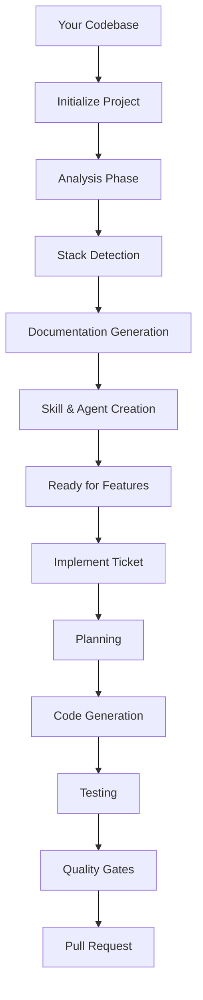
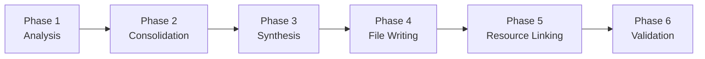
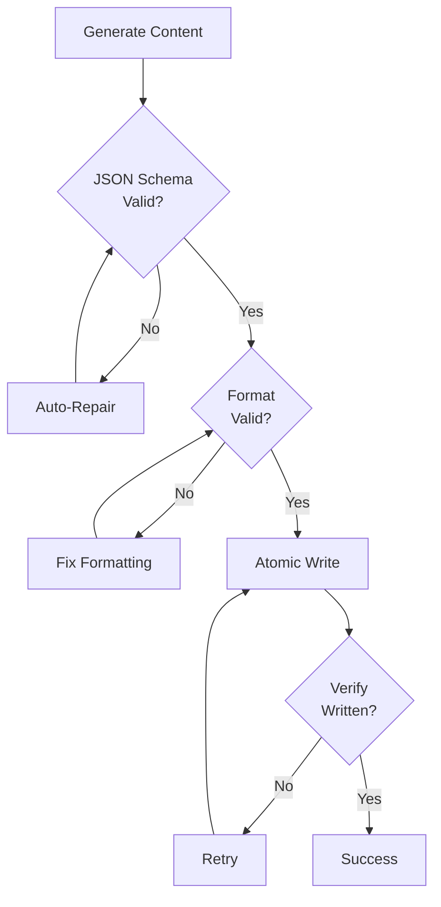
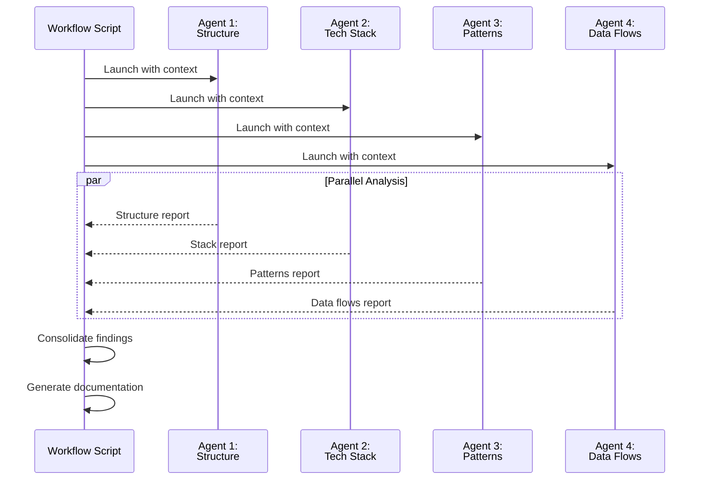
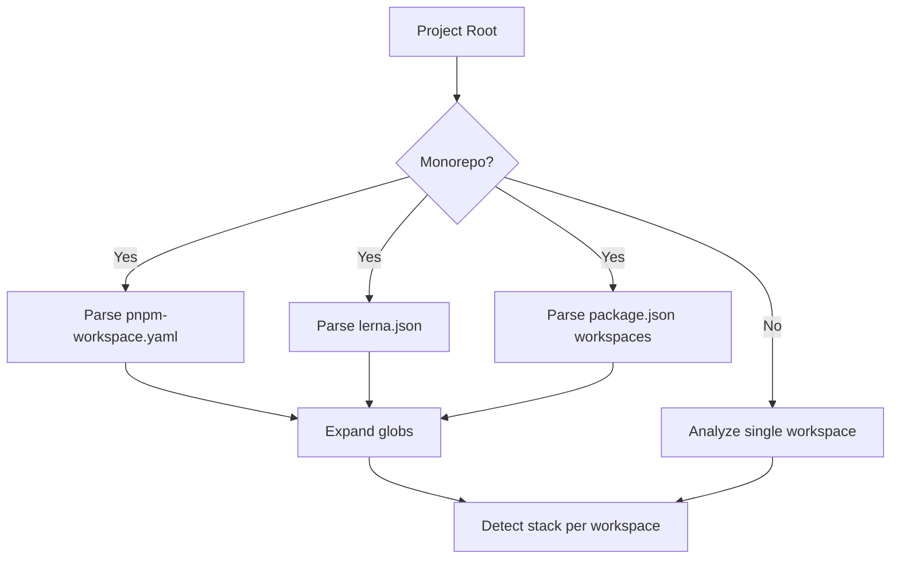
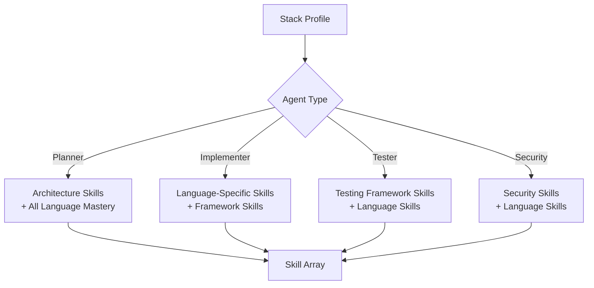
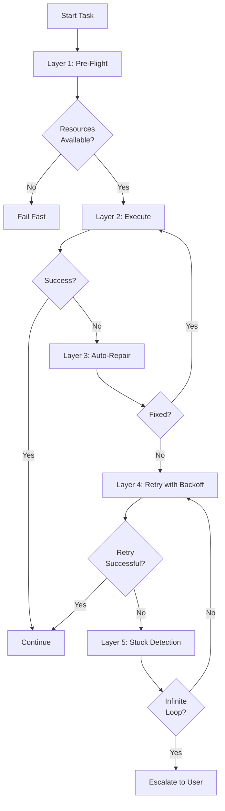
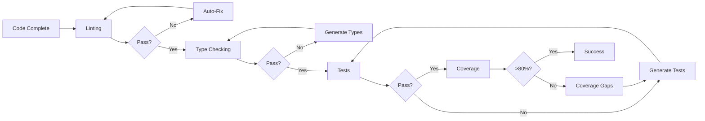

# Architecture

How the AI Agentic Framework achieves deterministic, context-aware software development at scale.

---

## Table of Contents

1. [System Overview](#system-overview)
2. [Core Workflows](#core-workflows)
3. [Deterministic Workflow Engine](#deterministic-workflow-engine)
4. [Multi-Agent Analysis](#multi-agent-analysis)
5. [Stack Detection System](#stack-detection-system)
6. [Context Management](#context-management)
7. [Validation & Recovery](#validation--recovery)
8. [Quality Gates](#quality-gates)

---

## System Overview

The AI Agentic Framework is a **deterministic workflow automation system** that transforms tickets into production-ready code through a multi-phase, validated process.



### Key Principles

**1. Determinism**: Same inputs → Same workflow → Consistent results

**2. Context Awareness**: Deep understanding of YOUR codebase, not generic patterns

**3. Multi-Layer Validation**: Validation at every step, with auto-repair and retry

**4. Stack Agnostic**: Works with any language, framework, or architecture

---

## Core Workflows

The framework has two primary workflows:

### 1. Initialize Project (One-Time Setup)

Analyzes your codebase and generates project-specific documentation and AI agents.

**Time**: ~2 minutes

**Output**:
- `CLAUDE.md` - Quick reference guide
- `project-context/SKILL.md` - Deep context
- Stack-specific skills (10-20 skills)
- Custom AI agents (3-7 agents)

### 2. Implement Ticket (Daily Development)

Transforms tickets into production-ready pull requests with automated testing and validation.

**Time**: 5-15 minutes per ticket

**Output**:
- Production-ready code
- Comprehensive tests
- Pull request with detailed description

---

## Deterministic Workflow Engine

The framework executes **exactly 26 steps** across **6 phases** for every initialization:



### Phase Breakdown

#### Phase 1: Analysis (4 Parallel Agents)

Four specialized agents analyze your codebase simultaneously:

| Agent | Examines | Output |
|-------|----------|--------|
| **Structure & Architecture** | Directory layout, module organization, patterns | Repository type, languages, frameworks |
| **Tech Stack & Dependencies** | package.json, requirements.txt, go.mod | Dependencies, versions, build tools |
| **Code Patterns & Testing** | Naming conventions, test frameworks, linting | Coding standards, test setup |
| **Data Flows & Integrations** | API patterns, auth, integrations | Request/response flows, authentication |

**Key Feature**: All 4 agents run in parallel for 4x speedup.

#### Phase 2: Consolidation

Merges findings from all agents, performs gap analysis, and identifies conflicts.

#### Phase 3: Synthesis

Generates intelligent documentation:
- Quick reference guide (CLAUDE.md: 30-200 lines)
- Deep project context (project-context/SKILL.md: 50-800 lines)
- Stack-specific patterns
- Testing conventions
- Development workflow

#### Phase 4: File Writing (Validated)

Writes all files with multi-layer validation:



#### Phase 5: Resource Linking

Links skills and agents based on detected stack:
- Copies stack-specific skills
- Generates custom agents
- Configures MCP integrations

#### Phase 6: Final Validation

Enforces quality gates:
- All files valid
- No missing dependencies
- Documentation complete
- Skills correctly linked

---

## Multi-Agent Analysis

The framework uses **workflow-orchestrated subagents**, not autonomous agent teams.

### Why Workflows, Not Agent Teams?

| Aspect | Workflows | Agent Teams |
|--------|-----------|-------------|
| **Control** | Programmatic (scripts) | LLM decision-making |
| **Predictability** | Deterministic | Non-deterministic |
| **Use Case** | Known process, fixed steps | Unknown process, exploration |
| **Best For** | Production systems | Research/exploration |

### Agent Coordination



**Key Benefits**:
- **Deterministic**: Same analysis every time
- **Fast**: 4 agents run in parallel
- **Validated**: Each agent output validated before consolidation

---

## Stack Detection System

Automatically detects your tech stack across monorepos and polyglot codebases.

### Workspace Detection

Supports all modern monorepo tools:



**Example Output** (Monorepo with 4 workspaces):
```
✓ 4 workspaces detected:
  1. services/backend (TypeScript, NestJS 11.0.11, PostgreSQL)
  2. services/frontend (TypeScript, React 19.1.0, Vite)
  3. services/auth (TypeScript, Docker-based)
  4. packages/shared (TypeScript, utility library)
```

### Language Detection

Detects all languages in your project:

| Language | Detection Method |
|----------|------------------|
| TypeScript | `tsconfig.json` |
| Python | `pyproject.toml`, `requirements.txt` |
| Go | `go.mod` |
| Java | `pom.xml`, `build.gradle` |
| Rust | `Cargo.toml` |
| Ruby | `Gemfile` |

**Multi-Language Support**: Returns **arrays**, not single values. A project with Python backend + TypeScript frontend returns both.

### Framework Detection

**Backend Frameworks**:
- NestJS: `@nestjs/core` in package.json
- Express: `express` dependency
- Django: `django` in requirements.txt
- FastAPI: `fastapi` dependency
- Spring Boot: `spring-boot-starter` in pom.xml
- Gin: `gin-gonic/gin` in go.mod

**Frontend Frameworks**:
- React: `react` dependency
- Vue: `vue` dependency
- Angular: `@angular/core` dependency
- Svelte: `svelte` dependency

**Version Extraction**: Extracts exact versions (e.g., React 17 vs 19) to use appropriate patterns.

---

## Context Management

Intelligent skill linking that reduces context by 70-85% while ensuring agents receive only relevant information.

### The Problem: Context Bloat

**Before Context Management**:
```yaml
implementer-typescript:
  skills: [22 skills including Python, Go, Java, Vue, Angular, etc.]
  # Signal-to-noise ratio: ~22%
```

**After Context Management**:
```yaml
implementer-typescript:
  skills:
    - project-context
    - mastering-typescript
    - react-frontend
    - atomic-design-react
  # Signal-to-noise ratio: 100%
  # Context reduction: 82%
```

### Agent-Specific Skill Mapping

Each agent type receives only skills relevant to its task:



**Example Skill Resolution**:

| Agent | Stack | Skills Linked |
|-------|-------|---------------|
| Planner | TypeScript + Python | project-context, analyze-requirements, mastering-typescript, mastering-python |
| Implementer (TypeScript) | React + NestJS | project-context, mastering-typescript, react-frontend |
| Implementer (Python) | Django | project-context, mastering-python, django-patterns |
| Tester (TypeScript) | Jest | project-context, mastering-typescript, jest-coverage |

### Multi-Language Support

The framework generates **one agent per language**:

```
TypeScript + Python project generates:
- planner (architecture-aware for both languages)
- implementer-typescript
- implementer-python
- tester-unit-typescript
- tester-unit-python
- security-reviewer-typescript
```

**File-to-Language Routing**: Tickets affecting multiple languages are automatically routed to the correct implementer based on file extensions.

---

## Validation & Recovery

Multi-layer validation with automatic error recovery ensures 95%+ success rate.

### 5-Layer Recovery System



#### Layer 1: Pre-Flight Validation

Checks before starting:
- **Disk Space**: 5GB minimum
- **Memory**: 2GB recommended
- **API Connectivity**: Jira, GitHub, other integrations
- **Git State**: Clean working directory

#### Layer 2: Checkpoint System

Atomic checkpoint operations enable resumable workflows:

**Checkpoint Structure**:
```json
{
  "id": "a7f2c3e1",
  "ticketKey": "PROJ-123",
  "phase": 4,
  "timestamp": "2026-03-02T14:23:45.123Z",
  "gitState": {
    "commitSha": "85538c9d...",
    "branch": "feat/PROJ-123",
    "hasUncommittedChanges": false
  }
}
```

**Resume Validation**: On resume, verifies:
- Git commit SHA match (warns if changed)
- Environment version match
- Checkpoint age (warns if > 24 hours old)

#### Layer 3: Auto-Repair

Automatically fixes common issues:
- Missing delimiters
- Formatting errors
- Truncation problems
- JSON schema violations

#### Layer 4: Retry with Backoff

Exponential backoff for transient failures:

| Attempt | Delay | Cumulative Time |
|---------|-------|-----------------|
| 1 | 2s | 2s |
| 2 | 4s | 6s |
| 3 | 6s | 12s |
| 4 | 8s | 20s |
| 5 | 10s | 30s |

**Smart Retry**: Includes error feedback in next attempt so AI can learn from failures.

#### Layer 5: Stuck Loop Detection

Detects infinite retry loops:

1. **Hash error message** (SHA-256, 16 chars)
2. **Track timestamps** of each error
3. **Detect pattern**: 3 identical errors within 5 minutes
4. **Escalate**: Suggest different approach or manual intervention

---

## Quality Gates

Automated checks enforce code standards at multiple phases.

### Gate Types



### Quality Gate Retry Strategy

Each gate has **3 attempts** with different strategies:

**Attempt 1**: Run all gates once
- If pass: continue
- If fail: analyze failures

**Attempt 2**: Fix identified issues
- Regenerate code
- Add missing tests
- Fix type errors

**Attempt 3**: Final retry
- Different approach
- Manual suggestions

### Fallback Options

If all 3 attempts fail:

1. **Rollback**: `git reset --hard` to base commit
2. **WIP PR**: Create draft PR with error context
3. **Checkpoint**: Save state for manual fixing

**WIP PR Example**:
```markdown
# ⚠️ WORK IN PROGRESS - DO NOT MERGE

## Status: BLOCKED
**Reason**: Coverage below 80% after 3 attempts

## Coverage Gaps
- File: auth.service.ts
  - Lines 45-62: Error handling path not tested
  - Lines 78-89: Edge case validation missing

## Next Steps
1. Review gap analysis above
2. Add missing tests manually
3. Resume: `/implement-ticket PROJ-123 --resume`
```

---

## Performance Characteristics

### Typical Timings

| Operation | Time | Notes |
|-----------|------|-------|
| Workspace detection | <1s | Parses workspace config files |
| Stack detection | 1-2s per workspace | Parallel per workspace |
| Agent analysis (Phase 1) | 10-15s | 4 agents run in parallel |
| Code generation | 15-30s | Depends on complexity |
| Test generation | 20-40s | Coverage-aware |
| Quality gates | 30-60s | Parallel lint/type/test |
| **Full initialization** | ~2 minutes | Phases 1-6 complete |
| **Full ticket implementation** | 5-15 minutes | Planning to PR |

### Optimization Strategies

**Parallelization**:
- Phase 1: 4 subagents (4x speedup)
- Tests: Parallel execution (2-4x speedup)
- Quality gates: Parallel checks

**Resource Management**:
- Pre-flight checks prevent OOM kills
- Memory monitoring with warnings
- API rate limit tracking

**Smart Caching**:
- Stack profile cached between runs
- Skills copied once per project
- Templates loaded on demand

---

## Success Metrics

The framework achieves:

- **95%+** initialization success rate
- **<1%** implementation failure rate
- **100%** validation enforcement (quality gates)
- **70-80%** time savings vs manual development
- **95%+** test pass rate on generated code

---

## Design Decisions

### Why Workflow-Orchestrated Subagents?

**Traditional AI coding tools** use autonomous agents that make their own decisions. This leads to:
- ❌ Non-deterministic behavior
- ❌ Skipped critical steps
- ❌ Inconsistent results

**Our approach** uses workflows that control the flow, with AI providing intelligence:
- ✅ Same 26-step process every time
- ✅ Validation at every step
- ✅ Predictable, reliable results

### Why Multi-Layer Validation?

Single-point validation misses edge cases. Our 5-layer approach:
1. Prevents failures before they happen (pre-flight)
2. Enables recovery from failures (checkpoints)
3. Fixes common issues automatically (auto-repair)
4. Handles transient errors (retry with backoff)
5. Detects systemic problems (stuck detection)

**Result**: 95%+ success rate even on first run.

### Why Stack-Agnostic?

Building language-specific tools doesn't scale. Our detection-based approach:
- Automatically adapts to any stack
- Works across 8 languages, 40+ frameworks
- Handles monorepos and polyglot codebases
- No configuration required

---

## Technical Foundation

The framework is built on:

- **Claude Code**: AI development environment
- **Sonnet 4 & Opus 4**: Anthropic's latest models
- **Bash Scripts**: Workflow orchestration
- **JSON Schema**: Validation contracts
- **Git**: Version control integration
- **MCP**: Multi-platform integrations (Jira, GitHub, etc.)

---

## Further Reading

- **[User Guide](./USER_GUIDE.md)** - Complete workflows and best practices
- **[API Reference](./API_REFERENCE.md)** - Skills, agents, and utilities
- **[Skill Catalog](../SKILL_CATALOG.md)** - Available skills with detection logic

---

**Want to understand a specific component in more depth?** Check the API Reference for implementation details of individual utilities and agents.
