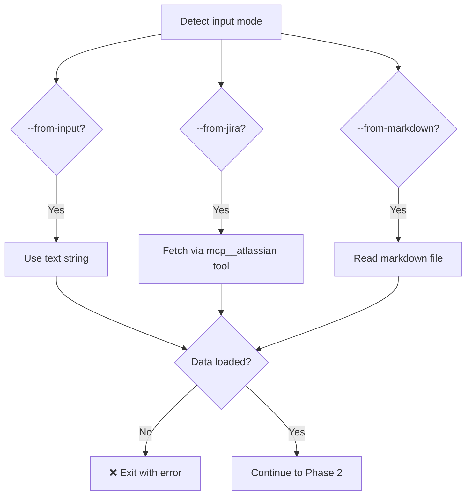
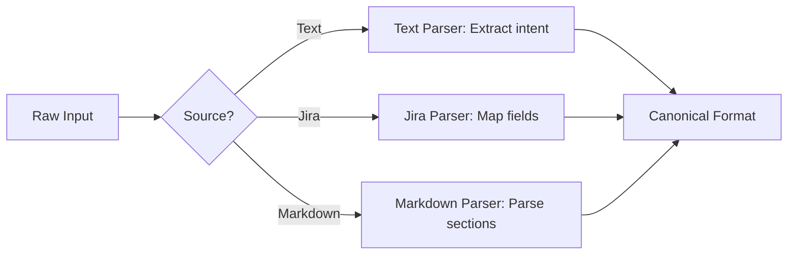
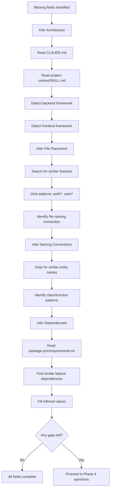
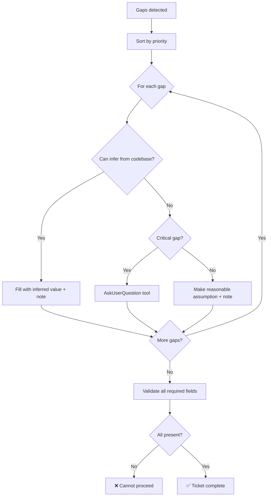
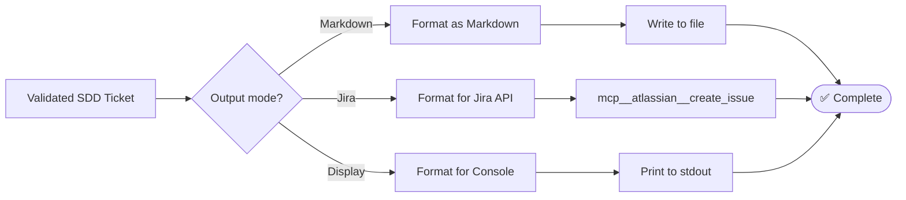

# create-sdd-ticket Workflow Documentation

## Overview

The `/create-sdd-ticket` skill generates comprehensive, gap-free tickets following Specification-Driven Development (SDD) principles with intelligent codebase inference to minimize engineer interruption.

**Version**: 2.0.0
**Last Updated**: 2026-03-08
**File**: `skills/020-development-workflow/create-sdd-ticket/SKILL.md`

---

## Key Principles

### 1. Specification-Driven Development (SDD)

Tickets are the single source of truth for implementation:
- ✅ **Gap-free**: No ambiguities or assumptions
- ✅ **Implementation-ready**: Engineer can start immediately
- ✅ **Test-first**: BDD scenarios define success
- ✅ **Autonomous**: Deep inference before asking questions

### 2. INVEST Criteria

Every ticket must be:
- **I**ndependent: Can be implemented without blocking dependencies
- **N**egotiable: Flexible on implementation approach
- **V**aluable: Delivers user/business value
- **E**stimable: Clear enough to estimate effort
- **S**mall: Completable in 1-3 days
- **T**estable: Clear acceptance criteria

### 3. Minimal Engineer Interruption

The skill performs **deep codebase research** to infer:
- Existing architecture patterns
- File placement conventions
- Naming conventions
- Common patterns
- Dependencies

Only unresolvable gaps require questions.

---

## Input/Output Modes

```mermaid
flowchart LR
    Text[Text Input] --> Skill[/create-sdd-ticket skill]
    Jira[Jira Input] --> Skill
    MD[Markdown Input] --> Skill

    Skill --> MDOut[Markdown Output]
    Skill --> JiraOut[Jira Output]
    Skill --> Display[Display Only]

    style Skill fill:#4A90E2,color:#fff
    style Text fill:#E8F5E9
    style Jira fill:#E8F5E9
    style MD fill:#E8F5E9
    style MDOut fill:#FFF3E0
    style JiraOut fill:#FFF3E0
    style Display fill:#FFF3E0
```

### Input Modes

| Mode | Flag | Example | Use Case |
|------|------|---------|----------|
| **Text** | `--from-input "text"` | `--from-input "Add JWT auth"` | Quick ad-hoc requirements |
| **Jira** | `--from-jira KEY` | `--from-jira "PROJ-123"` | Enhance existing Jira ticket |
| **Markdown** | `--from-markdown PATH` | `--from-markdown "./specs/draft.md"` | Complete draft ticket |

### Output Modes

| Mode | Flag | Example | Use Case |
|------|------|---------|----------|
| **Markdown** | `--save-to-markdown PATH` | `--save-to-markdown "./specs/FEAT-001.md"` | Local specification storage |
| **Jira** | `--save-to-jira URL` | `--save-to-jira "<board-url>"` | Create/update Jira ticket |
| **Display** | _(none)_ | _(no output flag)_ | Preview before saving |

### Valid Combinations

```bash
# 1. Text → Markdown (most common)
/create-sdd-ticket \
  --from-input "Add user profile page with avatar upload" \
  --save-to-markdown "./specs/PROF-001.md"

# 2. Text → Jira
/create-sdd-ticket \
  --from-input "Implement password reset flow" \
  --save-to-jira "https://company.atlassian.net/jira/software/c/projects/PROJ/boards/1"

# 3. Jira → Markdown (enhance & export)
/create-sdd-ticket \
  --from-jira "PROJ-123" \
  --save-to-markdown "./specs/PROJ-123-enhanced.md"

# 4. Jira → Jira (enhance in-place)
/create-sdd-ticket \
  --from-jira "PROJ-123" \
  --save-to-jira "https://company.atlassian.net/jira/software/c/projects/PROJ/boards/1"

# 5. Markdown → Jira (complete draft & publish)
/create-sdd-ticket \
  --from-markdown "./specs/DRAFT-auth.md" \
  --save-to-jira "<board-url>"

# 6. Markdown → Markdown (complete draft)
/create-sdd-ticket \
  --from-markdown "./specs/DRAFT-auth.md" \
  --save-to-markdown "./specs/AUTH-001.md"

# 7. Display only (preview)
/create-sdd-ticket \
  --from-input "Add real-time notifications"
```

---

## Complete Workflow (7 Phases)

```mermaid
flowchart TD
    Start([User invokes /create-sdd-ticket]) --> P1[Phase 1: Parse Input Source]

    P1 --> P1_Mode{Input Mode?}
    P1_Mode -->|Text| P1_Text[Use text string directly]
    P1_Mode -->|Jira| P1_Jira[Fetch via MCP atlassian tool]
    P1_Mode -->|Markdown| P1_MD[Read & parse markdown file]

    P1_Text --> P2
    P1_Jira --> P2
    P1_MD --> P2

    P2[Phase 2: Convert to Canonical Format] --> P2_Parse[Parse into canonical schema]
    P2_Parse --> P2_Extract[Extract all available information]
    P2_Extract --> P3

    P3[Phase 3: Deep Codebase Inference] --> P3_Arch[Infer architecture patterns]
    P3_Arch --> P3_File[Infer file placement]
    P3_File --> P3_Name[Infer naming conventions]
    P3_Name --> P3_Deps[Infer dependencies]
    P3_Deps --> P4

    P4[Phase 4: Gap Detection & Validation] --> P4_Check{Gaps found?}
    P4_Check -->|No| P5
    P4_Check -->|Yes| P4_Resolve{Can infer from codebase?}
    P4_Resolve -->|Yes| P4_Infer[Fill gap with inferred value]
    P4_Resolve -->|No| P4_Ask[Ask engineer via AskUserQuestion]
    P4_Infer --> P4_Verify
    P4_Ask --> P4_Verify
    P4_Verify[Verify all required fields present] --> P5

    P5[Phase 5: Apply SDD Template] --> P5_User[Generate user story]
    P5_User --> P5_BDD[Generate BDD scenarios]
    P5_BDD --> P5_Tech[Add technical context]
    P5_Tech --> P5_Acc[Generate acceptance criteria]
    P5_Acc --> P6

    P6[Phase 6: Validation & INVEST Check] --> P6_Ind{Independent?}
    P6_Ind -->|No| P6_Split[Suggest splitting ticket]
    P6_Ind -->|Yes| P6_Size{Small enough?}
    P6_Size -->|No| P6_Split
    P6_Size -->|Yes| P6_Test{Testable?}
    P6_Test -->|No| P6_Fix[Add BDD scenarios]
    P6_Test -->|Yes| P7
    P6_Split --> P7
    P6_Fix --> P7

    P7[Phase 7: Output Formatting] --> P7_Out{Output mode?}
    P7_Out -->|Markdown| P7_MD[Format as markdown]
    P7_Out -->|Jira| P7_Jira[Format for Jira API]
    P7_Out -->|Display| P7_Disp[Format for console]

    P7_MD --> Save[Save to file/Jira]
    P7_Jira --> Save
    P7_Disp --> Display[Display in console]

    Save --> Done([✅ Ticket Created])
    Display --> Done
```



---

## Phase-by-Phase Breakdown

### Phase 1: Parse Input Source

**Goal**: Load raw input data from text, Jira, or markdown.

**Decision Tree**:


**Actions**:
1. Parse command-line arguments
2. Validate required flags
3. Load input data:
   ```javascript
   // Text mode
   const rawInput = args.fromInput; // "Add user authentication"

   // Jira mode
   const jiraTicket = await mcp__atlassian__get_issue({ issueKey: "PROJ-123" });

   // Markdown mode
   const markdown = fs.readFileSync(args.fromMarkdown, 'utf-8');
   ```

**Outputs**:
- Raw input data ready for canonicalization

---

### Phase 2: Convert to Canonical Format

**Goal**: Transform input into standardized canonical ticket structure.

**Canonical Schema** (`schemas/sdd-ticket.schema.json`):
```json
{
  "id": "PROJ-123",
  "title": "Add user authentication with JWT",
  "userStory": {
    "asA": "registered user",
    "iWantTo": "log in securely",
    "soThat": "I can access protected features"
  },
  "stakeholders": ["engineering", "product", "security"],
  "successCriteria": [
    "Users can log in with email/password",
    "JWT tokens expire after 24 hours",
    "Failed login attempts are rate-limited"
  ],
  "acceptanceCriteria": [
    {
      "scenario": "Successful login",
      "given": "a registered user with valid credentials",
      "when": "they submit the login form",
      "then": "they receive a JWT token and are redirected to dashboard"
    }
  ],
  "technicalContext": {
    "architecture": "Backend: NestJS + JWT, Frontend: React",
    "dependencies": ["@nestjs/jwt", "bcrypt", "passport-jwt"],
    "filesToModify": [
      "src/auth/auth.controller.ts",
      "src/auth/auth.service.ts",
      "src/auth/jwt.strategy.ts"
    ]
  },
  "estimatedEffort": "2 days",
  "priority": "high",
  "labels": ["authentication", "security"]
}
```

**Parser Selection**:


**Actions**:
1. Select parser based on input mode
2. Extract available information
3. Create canonical ticket object
4. Flag missing required fields for Phase 4

**Outputs**:
- `canonicalTicket` object
- `missingFields` array

---

### Phase 3: Deep Codebase Inference

**Goal**: Infer missing information from codebase analysis before asking questions.

**Inference Strategy**:


**Examples of Inference**:

1. **File Placement Inference**:
   ```javascript
   // Search for similar features
   const authFiles = await Glob("src/auth/**/*.ts");
   const userFiles = await Glob("src/user/**/*.ts");

   // Infer pattern
   if (authFiles.length > 0) {
     inferredFiles.push("src/auth/jwt.strategy.ts");
     inferredFiles.push("src/auth/auth.service.ts");
   }
   ```

2. **Dependency Inference**:
   ```javascript
   // Read package.json
   const pkg = JSON.parse(await Read("package.json"));

   // Check for existing JWT libraries
   if (pkg.dependencies["@nestjs/jwt"]) {
     dependencies.push("@nestjs/jwt"); // Already present
   } else {
     dependencies.push("@nestjs/jwt"); // Will need to install
   }
   ```

3. **Naming Convention Inference**:
   ```javascript
   // Grep for existing services
   const services = await Grep("class.*Service", { glob: "src/**/*.ts" });

   // Infer pattern: AuthService, UserService, etc.
   const conventionPattern = "PascalCase + 'Service' suffix";
   ```

**Outputs**:
- `inferredFields` object with confidence scores
- `unresolvedGaps` array for Phase 4

---

### Phase 4: Gap Detection & Validation

**Goal**: Identify and resolve any remaining gaps with minimal engineer interruption.

**Gap Resolution Strategy**:


**Question Batching** (via `AskUserQuestion`):
```javascript
// Batch all questions in single prompt
const questions = [
  {
    question: "Which authentication method should we use?",
    header: "Auth method",
    options: [
      { label: "JWT (stateless)", description: "Token-based, no server state" },
      { label: "Session (stateful)", description: "Server-side session storage" },
      { label: "OAuth 2.0", description: "Third-party authentication" }
    ],
    multiSelect: false
  },
  {
    question: "Where should tokens be stored on frontend?",
    header: "Token storage",
    options: [
      { label: "localStorage", description: "Simple, persistent" },
      { label: "sessionStorage", description: "Tab-scoped, cleared on close" },
      { label: "httpOnly cookie", description: "Most secure, requires backend" }
    ],
    multiSelect: false
  }
];

const answers = await AskUserQuestion({ questions });
```

**Outputs**:
- Complete `canonicalTicket` with all fields filled
- `inferenceNotes` documenting assumptions

---

### Phase 5: Apply SDD Template

**Goal**: Format ticket following SDD template structure.

**Template Structure**:
```markdown
# [TICKET-ID] Title

## User Story
As a [role]
I want to [action]
So that [benefit]

## Stakeholders
- Engineering
- Product
- [Other stakeholders]

## Success Criteria
1. [Measurable outcome 1]
2. [Measurable outcome 2]
3. [Measurable outcome 3]

## Acceptance Criteria (BDD Scenarios)

### Scenario 1: [Happy path]
**Given** [precondition]
**When** [action]
**Then** [expected outcome]

### Scenario 2: [Error case]
**Given** [precondition]
**When** [action]
**Then** [error handling]

## Technical Context

### Architecture
[Brief description of technical approach]

### Dependencies
- [Dependency 1]
- [Dependency 2]

### Files to Modify/Create
- `path/to/file1.ts`
- `path/to/file2.ts`

### Database Changes
- [Schema changes if applicable]

## Implementation Notes
[Any additional context for engineer]

## Testing Strategy
- Unit tests: [What to test]
- Integration tests: [What to test]
- E2E tests: [What to test]

## Estimated Effort
[1-3 days]

## Priority
[High/Medium/Low]

## Labels
[authentication, security, etc.]
```

**Actions**:
1. Generate user story from canonical format
2. Create BDD scenarios for acceptance criteria
3. Add technical context
4. Format for readability

**Outputs**:
- Fully formatted SDD ticket

---

### Phase 6: Validation & INVEST Check

**Goal**: Ensure ticket meets INVEST criteria and quality standards.

**Validation Checklist**:

```mermaid
flowchart TD
    Start[Validate ticket] --> Indep{Independent?}
    Indep -->|No| IndepFix[Identify blocking dependencies]
    Indep -->|Yes| Neg{Negotiable?}

    IndepFix --> Suggest[Suggest prerequisite tickets]
    Suggest --> Neg

    Neg -->|No| NegFix[Clarify must-haves vs nice-to-haves]
    Neg -->|Yes| Val{Valuable?}

    NegFix --> Val
    Val -->|No| ValFix[Add business value justification]
    Val -->|Yes| Est{Estimable?}

    ValFix --> Est
    Est -->|No| EstFix[Add more technical detail]
    Est -->|Yes| Small{Small?}

    EstFix --> Small
    Small -->|No| SmallFix[Suggest splitting into sub-tickets]
    Small -->|Yes| Test{Testable?}

    SmallFix --> Test
    Test -->|No| TestFix[Add BDD scenarios]
    Test -->|Yes| Quality[Quality checks]

    TestFix --> Quality
    Quality --> Q1{All sections present?}
    Q1 -->|No| Q1Fix[Add missing sections]
    Q1 -->|Yes| Q2{BDD scenarios clear?}

    Q1Fix --> Q2
    Q2 -->|No| Q2Fix[Improve scenario clarity]
    Q2 -->|Yes| Q3{File paths verified?}

    Q2Fix --> Q3
    Q3 -->|No| Q3Fix[Verify paths with Glob]
    Q3 -->|Yes| Done[✅ Validation complete]

    Q3Fix --> Done
```


**Size Guidelines**:
- **Too Large (>3 days)**: Split into multiple tickets
- **Just Right (1-3 days)**: Perfect size
- **Too Small (<0.5 days)**: Combine with related work

**Outputs**:
- Validated ticket
- Split recommendations (if needed)
- Quality improvement suggestions

---

### Phase 7: Output Formatting

**Goal**: Format and save ticket in requested output mode.

**Output Routing**:


**Markdown Formatting**:
```javascript
const markdown = `
# ${ticket.id} ${ticket.title}

## User Story
As a ${ticket.userStory.asA}
I want to ${ticket.userStory.iWantTo}
So that ${ticket.userStory.soThat}

...
`;

fs.writeFileSync(args.saveToMarkdown, markdown);
```

**Jira Formatting**:
```javascript
await mcp__atlassian__create_issue({
  projectKey: "PROJ",
  summary: ticket.title,
  description: formatForJira(ticket),
  issueType: "Story",
  labels: ticket.labels,
  priority: ticket.priority
});
```

**Outputs**:
- Saved markdown file (if `--save-to-markdown`)
- Created Jira ticket (if `--save-to-jira`)
- Console output (if no save flags)

---

## Canonical Ticket Schema

Full schema specification (`schemas/sdd-ticket.schema.json`):

```json
{
  "$schema": "http://json-schema.org/draft-07/schema#",
  "type": "object",
  "required": [
    "id",
    "title",
    "userStory",
    "acceptanceCriteria",
    "technicalContext"
  ],
  "properties": {
    "id": {
      "type": "string",
      "pattern": "^[A-Z]+-[0-9]+$",
      "description": "Jira-style ticket ID (e.g., PROJ-123)"
    },
    "title": {
      "type": "string",
      "minLength": 10,
      "maxLength": 200,
      "description": "Concise, action-oriented title"
    },
    "userStory": {
      "type": "object",
      "required": ["asA", "iWantTo", "soThat"],
      "properties": {
        "asA": { "type": "string" },
        "iWantTo": { "type": "string" },
        "soThat": { "type": "string" }
      }
    },
    "stakeholders": {
      "type": "array",
      "items": { "type": "string" },
      "minItems": 1
    },
    "successCriteria": {
      "type": "array",
      "items": { "type": "string" },
      "minItems": 2
    },
    "acceptanceCriteria": {
      "type": "array",
      "items": {
        "type": "object",
        "required": ["scenario", "given", "when", "then"],
        "properties": {
          "scenario": { "type": "string" },
          "given": { "type": "string" },
          "when": { "type": "string" },
          "then": { "type": "string" }
        }
      },
      "minItems": 2
    },
    "technicalContext": {
      "type": "object",
      "required": ["architecture", "filesToModify"],
      "properties": {
        "architecture": { "type": "string" },
        "dependencies": {
          "type": "array",
          "items": { "type": "string" }
        },
        "filesToModify": {
          "type": "array",
          "items": { "type": "string" }
        },
        "databaseChanges": { "type": "string" }
      }
    },
    "testingStrategy": {
      "type": "object",
      "properties": {
        "unit": { "type": "string" },
        "integration": { "type": "string" },
        "e2e": { "type": "string" }
      }
    },
    "estimatedEffort": {
      "type": "string",
      "pattern": "^[0-9]+(\\.[0-9]+)? (hours|days)$"
    },
    "priority": {
      "type": "string",
      "enum": ["critical", "high", "medium", "low"]
    },
    "labels": {
      "type": "array",
      "items": { "type": "string" }
    }
  }
}
```

---

## Usage Examples

### Example 1: Quick Text → Markdown

```bash
/create-sdd-ticket \
  --from-input "Add real-time notifications using WebSockets" \
  --save-to-markdown "./specs/NOTIF-001.md"
```

**What happens**:
1. Parses text input
2. Infers architecture from codebase (finds existing WebSocket setup)
3. Infers file placement (sees `src/notifications/` directory)
4. Asks minimal questions (notification types, storage)
5. Generates complete SDD ticket
6. Saves to `./specs/NOTIF-001.md`

### Example 2: Enhance Jira → Jira

```bash
/create-sdd-ticket \
  --from-jira "PROJ-456" \
  --save-to-jira "https://company.atlassian.net/jira/software/c/projects/PROJ/boards/1"
```

**What happens**:
1. Fetches PROJ-456 from Jira
2. Converts to canonical format
3. Detects missing BDD scenarios
4. Infers technical context from codebase
5. Adds complete acceptance criteria
6. Updates PROJ-456 in Jira with enhancements

### Example 3: Complete Draft → Markdown

```bash
/create-sdd-ticket \
  --from-markdown "./specs/DRAFT-password-reset.md" \
  --save-to-markdown "./specs/AUTH-002.md"
```

**What happens**:
1. Reads draft markdown
2. Identifies gaps (missing BDD scenarios, technical context)
3. Infers implementation approach
4. Completes all sections
5. Saves polished ticket to `AUTH-002.md`

---

## Troubleshooting

### Too Many Questions

**Problem**: Skill asks many questions instead of inferring.

**Solution**:
1. Ensure `.claude/CLAUDE.md` is up to date
2. Ensure `.claude/skills/project-context/SKILL.md` exists
3. Add more examples of similar features in codebase

### Ticket Too Large

**Problem**: Validation says ticket is too large (>3 days).

**Solution**:
1. Skill will suggest splitting into sub-tickets
2. Focus input on smaller scope
3. Use multiple tickets for complex features

### Missing Technical Context

**Problem**: Generated ticket lacks specific implementation details.

**Solution**:
1. Check if codebase has similar features to infer from
2. Provide more detailed input: `--from-input "Add JWT auth using @nestjs/jwt library"`
3. Answer technical questions when prompted

---

## Performance

| Phase | Avg Time | Notes |
|-------|----------|-------|
| 1 | 5s | Input parsing |
| 2 | 10s | Canonicalization |
| 3 | 30s | Deep inference (Glob, Grep, Read) |
| 4 | 15s | Gap resolution |
| 5 | 10s | Template application |
| 6 | 10s | INVEST validation |
| 7 | 10s | Output formatting |
| **Total** | **~90s** | Full workflow |

---

## Version History

### 2.0.0 (2026-03-08)

- ✅ Added deep codebase inference
- ✅ Added AskUserQuestion for batch input
- ✅ Added multiple input modes (text, Jira, markdown)
- ✅ Added multiple output modes (markdown, Jira, display)
- ✅ Added INVEST validation
- ✅ Added canonical ticket schema

### 1.0.0 (2026-02-15)

- Initial version with basic ticket generation

---

**For more details, see**:
- `skills/020-development-workflow/create-sdd-ticket/SKILL.md` - Source implementation
- `schemas/sdd-ticket.schema.json` - Canonical schema
- `SKILLS_AND_AGENTS_MAP.md` - Architecture overview
