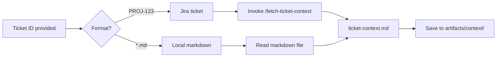
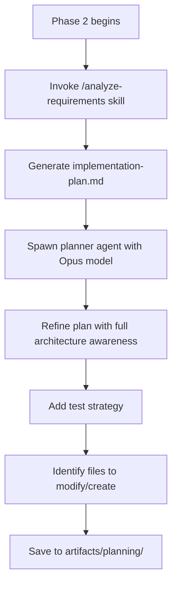
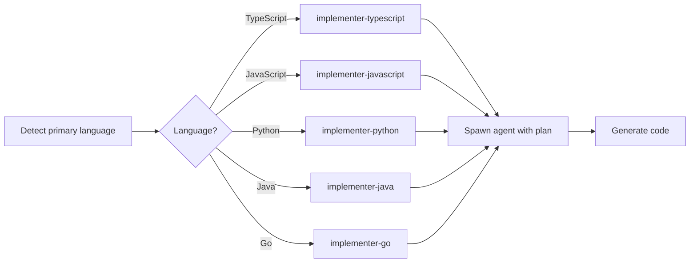
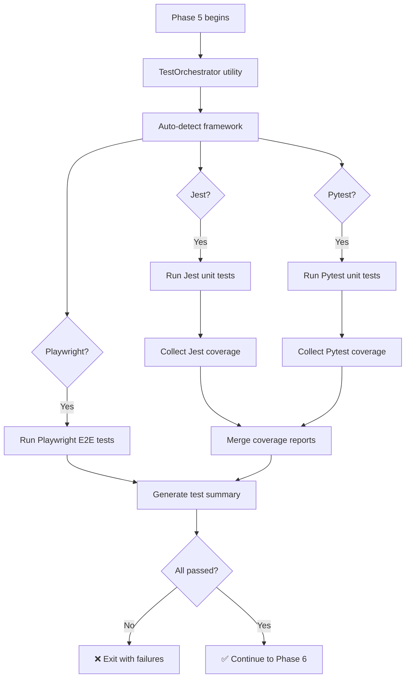
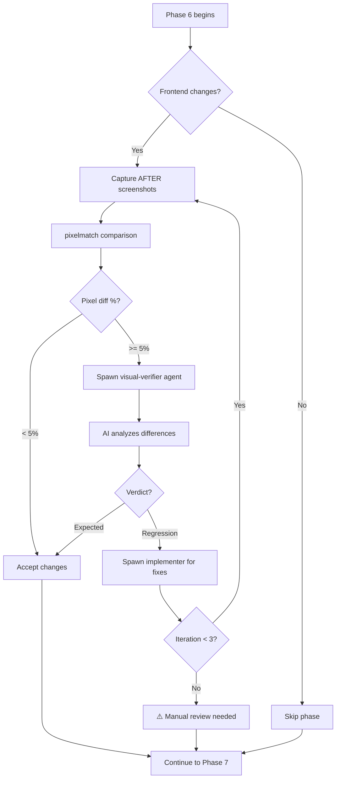
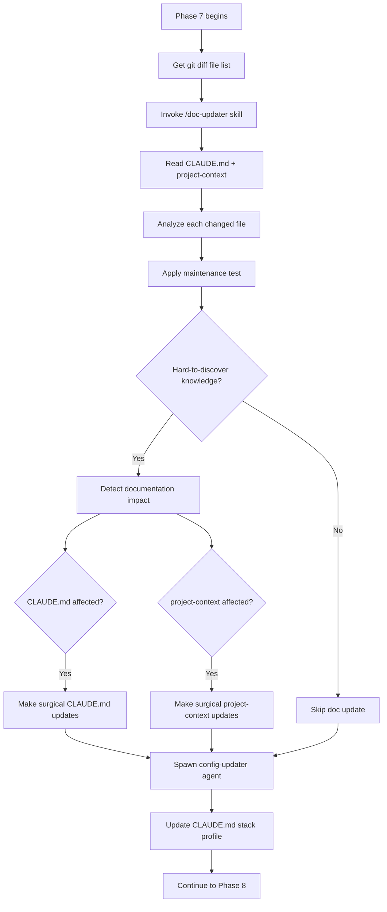
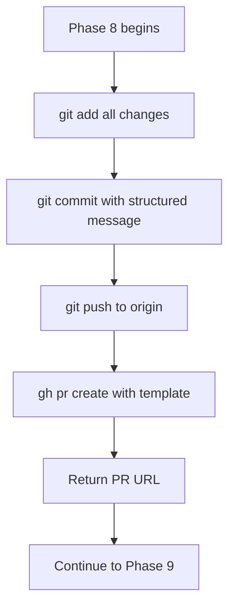
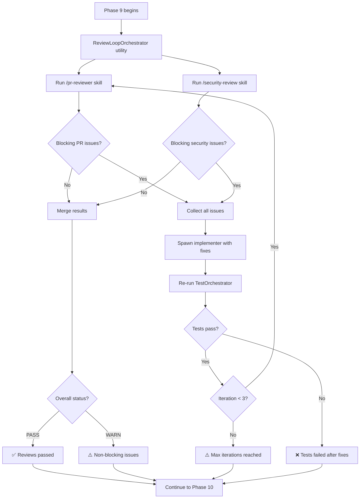

# implement-ticket Workflow Documentation

## Overview

The `/implement-ticket` skill is the complete end-to-end workflow for implementing a Jira ticket or markdown specification through all phases of the SDLC, from context gathering to PR creation and review.

**Version**: 2.0 (Skill-First Architecture)
**Last Updated**: 2026-03-13
**File**: `skills/020-development-workflow/implement-ticket/SKILL.md`

---

## Architecture Principles

### Skill-First Architecture

The refactored `implement-ticket` follows these principles:

1. **Skills over Agents**: Use skills for AI-powered analysis (e.g., doc-updater)
2. **Utilities over Agents**: Use utility classes for deterministic logic (e.g., TestOrchestrator)
3. **Agents only for Code Generation**: Spawn agents only for stack-specific code generation (planner, implementer, visual-verifier)

### Key Components

| Component | Type | Purpose | Invoked By |
|-----------|------|---------|------------|
| **TestOrchestrator** | Utility | Run all tests with coverage | Phase 5 |
| **ReviewLoopOrchestrator** | Utility | PR/security review iteration loop | Phase 9 |
| **doc-updater** | Skill | AI-powered documentation updates | Phase 7 |
| **planner** | Agent | Architecture-aware planning | Phase 2 |
| **implementer-{lang}** | Agent | Stack-specific code generation | Phase 4 |
| **visual-verifier** | Agent | Screenshot diff analysis | Phase 6 |
| **config-updater** | Agent (inline) | Update CLAUDE.md stack profile | Phase 7 |

---

## Complete Workflow (11 Phases)

```mermaid
flowchart TD
    Start([User invokes /implement-ticket TICKET-123]) --> P0[Phase 0: Pre-Flight Validation]

    P0 --> P0_Check{Environment OK?}
    P0_Check -->|No| P0_Fail[❌ Exit with errors]
    P0_Check -->|Yes| P1[Phase 1: Context Gathering]

    P1 --> P1_Source{Ticket Source?}
    P1_Source -->|Jira| P1_Jira[Invoke fetch-ticket-context skill]
    P1_Source -->|Markdown| P1_MD[Read local .md file]
    P1_Jira --> P2
    P1_MD --> P2

    P2[Phase 2: Planning & Architecture] --> P2_Analyze[Invoke analyze-requirements skill]
    P2_Analyze --> P2_Spawn[Spawn planner agent]
    P2_Spawn --> P3

    P3[Phase 3: Environment Setup] --> P3_Ports[Allocate ports for services]
    P3_Ports --> P3_Docker[Create docker-compose override]
    P3_Docker --> P3_Screen[Capture BEFORE screenshots]
    P3_Screen --> P4

    P4[Phase 4: Implementation] --> P4_Spawn[Spawn implementer-{lang} agent]
    P4_Spawn --> P4_Code[Generate code changes]
    P4_Code --> P5

    P5[Phase 5: Testing] --> P5_Orch[TestOrchestrator utility]
    P5_Orch --> P5_Unit[Run unit tests]
    P5_Orch --> P5_Int[Run integration tests]
    P5_Orch --> P5_E2E[Run E2E tests]
    P5_Unit --> P5_Cov[Collect coverage]
    P5_Int --> P5_Cov
    P5_E2E --> P5_Cov
    P5_Cov --> P5_Check{Tests pass?}
    P5_Check -->|No| P5_Fail[❌ Exit with test failures]
    P5_Check -->|Yes| P6

    P6[Phase 6: Visual Verification] --> P6_Front{Frontend changes?}
    P6_Front -->|No| P7
    P6_Front -->|Yes| P6_After[Capture AFTER screenshots]
    P6_After --> P6_Diff[Compare with BEFORE]
    P6_Diff --> P6_Pixel{Pixel diff > 5%?}
    P6_Pixel -->|No| P7
    P6_Pixel -->|Yes| P6_Agent[Spawn visual-verifier agent]
    P6_Agent --> P6_Loop{Approve or Fix?}
    P6_Loop -->|Fix| P6_Fix[Spawn implementer for visual fixes]
    P6_Fix --> P6_After
    P6_Loop -->|Approve| P7

    P7[Phase 7: Documentation Update] --> P7_Skill[Invoke /doc-updater skill]
    P7_Skill --> P7_AI[AI analyzes changed files]
    P7_AI --> P7_Test[Apply maintenance test]
    P7_Test --> P7_Update[Make surgical doc updates]
    P7_Update --> P7_Config[Spawn config-updater agent]
    P7_Config --> P8

    P8[Phase 8: PR Creation] --> P8_Commit[Git add + commit]
    P8_Commit --> P8_Push[Git push to remote]
    P8_Push --> P8_PR[Create PR via gh CLI]
    P8_PR --> P9

    P9[Phase 9: Review Loop] --> P9_Orch[ReviewLoopOrchestrator utility]
    P9_Orch --> P9_PR[Run PR review via skill]
    P9_Orch --> P9_Sec[Run security review via skill]
    P9_PR --> P9_Check{Blocking issues?}
    P9_Sec --> P9_Check
    P9_Check -->|No| P10
    P9_Check -->|Yes| P9_Fix[Spawn implementer with fixes]
    P9_Fix --> P9_Test[Re-run TestOrchestrator]
    P9_Test --> P9_Iter{Iteration < 3?}
    P9_Iter -->|Yes| P9_PR
    P9_Iter -->|No| P9_Warn[⚠️ Max iterations reached]
    P9_Warn --> P10

    P10[Phase 10: Cleanup] --> P10_Tear[Teardown docker override]
    P10_Tear --> P10_Archive[Archive artifacts]
    P10_Archive --> Done([✅ Complete])

    P0_Fail --> End([End])
    P5_Fail --> End
    Done --> End
```

---

## Phase-by-Phase Breakdown

### Phase 0: Pre-Flight Validation

**Goal**: Ensure environment is ready before starting work.

**Actions**:
1. Check git repository status (clean working tree)
2. Verify test commands exist and work
3. Verify build commands exist and work
4. Detect primary language and stack

**TodoWrite Integration**:
```json
{
  "content": "Validate environment and detect stack",
  "status": "in_progress|completed",
  "activeForm": "Validating environment and detecting stack"
}
```

**Exit Conditions**:
- ❌ Fail if git is dirty (uncommitted changes)
- ❌ Fail if test command doesn't exist
- ❌ Fail if build command doesn't exist

---

### Phase 1: Context Gathering

**Goal**: Gather all context from Jira, Confluence, Notion, or local markdown.

**Decision Tree**:


**Skill Invocation**:
```bash
# If Jira ticket (e.g., PROJ-123)
/fetch-ticket-context --ticket-id "$TICKET_ID" --output "$ARTIFACTS_DIR/context/ticket-context.md"

# If local markdown
cp "$TICKET_ID" "$ARTIFACTS_DIR/context/ticket-context.md"
```

**TodoWrite Integration**:
```json
{
  "content": "Gather context from Jira/Markdown and external documentation",
  "status": "in_progress|completed",
  "activeForm": "Gathering context from Jira/Markdown and external documentation"
}
```

**Outputs**:
- `$ARTIFACTS_DIR/context/ticket-context.md`
- `$ARTIFACTS_DIR/context/confluence-docs.md` (if applicable)
- `$ARTIFACTS_DIR/context/related-tickets.json` (if Jira)

---

### Phase 2: Planning & Architectural Design

**Goal**: Create detailed implementation plan with test strategy.

**Two-Step Process**:


**Agent Spawning**:
```bash
claude-agent spawn planner \
  --model opus \
  --context "$ARTIFACTS_DIR/context/ticket-context.md" \
  --context "$ARTIFACTS_DIR/planning/implementation-plan.md" \
  --output "$ARTIFACTS_DIR/planning/detailed-plan.md"
```

**TodoWrite Integration**:
```json
{
  "content": "Create implementation plan with test strategy",
  "status": "in_progress|completed",
  "activeForm": "Creating implementation plan with test strategy"
}
```

**Outputs**:
- `$ARTIFACTS_DIR/planning/implementation-plan.md` (from analyze-requirements)
- `$ARTIFACTS_DIR/planning/detailed-plan.md` (from planner agent)
- `$ARTIFACTS_DIR/planning/test-strategy.md`
- `$ARTIFACTS_DIR/planning/files-to-modify.json`

---

### Phase 3: Environment Setup

**Goal**: Isolate environment, allocate ports, capture baseline state.

**Actions**:
1. **Port Allocation**: Reserve ports for new services
2. **Docker Override**: Create `docker-compose.override.yml` with allocated ports
3. **Baseline Screenshots**: Capture BEFORE state (frontend only)

**Port Allocation Logic**:
```bash
# Find available ports starting from 3000
ALLOCATED_PORTS=$(node -e "
const startPort = 3000;
const needed = 3; // Number of services needing ports
const ports = [];
for (let i = 0; i < needed; i++) {
  const port = startPort + i;
  // Check if port is available
  ports.push(port);
}
console.log(JSON.stringify(ports));
")
```

**TodoWrite Integration**:
```json
{
  "content": "Set up isolated environment and capture before screenshots",
  "status": "in_progress|completed",
  "activeForm": "Setting up isolated environment and capturing before screenshots"
}
```

**Outputs**:
- `docker-compose.override.yml`
- `$ARTIFACTS_DIR/environment/allocated-ports.json`
- `$ARTIFACTS_DIR/screenshots/before/*.png` (if frontend)

---

### Phase 4: Implementation

**Goal**: Generate all code changes with unit and integration tests.

**Agent Selection**:


**Agent Spawning**:
```bash
claude-agent spawn implementer-$PRIMARY_LANGUAGE \
  --model sonnet \
  --context "$ARTIFACTS_DIR/planning/detailed-plan.md" \
  --context "$ARTIFACTS_DIR/context/ticket-context.md" \
  --output "$ARTIFACTS_DIR/implementations/implementation-log.md"
```

**TodoWrite Integration**:
```json
{
  "content": "Implement code changes with unit and integration tests",
  "status": "in_progress|completed",
  "activeForm": "Implementing code changes with unit and integration tests"
}
```

**Outputs**:
- Modified/created source files
- Unit test files
- Integration test files
- `$ARTIFACTS_DIR/implementations/implementation-log.md`

---

### Phase 5: Testing

**Goal**: Run all tests (unit, integration, E2E) with coverage collection.

**TestOrchestrator Workflow**:


**Utility Invocation**:
```bash
node -e "
const { TestOrchestrator } = require('$UTILS_DIR/test-orchestrator.js');

const orchestrator = new TestOrchestrator(process.cwd(), {
    collectCoverage: true,
    onlyNew: false,
    timeout: 600000,
    artifactDir: '$ARTIFACTS_DIR/tests'
});

orchestrator.runAll().then(results => {
    require('fs').writeFileSync(
        '$ARTIFACTS_DIR/tests/test-results.json',
        JSON.stringify(results, null, 2)
    );
});
"
```

**TodoWrite Integration**:
```json
{
  "content": "Run all tests (unit, integration, E2E) and check coverage",
  "status": "in_progress|completed",
  "activeForm": "Running all tests and checking coverage"
}
```

**Outputs**:
- `$ARTIFACTS_DIR/tests/test-results.json`
- `$ARTIFACTS_DIR/tests/coverage/`
- `$ARTIFACTS_DIR/tests/unit-results.xml`
- `$ARTIFACTS_DIR/tests/e2e-results.xml`

**Exit Conditions**:
- ❌ Fail if any test fails
- ❌ Fail if coverage drops below threshold

---

### Phase 6: Visual Verification

**Goal**: Compare UI screenshots and fix visual regressions.

**Conditional Execution**:
- Only runs if frontend files were modified
- Only runs if BEFORE screenshots exist

**Workflow**:


**Agent Spawning** (if needed):
```bash
claude-agent spawn visual-verifier-$TICKET_ID \
  --model opus \
  --context "$ARTIFACTS_DIR/screenshots/diff-report.json" \
  --output "$ARTIFACTS_DIR/visual-verification/verdict.json"
```

**TodoWrite Integration**:
```json
{
  "content": "Capture and compare screenshots with iteration loop",
  "status": "in_progress|completed",
  "activeForm": "Capturing and comparing screenshots"
}
```

**Outputs**:
- `$ARTIFACTS_DIR/screenshots/after/*.png`
- `$ARTIFACTS_DIR/screenshots/diff/*.png`
- `$ARTIFACTS_DIR/visual-verification/diff-report.json`
- `$ARTIFACTS_DIR/visual-verification/verdict.json`

---

### Phase 7: Documentation Update

**Goal**: Update CLAUDE.md and project-context based on code changes.

**doc-updater Skill Workflow**:


**Skill Invocation**:
```bash
# Export env vars for skill
export TICKET_ID="$TICKET_ID"
export ARTIFACTS_DIR="$ARTIFACTS_DIR"
export CHANGED_FILES="$(git diff --name-only origin/main...HEAD)"

# Invoke skill
/doc-updater
```

**TodoWrite Integration**:
```json
{
  "content": "Update documentation",
  "status": "in_progress|completed",
  "activeForm": "Updating documentation"
}
```

**Outputs**:
- Updated `.claude/CLAUDE.md` (if changes needed)
- Updated `.claude/skills/project-context/SKILL.md` (if changes needed)
- `$ARTIFACTS_DIR/documentation/doc-update-analysis.json`

---

### Phase 8: PR Creation

**Goal**: Commit changes and create pull request.

**Workflow**:


**Commit Message Format**:
```
feat(PROJ-123): Brief summary of changes

- Detailed change 1
- Detailed change 2
- Detailed change 3

Test Plan:
- [ ] Unit tests passing
- [ ] Integration tests passing
- [ ] E2E tests passing

🤖 Generated with Claude Code
Co-Authored-By: Claude Sonnet 4.5 <noreply@anthropic.com>
```

**TodoWrite Integration**:
```json
{
  "content": "Collect artifacts and create pull request",
  "status": "in_progress|completed",
  "activeForm": "Collecting artifacts and creating pull request"
}
```

**Outputs**:
- Git commit
- Git push
- Pull request created
- `$ARTIFACTS_DIR/pr-url.txt`

---

### Phase 9: Review Loop

**Goal**: Run PR review and security review with automated fix iterations.

**ReviewLoopOrchestrator Workflow**:


**Utility Invocation**:
```bash
node -e "
const { ReviewLoopOrchestrator } = require('$UTILS_DIR/review-loop-orchestrator.js');

const orchestrator = new ReviewLoopOrchestrator(process.cwd(), '$TICKET_ID');

orchestrator.orchestrate().then(result => {
    require('fs').writeFileSync(
        '$ARTIFACTS_DIR/review-loop-result.json',
        JSON.stringify(result, null, 2)
    );
});
"
```

**TodoWrite Integration**:
```json
{
  "content": "Run PR review loop with automated fixes",
  "status": "in_progress|completed",
  "activeForm": "Running PR review loop with automated fixes"
}
```

**Outputs**:
- `$ARTIFACTS_DIR/reviews/pr-review.json`
- `$ARTIFACTS_DIR/reviews/security-review.json`
- `$ARTIFACTS_DIR/review-loop-result.json`
- Additional commits if fixes applied

---

### Phase 10: Cleanup

**Goal**: Teardown isolated environment and archive artifacts.

**Actions**:
1. Remove `docker-compose.override.yml`
2. Archive all artifacts to zip file
3. Print summary report

**TodoWrite Integration**:
```json
{
  "content": "Tear down environment and archive artifacts",
  "status": "in_progress|completed",
  "activeForm": "Tearing down environment and archiving artifacts"
}
```

**Outputs**:
- Deleted `docker-compose.override.yml`
- `$ARTIFACTS_DIR.zip`
- Summary printed to console

---

## Artifact Structure

All artifacts are stored in `.claude/artifacts/$TICKET_ID/`:

```
.claude/artifacts/PROJ-123/
├── context/
│   ├── ticket-context.md
│   ├── confluence-docs.md
│   └── related-tickets.json
├── planning/
│   ├── implementation-plan.md
│   ├── detailed-plan.md
│   ├── test-strategy.md
│   └── files-to-modify.json
├── environment/
│   └── allocated-ports.json
├── screenshots/
│   ├── before/
│   │   ├── homepage.png
│   │   └── dashboard.png
│   ├── after/
│   │   ├── homepage.png
│   │   └── dashboard.png
│   └── diff/
│       ├── homepage-diff.png
│       └── dashboard-diff.png
├── implementations/
│   └── implementation-log.md
├── tests/
│   ├── test-results.json
│   ├── coverage/
│   ├── unit-results.xml
│   └── e2e-results.xml
├── visual-verification/
│   ├── diff-report.json
│   └── verdict.json
├── documentation/
│   └── doc-update-analysis.json
├── reviews/
│   ├── pr-review.json
│   └── security-review.json
├── review-loop-result.json
└── pr-url.txt
```

---

## Usage Examples

### Basic Usage

```bash
# Jira ticket
/implement-ticket PROJ-123

# Local markdown
/implement-ticket ./specs/feature-xyz.md
```

### With Environment Variables

```bash
# Override default branch
export BASE_BRANCH="develop"
/implement-ticket PROJ-456

# Skip visual verification
export SKIP_VISUAL_VERIFICATION="true"
/implement-ticket PROJ-789
```

---

## Exit Codes

| Code | Meaning |
|------|---------|
| 0 | Success - all phases completed |
| 1 | Pre-flight validation failed |
| 2 | Context gathering failed |
| 3 | Planning failed |
| 4 | Implementation failed |
| 5 | Tests failed |
| 6 | Visual verification failed (critical) |
| 7 | Documentation update failed |
| 8 | PR creation failed |
| 9 | Review loop failed |
| 10 | Cleanup failed |

---

## Troubleshooting

### Tests Failing in Phase 5

**Problem**: TestOrchestrator reports test failures.

**Solution**:
1. Check `$ARTIFACTS_DIR/tests/test-results.json` for details
2. Run tests manually: `npm test` or `pytest`
3. Fix failing tests
4. Re-run `/implement-ticket`

### Visual Verification Stuck in Loop

**Problem**: Phase 6 keeps spawning visual-verifier agent.

**Solution**:
1. Check `$ARTIFACTS_DIR/screenshots/diff/` for actual differences
2. If expected, manually approve by setting `SKIP_VISUAL_VERIFICATION=true`
3. If bug, fix visual issues manually

### Doc Updater Not Updating Docs

**Problem**: Phase 7 completes but no doc changes.

**Solution**:
1. Check `$ARTIFACTS_DIR/documentation/doc-update-analysis.json`
2. Verify maintenance test: "Would new endpoint need this?"
3. If yes, content shouldn't be in docs (by design)
4. If no, skill correctly identified no hard-to-discover knowledge changed

### Review Loop Max Iterations

**Problem**: Phase 9 hits 3-iteration limit.

**Solution**:
1. Check `$ARTIFACTS_DIR/reviews/pr-review.json` for persistent issues
2. Review `$ARTIFACTS_DIR/review-loop-result.json` for iteration history
3. Fix issues manually
4. Re-run review: `/pr-reviewer`

---

## Performance Metrics

Typical execution times per phase:

| Phase | Avg Time | Max Time | Notes |
|-------|----------|----------|-------|
| 0 | 10s | 30s | Depends on project size |
| 1 | 30s | 2m | Depends on Jira API |
| 2 | 2m | 5m | Opus model (planner) |
| 3 | 20s | 1m | Port allocation |
| 4 | 5m | 15m | Code generation |
| 5 | 3m | 10m | Test execution |
| 6 | 2m | 10m | Visual verification |
| 7 | 1m | 3m | Doc analysis |
| 8 | 30s | 1m | PR creation |
| 9 | 3m | 15m | Review + iterations |
| 10 | 10s | 30s | Cleanup |
| **Total** | **~17m** | **~63m** | Full workflow |

---

## Version History

### 2.0 (2026-03-13) - Skill-First Architecture

- ✅ Removed agent spawning for testing (→ TestOrchestrator)
- ✅ Removed agent spawning for doc updates (→ doc-updater skill)
- ✅ Removed agent spawning for reviews (→ ReviewLoopOrchestrator)
- ✅ Added TodoWrite integration (11 phases)
- ✅ Added Phase 0 (pre-flight validation)
- ✅ Added Phase 3 (environment setup)
- ✅ Added Phase 6 (visual verification)
- ✅ Added Phase 9 (review loop)
- ✅ Added Phase 10 (cleanup)

### 1.0 (2026-03-10) - Agent-Heavy Architecture

- Initial version with 7 agent types
- No TodoWrite integration
- 6 phases only

---

**For more details, see**:
- `SKILLS_AND_AGENTS_MAP.md` - Complete architecture overview
- `skills/020-development-workflow/implement-ticket/SKILL.md` - Source implementation
- `REFACTOR_PROGRESS.md` - Refactor history
