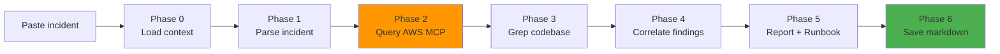

# Triage Incident Command (`/triage-incident`)

AI-powered incident triage and root cause analysis. Paste an error, alert, or outage description — the framework queries AWS for live observability data, greps the codebase for evidence, correlates findings, and produces a structured diagnosis, step-by-step runbook, and a saved markdown report.

---

## Table of Contents

1. [How it works](#how-it-works)
2. [Quick start](#quick-start)
3. [MCP Setup — Datadog](#mcp-setup--datadog)
4. [MCP Setup — AWS](#mcp-setup--aws)
5. [MCP Setup — Atlassian / Confluence](#mcp-setup--atlassian--confluence)
6. [Degraded mode — what happens without MCP](#degraded-mode--what-happens-without-mcp)
7. [Output — saved triage report](#output--saved-triage-report)
8. [IAM permissions required](#iam-permissions-required)
9. [What to paste for best results](#what-to-paste-for-best-results)

---

## How it works



| Phase | What it does | Requires MCP? |
|-------|-------------|---------------|
| 0 — Load context | Reads `{{CONFIG_DIR}}/{{INSTRUCTION_FILE}}` for architecture and stack | No |
| 1 — Parse incident | Extracts error messages, service name, timeline, recent changes | No |
| 2a–2e — Query AWS | CloudWatch alarms/metrics/logs, ECS/EKS/RDS status, CloudTrail events | AWS MCP |
| 2f — Query Confluence | Existing runbooks, past incidents, architecture docs | Atlassian MCP |
| 2g — Query Datadog | Active monitors, incidents, logs, APM traces, deployment events | Datadog MCP |
| 3 — Explore codebase | Greps for error origin, checks config limits, infra definitions | No |
| 4 — Correlate | Combines all signals + codebase evidence into root cause | No |
| 5 — Report + Runbook | Structured triage incident report with copy-pasteable runbook | No |
| 6 — Save markdown | Writes report to `.claude/triage-reports/` | No |

---

## Quick start

Open Claude Code in your service repository and run:

```
/triage-incident [paste your incident here]
```

Example:
```
/triage-incident ECS service api-gateway throwing 502s since 14:30 UTC.
ALB shows 3/10 healthy hosts. CPU at 95% on all tasks.
Started after deploy v2.4.0. CloudWatch alarm: api-gateway-cpu-high.
Error in logs: "Cannot read properties of undefined (reading 'userId')"
```

The report is saved automatically to `.claude/triage-reports/YYYY-MM-DD-api-gateway-triage.md`.

---

## MCP Setup — Datadog

Datadog MCP is the **official server published by Datadog** — no local install needed. It's a remote HTTP MCP that connects Claude directly to your Datadog account via OAuth or API key.

When configured, Phase 2g queries:
- Active monitors in ALERT/WARN state for the affected service
- Open incidents matching the service or severity
- Logs filtered by the error message and time window
- APM spans/traces showing slow or erroring calls
- Deployment events that correlate with the incident timeline

**Rate limits:** 50 req/10s · 5 000 tool calls/day · 50 000/month

### Step 1 — Find your regional endpoint

The Datadog MCP endpoint depends on your Datadog site. Check your site at `https://docs.datadoghq.com/bits_ai/mcp_server/setup/` using the site selector, or use the table below:

| Datadog site | Endpoint URL |
|---|---|
| `app.datadoghq.com` (US1) | `https://mcp.datadoghq.com/api/unstable/mcp-server/mcp` |
| `us3.datadoghq.com` (US3) | `https://mcp.us3.datadoghq.com/api/unstable/mcp-server/mcp` |
| `us5.datadoghq.com` (US5) | `https://mcp.us5.datadoghq.com/api/unstable/mcp-server/mcp` |
| `app.datadoghq.eu` (EU1) | `https://mcp.datadoghq.eu/api/unstable/mcp-server/mcp` |
| `ap1.datadoghq.com` (AP1) | `https://mcp.ap1.datadoghq.com/api/unstable/mcp-server/mcp` |

> **Note:** The path `/api/unstable/mcp-server/mcp` is the current endpoint as of April 2026 — Datadog may stabilize this under a versioned path. Check [their setup docs](https://docs.datadoghq.com/bits_ai/mcp_server/setup/) if the URL stops working.

### Step 2 — Add Datadog MCP via Claude Code CLI

**Option A — OAuth (recommended, opens browser to authenticate):**

```bash
claude mcp add --transport http datadog-mcp https://mcp.datadoghq.com/api/unstable/mcp-server/mcp
```

On first use Claude Code opens a browser login to your Datadog account. No credentials stored locally.

**Option B — API key (no browser, suitable for headless/CI environments):**

You need a Datadog **API key** and an **Application key**:
- API key: `https://app.datadoghq.com/organization-settings/api-keys`
- Application key: `https://app.datadoghq.com/organization-settings/application-keys`

```bash
claude mcp add --transport http \
  -H "DD-API-KEY: your-api-key" \
  -H "DD-APPLICATION-KEY: your-app-key" \
  datadog-mcp "https://mcp.datadoghq.com/api/unstable/mcp-server/mcp?toolsets=all"
```

To enable all toolsets (recommended — gives Claude access to monitors, incidents, APM, logs, dashboards, and more):

```bash
claude mcp add --transport http \
  -H "DD-API-KEY: your-api-key" \
  -H "DD-APPLICATION-KEY: your-app-key" \
  datadog-mcp "https://mcp.datadoghq.com/api/unstable/mcp-server/mcp?toolsets=all"
```

For a targeted triage-incident-only surface (monitors + alerting + APM + logs):

```bash
claude mcp add --transport http \
  -H "DD-API-KEY: your-api-key" \
  -H "DD-APPLICATION-KEY: your-app-key" \
  datadog-mcp "https://mcp.datadoghq.com/api/unstable/mcp-server/mcp?toolsets=core,alerting,apm"
```

<details>
<summary>Manual JSON alternative (settings.local.json / settings.json)</summary>

```json
{
  "mcpServers": {
    "datadog-mcp": {
      "type": "http",
      "url": "https://mcp.datadoghq.com/api/unstable/mcp-server/mcp?toolsets=all",
      "headers": {
        "DD-API-KEY": "your-api-key",
        "DD-APPLICATION-KEY": "your-app-key"
      }
    }
  }
}
```

</details>

### Toolsets reference

| Toolset | What it adds | Useful for triage incident? |
|---------|-------------|------------------------|
| `core` | Logs, metrics, traces, monitors, incidents, events, hosts | ✅ Essential |
| `alerting` | Monitor search/create/validate, SLOs | ✅ Essential |
| `apm` | Span search, trace comparison, Watchdog insights | ✅ High value |
| `dashboards` | Dashboard read/write | Optional |
| `cases` | Case management + Jira integration | Optional |
| `error-tracking` | RUM/log/trace error grouping | ✅ High value |
| `software-delivery` | CI/CD pipeline visibility | Optional |
| `security` | Security signals and findings | Optional |
| `all` | Everything above | Use in Claude Code (supports tool filtering) |

### Step 3 — Required Datadog permissions

The API key's user/service account needs:
- `mcp_read` permission (required for all read tool calls)
- `mcp_write` permission (required for create/update tools — optional for triage-incident-only use)
- Resource-level read permissions for the toolsets you enable (monitors read, logs read, APM read, etc.)

### Step 4 — Restart Claude Code

### Step 5 — Verify Datadog MCP is active

Run `/mcp` — `datadog-mcp` should appear as **connected**.

> **Note:** Not supported on `app.ddog-gov.com` (GovCloud). For HIPAA accounts, verify your Claude Code deployment meets compliance requirements before connecting.

---

## MCP Setup — AWS

AWS MCP gives the command live access to CloudWatch, ECS/EKS, RDS, and CloudTrail.

### Config scopes

`claude mcp add` supports three scopes — pick one based on where you want the config to live:

| Scope | Flag | Config file written | Use when |
|-------|------|---------------------|----------|
| `local` (default) | _(omit flag)_ | `.claude/settings.local.json` | Per-project, not committed to git |
| `project` | `--scope project` | `.mcp.json` | Per-project, committed to git (shared with team) |
| `user` | `--scope user` | `~/.claude/settings.json` | Global, applies to all projects |

### Step 1 — Install uv

```bash
curl -LsSf https://astral.sh/uv/install.sh | sh
```

### Step 2 — Add AWS MCP servers via Claude Code CLI

Run these commands from the root of your project (replace `your-profile-name` and `us-east-1` with your values):

```bash
# Core AWS MCP server
claude mcp add \
  -e AWS_PROFILE=your-profile-name \
  -e AWS_REGION=us-east-1 \
  -e FASTMCP_LOG_LEVEL=ERROR \
  awslabs.core-mcp-server -- uvx awslabs.core-mcp-server@latest

# CloudWatch Logs MCP server
claude mcp add \
  -e AWS_PROFILE=your-profile-name \
  -e AWS_REGION=us-east-1 \
  -e FASTMCP_LOG_LEVEL=ERROR \
  awslabs.cloudwatch-logs-mcp-server -- uvx awslabs.cloudwatch-logs-mcp-server@latest
```

This writes to `.claude/settings.local.json` (local scope, not committed). To share with the team via `.mcp.json`, add `--scope project`:

```bash
claude mcp add --scope project \
  -e AWS_PROFILE=your-profile-name \
  -e AWS_REGION=us-east-1 \
  -e FASTMCP_LOG_LEVEL=ERROR \
  awslabs.core-mcp-server -- uvx awslabs.core-mcp-server@latest

claude mcp add --scope project \
  -e AWS_PROFILE=your-profile-name \
  -e AWS_REGION=us-east-1 \
  -e FASTMCP_LOG_LEVEL=ERROR \
  awslabs.cloudwatch-logs-mcp-server -- uvx awslabs.cloudwatch-logs-mcp-server@latest
```

To apply globally across all projects, use `--scope user`:

```bash
claude mcp add --scope user \
  -e AWS_PROFILE=your-profile-name \
  -e AWS_REGION=us-east-1 \
  -e FASTMCP_LOG_LEVEL=ERROR \
  awslabs.core-mcp-server -- uvx awslabs.core-mcp-server@latest

claude mcp add --scope user \
  -e AWS_PROFILE=your-profile-name \
  -e AWS_REGION=us-east-1 \
  -e FASTMCP_LOG_LEVEL=ERROR \
  awslabs.cloudwatch-logs-mcp-server -- uvx awslabs.cloudwatch-logs-mcp-server@latest
```

<details>
<summary>Manual JSON alternative</summary>

Edit the appropriate settings file directly and add under `mcpServers`:

```json
{
  "mcpServers": {
    "awslabs.core-mcp-server": {
      "command": "uvx",
      "args": ["awslabs.core-mcp-server@latest"],
      "env": {
        "AWS_PROFILE": "your-profile-name",
        "AWS_REGION": "us-east-1",
        "FASTMCP_LOG_LEVEL": "ERROR"
      }
    },
    "awslabs.cloudwatch-logs-mcp-server": {
      "command": "uvx",
      "args": ["awslabs.cloudwatch-logs-mcp-server@latest"],
      "env": {
        "AWS_PROFILE": "your-profile-name",
        "AWS_REGION": "us-east-1",
        "FASTMCP_LOG_LEVEL": "ERROR"
      }
    }
  }
}
```

Files: `.claude/settings.local.json` (local), `.mcp.json` (project), `~/.claude/settings.json` (user).

</details>

### Step 3 — Verify AWS credentials

```bash
aws sts get-caller-identity --profile your-profile-name
```

Expected output:
```json
{
    "UserId": "AIDA...",
    "Account": "123456789012",
    "Arn": "arn:aws:iam::123456789012:user/yourname"
}
```

If it fails: run `aws configure` for static credentials or `aws sso login --profile your-profile-name` for SSO.

### Step 4 — Restart Claude Code

MCP servers load at startup — restart is required after any config change.

### Step 5 — Verify MCP is active

In Claude Code, run `/mcp`. You should see both servers listed as **connected**:
```
✓ awslabs.core-mcp-server
✓ awslabs.cloudwatch-logs-mcp-server
```

---

## MCP Setup — Atlassian / Confluence

Confluence MCP lets the command search existing runbooks, past incident reports, and architecture docs for the affected service. **Optional but strongly recommended** for teams that document incidents in Confluence.

> **Already using the built-in Atlassian integration?** If your Claude Code session already shows `mcp__claude_ai_Atlassian__*` tools (visible in `/mcp`), Phase 2f will use those automatically — no extra setup needed. The steps below are for adding a self-hosted Confluence MCP server instead.

### Step 1 — Get an Atlassian API token

1. Go to: `https://id.atlassian.com/manage-profile/security/api-tokens`
2. Click **Create API token**
3. Give it a name (e.g. `claude-triage-incident`)
4. Copy the token — you won't see it again

### Step 2 — Add Confluence MCP via Claude Code CLI

Run from the root of your project (replace values with your own):

```bash
claude mcp add \
  -e ATLASSIAN_SITE_NAME=your-company \
  -e ATLASSIAN_USER_EMAIL=you@company.com \
  -e ATLASSIAN_API_TOKEN=your-api-token \
  confluence -- npx -y @aashari/mcp-server-atlassian-confluence
```

This writes to `.claude/settings.local.json` (local, not committed). Use `--scope project` to share via `.mcp.json` or `--scope user` for all projects:

```bash
# Shared with team (committed to git)
claude mcp add --scope project \
  -e ATLASSIAN_SITE_NAME=your-company \
  -e ATLASSIAN_USER_EMAIL=you@company.com \
  -e ATLASSIAN_API_TOKEN=your-api-token \
  confluence -- npx -y @aashari/mcp-server-atlassian-confluence

# Global (all projects)
claude mcp add --scope user \
  -e ATLASSIAN_SITE_NAME=your-company \
  -e ATLASSIAN_USER_EMAIL=you@company.com \
  -e ATLASSIAN_API_TOKEN=your-api-token \
  confluence -- npx -y @aashari/mcp-server-atlassian-confluence
```

Replace:
- `your-company` → your Atlassian subdomain (e.g. `acme` for `acme.atlassian.net`)
- `you@company.com` → your Atlassian account email
- `your-api-token` → the token from Step 1

<details>
<summary>Manual JSON alternative</summary>

Edit the appropriate settings file and add under `mcpServers`:

```json
{
  "mcpServers": {
    "confluence": {
      "command": "npx",
      "args": ["-y", "@aashari/mcp-server-atlassian-confluence"],
      "env": {
        "ATLASSIAN_SITE_NAME": "your-company",
        "ATLASSIAN_USER_EMAIL": "you@company.com",
        "ATLASSIAN_API_TOKEN": "your-api-token"
      }
    }
  }
}
```

</details>

### Step 3 — Restart Claude Code

### Step 4 — Verify Confluence MCP is active

Run `/mcp` — `confluence` should appear as **connected**.

---

## Degraded mode — what happens without MCP

All MCPs are **optional**. The command degrades gracefully and always produces a complete report — it just relies on codebase evidence instead of live observability data.

| MCP missing | Phases affected | What the command does instead | Impact on output |
|-------------|----------------|-------------------------------|-----------------|
| Datadog MCP | Phase 2g | Skips monitor/incident/APM queries. States "Datadog MCP not configured." | No live Datadog signals. If AWS MCP is present, CloudWatch fills the gap. |
| AWS MCP | Phase 2a–2e | Skips CloudWatch, ECS/RDS queries. States "AWS MCP not configured." | No live AWS metrics or log data. Root cause based on codebase only. Confidence set to MEDIUM or LOW. |
| Atlassian MCP | Phase 2f | Skips Confluence search. States "Confluence MCP not available." | No historical incident context or existing runbooks. |
| All missing | Phases 2a–2g | Skips all live data queries. | Full report generated from codebase grep + incident description. Confidence typically LOW–MEDIUM. Runbook uses inferred values. |

### What a codebase-only report looks like

When AWS MCP is not configured, the report still includes:

- **Root cause**: inferred from the error string, config files, and infra definitions found in the repo
- **Runbook**: all commands are present but values derived from code instead of live API (e.g. task definition CPU/memory comes from the ECS task def file, not the running service)
- **Confidence**: LOW if no direct evidence found, MEDIUM if error string located in code
- **Note at top**: "AWS MCP not configured — analysis based on codebase only. For live metrics, see [MCP Setup docs](./TRIAGE_INCIDENT.md#mcp-setup--aws)."

### Recommended minimum setup

For a useful triage incident report without any MCP:
1. Run `initialize-project` on the repo first — gives Claude the architecture context
2. Paste the full error message and stack trace
3. Include the deploy version or commit SHA if known

This produces a MEDIUM-confidence report in most cases.

---

## Output — saved triage report

At the end of every run, Phase 6 writes the report to disk regardless of MCP availability.

**Location:**
```
{project-root}/.claude/triage-reports/YYYY-MM-DD-{service}-triage.md
```

**Example:**
```
.claude/triage-reports/2026-04-27-api-gateway-triage.md
```

**Report structure:**
```markdown
## Incident Report

Date: 2026-04-27T15:42:00Z
Severity: 🔴 CRITICAL
Status: 🔥 ONGOING

### Summary
api-gateway ECS tasks crash-looping due to null dereference in auth middleware...

### Root Cause
...

### Affected Resources
| Resource | Type | Region | Status |
...

### Timeline
...

### Runbook — Step by Step
...

### Prevention
...

### What to watch after resolution
...
```

---

## IAM permissions required

The AWS profile used by the MCP servers needs read-only access:

```json
{
  "Version": "2012-10-17",
  "Statement": [
    {
      "Effect": "Allow",
      "Action": [
        "cloudwatch:DescribeAlarms",
        "cloudwatch:GetMetricStatistics",
        "cloudwatch:GetMetricData",
        "logs:DescribeLogGroups",
        "logs:FilterLogEvents",
        "logs:GetLogEvents",
        "ecs:DescribeServices",
        "ecs:DescribeTasks",
        "ecs:ListTasks",
        "ecs:DescribeTaskDefinition",
        "eks:DescribeCluster",
        "rds:DescribeDBInstances",
        "rds:DescribeDBClusters",
        "cloudtrail:LookupEvents",
        "ec2:DescribeInstances"
      ],
      "Resource": "*"
    }
  ]
}
```

All actions are read-only (`Describe`, `Get`, `List`, `Filter`, `Lookup`). No write permissions needed.

---

## What to paste for best results

Include as many of these as possible:

| Signal | Example |
|--------|---------|
| Exact error message | `"Cannot read properties of undefined (reading 'userId')"` |
| Stack trace | Full trace with file paths and line numbers |
| Service / component name | `api-gateway`, `payment-worker`, `auth-service` |
| When it started | `"14:30 UTC"` or `"after deploy v2.4.0"` |
| Environment | `prod`, `staging`, `us-east-1` |
| Recent changes | deploy version, config change, migration, traffic spike |
| CloudWatch alarm name | `api-gateway-cpu-high` |
| AWS region | `us-east-1` |

The more context you provide, the higher the confidence level in the root cause.
