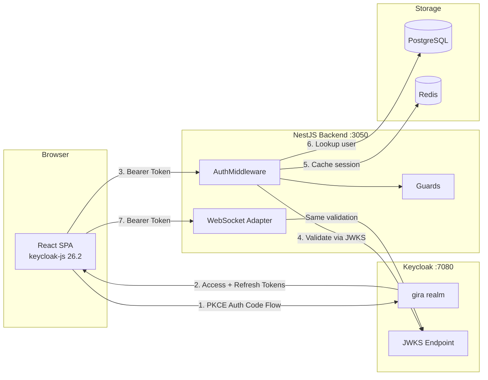
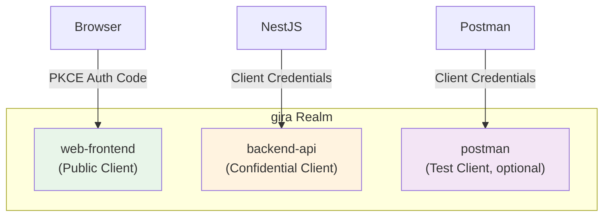
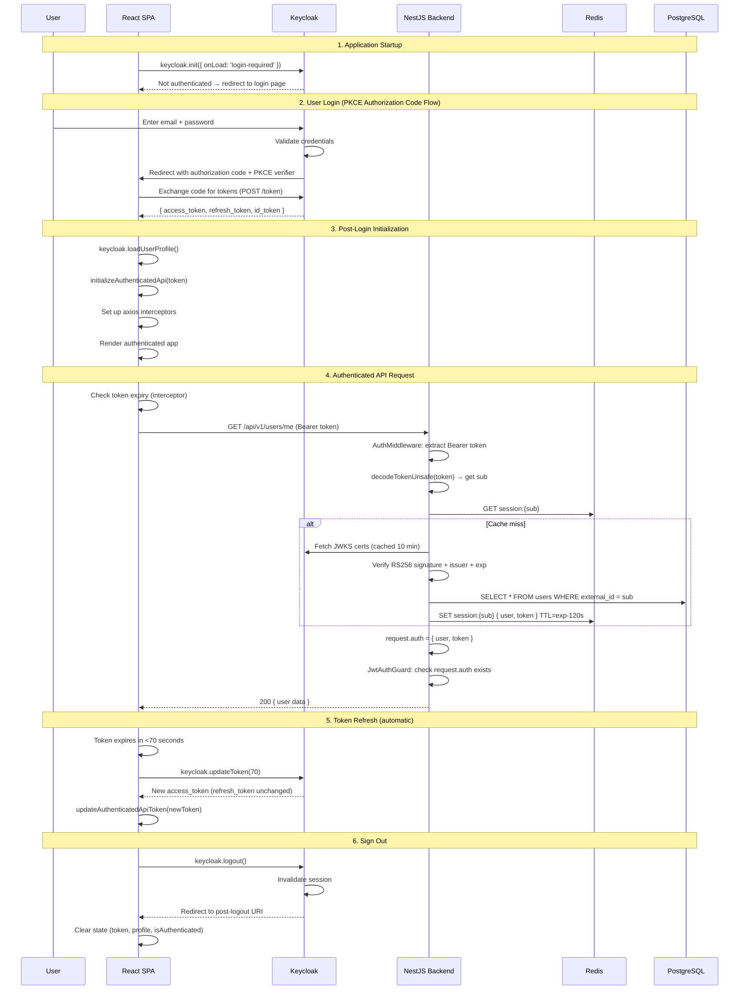
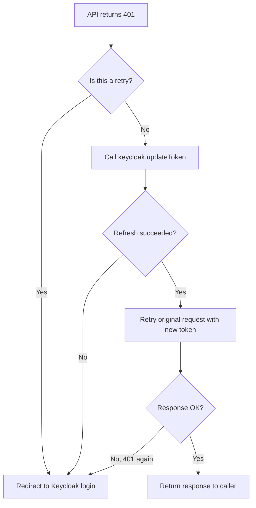
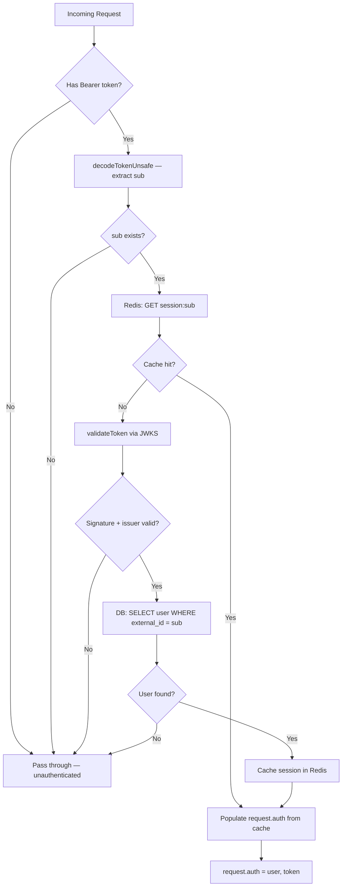
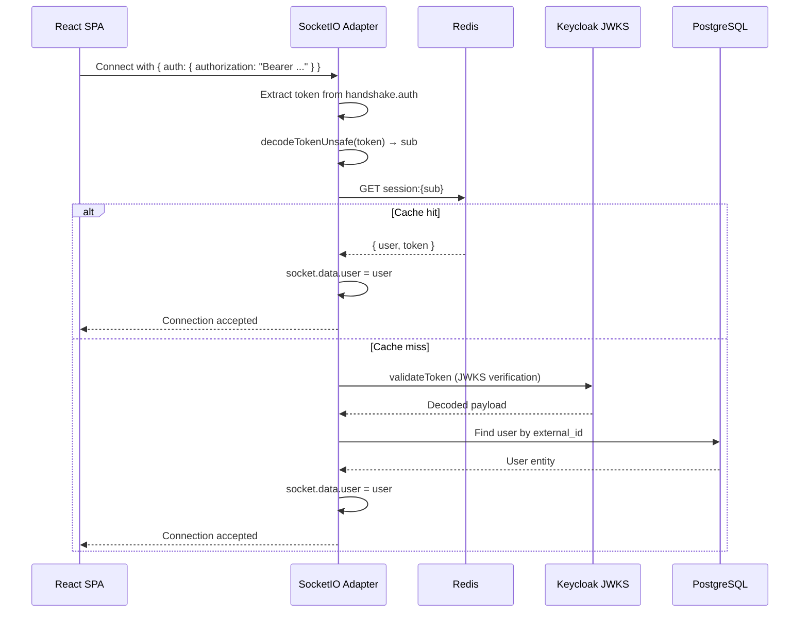
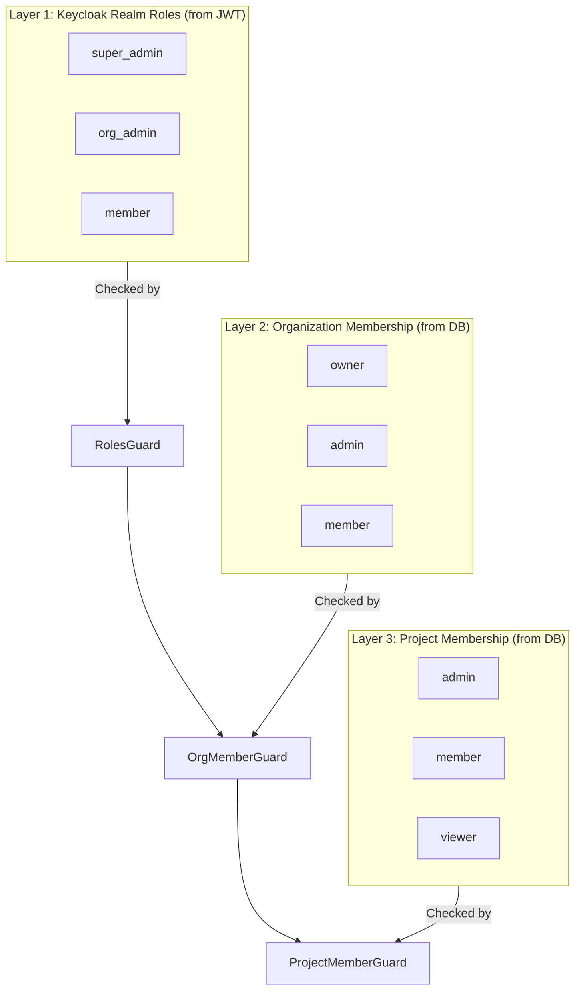

# Keycloak Authentication Architecture

> Complete guide to the authentication and authorization system across all services.
> Estimated reading time: ~2.5 hours for thorough understanding.

## Table of Contents

1. [Overview](#1-overview)
2. [Realm Configuration](#2-realm-configuration)
3. [Clients & Roles](#3-clients--roles)
4. [Automated Initialization](#4-automated-initialization)
5. [Authentication Flow: Sign In to Sign Out](#5-authentication-flow-sign-in-to-sign-out)
6. [Token Lifecycle](#6-token-lifecycle)
7. [Backend Token Validation](#7-backend-token-validation)
8. [WebSocket Authentication](#8-websocket-authentication)
9. [Three-Layer RBAC](#9-three-layer-rbac)
10. [Theme Customization](#10-theme-customization)
11. [Configuration Reference](#11-configuration-reference)
12. [Cookbooks](#12-cookbooks)

---

## 1. Overview

The application uses **Keycloak 26.1.3** as its Identity and Access Management (IAM) provider, implementing OpenID Connect (OIDC) for authentication and a three-layer Role-Based Access Control (RBAC) system for authorization.



**Key Design Decisions:**

| Decision | Rationale |
|----------|-----------|
| PKCE (S256) for SPA | Prevents authorization code interception; no client secret in browser |
| Redis session cache | Avoids JWKS + DB lookup on every request (~100x faster) |
| Unsafe decode first | Extract `sub` for cache key without crypto overhead |
| Token TTL-based cache | Cache expires when token expires (minus 2-minute buffer) |
| Separate internal/external URLs | Internal URL for server-to-server (Docker network), external for browser + issuer verification |

---

## 2. Realm Configuration

The **gira** realm is the single application realm. All users, clients, and roles live here.

### Realm Settings

| Setting | Value | Purpose |
|---------|-------|---------|
| `loginWithEmailAllowed` | `true` | Users log in with email, not username |
| `registrationAllowed` | `false` | No self-registration; users are invited |
| `resetPasswordAllowed` | `true` | Password recovery via email |
| `rememberMe` | `true` | "Remember me" checkbox on login form |

### How the Realm is Created

The realm is **not imported from a JSON file**. Instead, it's created programmatically by the `init-keycloak.ts` script:

```
make setup
  → docker-compose up -d          (starts Keycloak + PostgreSQL)
  → wait for Keycloak health      (polls :9000/health/ready)
  → pnpm --filter keycloak init   (runs init-keycloak.ts)
```

The script authenticates to the **master** realm using `admin-cli`, then creates the application realm and all resources via the Keycloak Admin REST API.

### Keycloak Database

Keycloak uses its own PostgreSQL database, separate from the application database:

```sql
-- Created by services/db/init.sql at container startup
CREATE USER keycloak WITH PASSWORD 'keycloak';
CREATE DATABASE keycloak;
CREATE SCHEMA IF NOT EXISTS keycloak;
```

The Docker Compose config connects Keycloak to this database:
```yaml
KC_DB: postgres
KC_DB_URL: jdbc:postgresql://db:5432/keycloak
KC_DB_USERNAME: keycloak
KC_DB_PASSWORD: keycloak
KC_DB_SCHEMA: keycloak
```

---

## 3. Clients & Roles

### Clients



#### web-frontend (Public PKCE Client)

Used by the React SPA. Public clients don't have a client secret — security relies on PKCE.

| Property | Value |
|----------|-------|
| `publicClient` | `true` |
| `standardFlowEnabled` | `true` (Authorization Code flow) |
| `directAccessGrantsEnabled` | `false` |
| `serviceAccountsEnabled` | `false` |
| PKCE method | `S256` |
| Root URL | `http://localhost:2712` |
| Redirect URIs | `http://localhost:2712/*` |
| Post-logout redirect | `http://localhost:2712/*` |
| Default scopes | `web-origins`, `acr`, `profile`, `roles`, `basic`, `email` |

#### backend-api (Confidential Service Account)

Used by the NestJS backend for server-to-server operations (user provisioning, role assignment).

| Property | Value |
|----------|-------|
| `publicClient` | `false` |
| `clientAuthenticatorType` | `client-secret` |
| `standardFlowEnabled` | `false` |
| `serviceAccountsEnabled` | `true` |
| Secret | From `KEYCLOAK_BACKEND_CLIENT_SECRET` env var |

### Realm Roles

Three roles that map to the first layer of the RBAC system:

| Role | Assigned To | Purpose |
|------|-------------|---------|
| `super_admin` | Platform admins | Full system access |
| `org_admin` | Organization admins | Manage organizations |
| `member` | All users (default) | Base authenticated access |

The `member` role is automatically assigned to every new user via Keycloak's default role composite mechanism.

---

## 4. Automated Initialization

### Script: `services/keycloak/src/init-keycloak.ts`

The init script is the single source of truth for realm configuration. It's fully idempotent:

```
Step 1: Auth to master realm (admin-cli + password grant)
Step 2: Create realm (skip if exists, 409 → no-op)
Step 3: Create roles (skip each if exists)
Step 4: Set default role (add "member" to default-roles-{realm} composite)
Step 5: Create/update web-frontend client (upsert on 409)
Step 6: Create/update backend-api client (upsert on 409)
Step 7: Create/update test client (only if KEYCLOAK_TEST_CLIENT_NAME is set)
Step 8: Create admin user + assign super_admin (skip if exists)
```

### When Does It Run?

| Trigger | Command |
|---------|---------|
| First-time setup | `make setup` (runs automatically after Keycloak is healthy) |
| Manual re-init | `pnpm --filter ./services/keycloak run init` |
| CI/CD | Can be added as a post-deploy step |

### Exporting Realm Configuration

To export the current realm as JSON (for backup or migration):

```bash
cd services/keycloak
REALM_NAME=gira docker compose -f docker-compose-export.yml up
# Output: services/keycloak/realms/gira.json
```

---

## 5. Authentication Flow: Sign In to Sign Out

### Complete Sign-In Flow



### What Happens on Each Service

#### Frontend (`keycloak-js` SDK)

1. **Init**: `keycloak.init({ onLoad: 'login-required' })` — If no valid session, redirects to Keycloak login page
2. **Token storage**: `keycloak-js` stores tokens in memory (not localStorage) — cleared on page refresh
3. **Profile**: `keycloak.loadUserProfile()` fetches user info from Keycloak's `/userinfo` endpoint
4. **API singleton**: `initializeAuthenticatedApi(token)` creates an axios instance with the Bearer header
5. **Interceptors**: Two layers — request interceptor (proactive refresh) + response interceptor (401 retry)

#### Keycloak

1. **Login page**: Custom "gira" theme with branded login form
2. **Token generation**: Issues JWT with RS256, includes `realm_access.roles` claim
3. **Token lifetimes**: Configurable in realm settings (default: 5 min access, 30 min refresh)
4. **JWKS**: Exposes signing keys at `/realms/{realm}/protocol/openid-connect/certs`

#### Backend (NestJS)

1. **AuthMiddleware**: Runs on every route, extracts and validates token
2. **Redis cache**: Avoids repeated JWKS calls and DB lookups
3. **Guards**: Check realm roles, org membership, project membership
4. **Decorators**: `@CurrentUser()` extracts the User entity from the request

### What Happens on 401



---

## 6. Token Lifecycle

### Access Token

| Property | Value |
|----------|-------|
| Type | JWT (RS256 signed) |
| Issuer | `{KEYCLOAK_EXTERNAL_URL}/realms/{REALM}` |
| Audience | Account service |
| Default lifetime | 5 minutes (configurable in Keycloak admin) |
| Contains | `sub`, `email`, `name`, `realm_access.roles`, `exp`, `iat` |
| Storage | In-memory (`keycloak-js` instance) |

### Refresh Token

| Property | Value |
|----------|-------|
| Type | Opaque token (not a JWT) |
| Default lifetime | 30 minutes (configurable) |
| Purpose | Exchange for new access token without re-login |
| Storage | In-memory (`keycloak-js` instance) |
| Revocation | On logout or session termination |

### Token Refresh Strategy

The frontend uses a **proactive refresh** approach:

```typescript
// In axios request interceptor — runs BEFORE every API call
if (keycloak.token && isTokenExpired(keycloak.token)) {
  await updateToken(); // calls keycloak.updateToken(70)
}
```

`keycloak.updateToken(70)` means: "Refresh the token if it expires within 70 seconds." This ensures:
- Tokens are refreshed **before** they expire (no failed requests)
- The 70-second window accounts for network latency and clock skew
- If the refresh token itself has expired, the user is redirected to login

### Token Refresh for WebSocket

WebSocket connections don't reconnect on token refresh. Instead, the auth header is updated for future reconnections:

```typescript
// When token changes, update the stored auth for reconnections
(socket.io.opts as any).auth = { authorization: `Bearer ${newToken}` };
```

The existing connection remains valid because the backend caches the session in Redis. If the WebSocket disconnects and reconnects, it will use the updated token.

---

## 7. Backend Token Validation

### Validation Pipeline



### JWKS Configuration

```typescript
// services/backend/src/modules/auth/keycloak/keycloak.utils.ts
const jwksClient = jwksRsa({
  jwksUri: `${KEYCLOAK_INTERNAL_URL}/realms/${REALM}/protocol/openid-connect/certs`,
  cache: true,
  cacheMaxEntries: 5,    // Cache up to 5 signing keys
  cacheMaxAge: 600000,   // 10-minute cache TTL
});
```

**Why internal URL for JWKS?** The backend fetches JWKS over the Docker network (`http://keycloak:7080`), but verifies the `issuer` claim against the external URL (`http://localhost:7080`). This is because:
- JWKS fetch is server-to-server (Docker internal network)
- Issuer in the token is set by Keycloak using its external hostname
- The browser issued the token via the external URL

### Redis Session Cache

```
Key:    session:{keycloak-sub-uuid}
Value:  { user: User, token: JwtPayload }
TTL:    token.exp - now - 120 seconds (minimum 60 seconds)
```

The 120-second buffer ensures the cache expires before the token does, preventing stale sessions from being served when the token has already expired.

---

## 8. WebSocket Authentication



The `AuthenticatedSocketIoAdapter` mirrors the HTTP `AuthMiddleware` pattern exactly. After authentication, the `User` entity is available on `socket.data.user` for all event handlers.

---

## 9. Three-Layer RBAC



| Layer | Source | Guard | Decorator | Checks |
|-------|--------|-------|-----------|--------|
| Realm | JWT `realm_access.roles` | `RolesGuard` | `@Roles('super_admin')` | Token contains required role |
| Organization | DB `organization_members` | `OrgMemberGuard` | `@OrgRoles('owner', 'admin')` | User is member of `:orgId` with required role |
| Project | DB `project_members` | `ProjectMemberGuard` | `@ProjectRoles('admin', 'member')` | User is member of `:projectId` with required role |

### Guard Execution Order

Guards execute in declaration order. Always start with `JwtAuthGuard`:

```typescript
// Realm-level access
@UseGuards(JwtAuthGuard, RolesGuard)
@Roles('super_admin')

// Organization-level access
@UseGuards(JwtAuthGuard, OrgMemberGuard)
@OrgRoles('owner', 'admin')

// Project-level access
@UseGuards(JwtAuthGuard, ProjectMemberGuard)
@ProjectRoles('admin', 'member')
```

---

## 10. Theme Customization

### Theme Structure

```
services/keycloak/themes/gira/
├── login/                          # Login page theme
│   ├── theme.properties            # Theme metadata (parent=base)
│   ├── template.ftl                # Base HTML layout (logo, footer)
│   ├── login.ftl                   # Login form (email + password)
│   ├── login-reset-password.ftl    # Password recovery form
│   ├── login-update-password.ftl   # Password update form
│   ├── login-config-totp.ftl       # MFA/TOTP setup
│   ├── login-otp.ftl               # OTP entry
│   ├── error.ftl                   # Error page
│   ├── messages/
│   │   └── messages_en.properties  # English translations
│   └── resources/
│       ├── css/                    # Stylesheets (variables, components, views)
│       ├── fonts/telegraf/         # Custom font files (Telegraf)
│       └── img/                    # Logo, social provider icons
└── email/                          # Email theme
    ├── theme.properties
    ├── messages/
    │   └── messages_en.properties  # Email copy
    ├── html/
    │   ├── template.ftl            # Email HTML layout
    │   └── password-reset.ftl      # Password reset email
    ├── text/
    │   └── password-reset.ftl      # Plaintext fallback
    └── resources/img/
        └── main_logo.png           # Email logo
```

### How Themes Work

Keycloak uses **FreeMarker** (`.ftl`) templates. The theme inherits from the `base` theme and overrides specific templates:

1. `template.ftl` defines the page shell (HTML head, logo, footer)
2. Individual pages (`login.ftl`, `error.ftl`, etc.) use `<@layout.registrationLayout>` macro
3. CSS variables in `variables.css` control colors and fonts
4. `messages_en.properties` controls all UI text

### How to Modify the Theme

**Change brand colors:**
Edit `themes/gira/login/resources/css/variables.css`:
```css
:root {
  --primary-600: #001866;  /* Buttons */
  --primary-700: #001352;  /* Links */
}
```

**Change logo:**
Replace `themes/gira/login/resources/img/main_logo_svg.svg`

**Change text/labels:**
Edit `themes/gira/login/messages/messages_en.properties`:
```properties
usernameLabel=Email
passwordLabel=Password
doLogIn=Login
forgotPassword=Forgot your password?
supportEmail=support@gira.ai
```

**Change email templates:**
Edit `themes/gira/email/html/password-reset.ftl` and `text/password-reset.ftl`

**After changes:**
Restart the Keycloak container. In development, themes are hot-reloaded because they're volume-mounted:
```yaml
volumes:
  - ./services/keycloak/themes:/opt/keycloak/themes
```

---

## 11. Configuration Reference

### Environment Variables

#### Keycloak Server

| Variable | Default | Used By | Purpose |
|----------|---------|---------|---------|
| `KEYCLOAK_HTTP_PORT` | `7080` | Docker Compose | HTTP listener port |
| `KEYCLOAK_ADMIN_USERNAME` | `admin` | Init script, Backend | Master realm admin |
| `KEYCLOAK_ADMIN_PASSWORD` | `admin` | Init script, Backend | Master realm password |

#### Realm & Client Config

| Variable | Default | Used By | Purpose |
|----------|---------|---------|---------|
| `KEYCLOAK_REALM` | `gira` | All services | Realm name |
| `KEYCLOAK_CLIENT_ID` | `web-frontend` | Frontend, Init script | SPA client ID |
| `KEYCLOAK_BACKEND_CLIENT_ID` | `backend-api` | Backend, Init script | API client ID |
| `KEYCLOAK_BACKEND_CLIENT_SECRET` | `backend-api-secret` | Backend, Init script | API client secret |

#### URLs

| Variable | Default | Used By | Purpose |
|----------|---------|---------|---------|
| `KEYCLOAK_INTERNAL_URL` | `http://keycloak:7080` | Backend | Docker-network URL for JWKS |
| `KEYCLOAK_EXTERNAL_URL` | `http://localhost:7080` | Backend, Init script | Public URL for issuer verification |
| `KEYCLOAK_INTERNAL_MGMT_URL` | `http://keycloak:9000` | Backend health check | Admin API (Docker) |
| `KEYCLOAK_EXTERNAL_MGMT_URL` | `http://localhost:9000` | Makefile | Admin API (host, for health check) |

#### Frontend (Vite)

| Variable | Default | Used By | Purpose |
|----------|---------|---------|---------|
| `VITE_KEYCLOAK_EXTERNAL_URL` | `http://localhost:7080` | Frontend | Keycloak URL for browser |
| `VITE_KEYCLOAK_REALM` | `gira` | Frontend | Realm name |
| `VITE_KEYCLOAK_CLIENT_ID` | `web-frontend` | Frontend | Client ID for PKCE flow |

#### Application URLs (Init Script)

| Variable | Default | Used By | Purpose |
|----------|---------|---------|---------|
| `ROOT_URL` | `http://localhost:2712` | Init script | Client root URL |
| `REDIRECT_URIS` | `http://localhost:2712/*` | Init script | OAuth redirect URIs (comma-separated) |
| `WEB_ORIGINS` | `http://localhost:2712` | Init script | CORS allowed origins |

### Token TTL Configuration

Token lifetimes are configured in the Keycloak Admin Console (not in code):

1. Navigate to `http://localhost:7080/admin/master/console/`
2. Select the **gira** realm
3. Go to **Realm Settings** → **Tokens** tab

| Setting | Default | Recommendation |
|---------|---------|----------------|
| Access Token Lifespan | 5 minutes | 5-15 minutes for APIs |
| SSO Session Idle | 30 minutes | How long until idle session expires |
| SSO Session Max | 10 hours | Maximum session duration |
| Refresh Token Max Reuse | 0 | Disable refresh token reuse (rotate on each use) |

**Important:** The frontend's `updateToken(70)` threshold should be less than the access token lifespan. If you set the access token lifespan to 5 minutes (300s), the 70-second threshold means refresh happens at ~230 seconds.

### Ports

| Service | Port | Protocol | Purpose |
|---------|------|----------|---------|
| Keycloak | 7080 | HTTP | Login pages, token endpoints, JWKS |
| Keycloak Admin | 9000 | HTTP | Health checks, admin API |

---

## 12. Cookbooks

### How to Add a New Realm Role

1. Add the role name to `REALM_ROLES` in `services/keycloak/src/init-keycloak.ts`:
   ```typescript
   const REALM_ROLES = ['super_admin', 'org_admin', 'member', 'new_role'] as const;
   ```

2. Re-run init: `pnpm --filter ./services/keycloak run init`

3. Reference in backend guards:
   ```typescript
   @UseGuards(JwtAuthGuard, RolesGuard)
   @Roles('new_role')
   ```

### How to Add a New Keycloak Client

Add a new function in `init-keycloak.ts`:

```typescript
function getMyNewClient(): ClientRepresentation {
  return {
    clientId: 'my-new-client',
    name: 'My New Client',
    enabled: true,
    publicClient: false,           // true for SPAs, false for server apps
    clientAuthenticatorType: 'client-secret',
    secret: process.env.MY_CLIENT_SECRET,
    standardFlowEnabled: false,    // true if browser-based auth needed
    serviceAccountsEnabled: true,  // true for server-to-server
    protocol: 'openid-connect',
  };
}
```

Then add it to the `initKeycloak()` sequence:
```typescript
await createOrUpdateClient(kcAdminClient, getMyNewClient());
```

### How to Change Token Lifetimes

**Via Admin Console:**
1. Login to `http://localhost:7080/admin/master/console/`
2. Select **gira** realm → **Realm Settings** → **Tokens**
3. Modify the desired lifetimes

**Via Init Script (programmatic):**
Add to the `createRealm()` function:
```typescript
await kcAdminClient.realms.create({
  realm: REALM_NAME,
  enabled: true,
  accessTokenLifespan: 600,     // 10 minutes (in seconds)
  ssoSessionIdleTimeout: 1800,  // 30 minutes
  ssoSessionMaxLifespan: 36000, // 10 hours
});
```

**Frontend impact:** If you change the access token lifespan, consider adjusting the refresh threshold in `services/web-frontend/src/shared/context/keycloak.tsx`:
```typescript
const refreshed = await keycloak.updateToken(70); // Adjust this value
```
Rule of thumb: Set this to ~25% of the access token lifespan.

### How to Provision a New User Programmatically

From the backend, using `KeycloakAdminService`:

```typescript
// 1. Create user in Keycloak
const { id: keycloakId } = await this.keycloakAdminService.createUser({
  email: 'newuser@example.com',
  firstName: 'New',
  lastName: 'User',
  password: 'tempPassword123',
});

// 2. Assign realm role
await this.keycloakAdminService.assignRealmRole(keycloakId, 'member');

// 3. Create user in application database
await this.userRepository.create({
  externalId: keycloakId,  // Links to Keycloak sub claim
  email: 'newuser@example.com',
  fullName: 'New User',
  status: 'active',
});
```

### How to Test Authentication Locally

**Using the demo credentials:**

| User | Email | Password | Realm Role |
|------|-------|----------|------------|
| Admin | admin@gira.com | admin123 | super_admin |

After running `make setup` and `make seed`, additional test users are created:

| User | Email | Password | Realm Role |
|------|-------|----------|------------|
| Alice | alice@acme.com | member123 | member |
| Bob | bob@acme.com | member123 | member |
| Carol | carol@widgets.com | member123 | member |

**Using the test client (Postman):**

If `KEYCLOAK_TEST_CLIENT_NAME=postman` is set in your `.env`, a confidential test client is created. Get a token via:

```bash
curl -X POST http://localhost:7080/realms/gira/protocol/openid-connect/token \
  -d "grant_type=password" \
  -d "client_id=postman" \
  -d "client_secret=dumbsecret" \
  -d "username=admin@gira.com" \
  -d "password=admin123"
```

### How to Debug Token Issues

1. **Decode a token:** Paste at [jwt.io](https://jwt.io) or use:
   ```bash
   echo "YOUR_TOKEN" | cut -d. -f2 | base64 -d | jq .
   ```

2. **Check the issuer:** The `iss` claim must match `{KEYCLOAK_EXTERNAL_URL}/realms/{REALM}`

3. **Check roles:** Look for `realm_access.roles` in the decoded token

4. **Check Redis cache:** Connect to Redis and inspect:
   ```bash
   redis-cli GET "session:{keycloak-sub-uuid}"
   ```

5. **Check JWKS endpoint:**
   ```bash
   curl http://localhost:7080/realms/gira/protocol/openid-connect/certs | jq .
   ```

### How to Export/Import Realm Configuration

**Export (for backup):**
```bash
cd services/keycloak
REALM_NAME=gira docker compose -f docker-compose-export.yml up
# Output: services/keycloak/realms/gira.json
```

**Import (on startup):**
Place the JSON file in `services/keycloak/realms/`. The Docker Compose volume mount maps this to Keycloak's import directory:
```yaml
volumes:
  - ./services/keycloak/realms:/opt/keycloak/data/import
```
Then start Keycloak with the `--import-realm` flag.

---

## File Reference

| File | Service | Purpose |
|------|---------|---------|
| `services/keycloak/src/init-keycloak.ts` | Keycloak | Realm initialization script |
| `services/keycloak/Dockerfile` | Keycloak | Container image (copies themes + scripts) |
| `services/keycloak/themes/gira/` | Keycloak | Custom login + email theme |
| `services/db/init.sql` | Database | Creates keycloak DB + user |
| `services/web-frontend/src/shared/lib/keycloak.ts` | Frontend | Keycloak SDK instance |
| `services/web-frontend/src/shared/context/keycloak.tsx` | Frontend | Auth provider, token refresh, interceptors |
| `services/web-frontend/src/shared/lib/axios.ts` | Frontend | Authenticated API singleton |
| `services/web-frontend/src/shared/context/socket/socket-context.tsx` | Frontend | WebSocket auth integration |
| `services/web-frontend/src/routes/_auth.tsx` | Frontend | Protected route guard |
| `services/backend/src/modules/auth/middleware/auth.middleware.ts` | Backend | Token validation + Redis caching |
| `services/backend/src/modules/auth/keycloak/keycloak.utils.ts` | Backend | JWKS validation + unsafe decode |
| `services/backend/src/modules/auth/keycloak/keycloak-admin.service.ts` | Backend | User provisioning + role management |
| `services/backend/src/modules/auth/guards/*.ts` | Backend | JWT, Roles, OrgMember, ProjectMember guards |
| `services/backend/src/modules/auth/decorators/*.ts` | Backend | @Roles, @OrgRoles, @ProjectRoles, @CurrentUser |
| `services/backend/src/modules/websocket/websocket.adapter.ts` | Backend | WebSocket JWT authentication |
