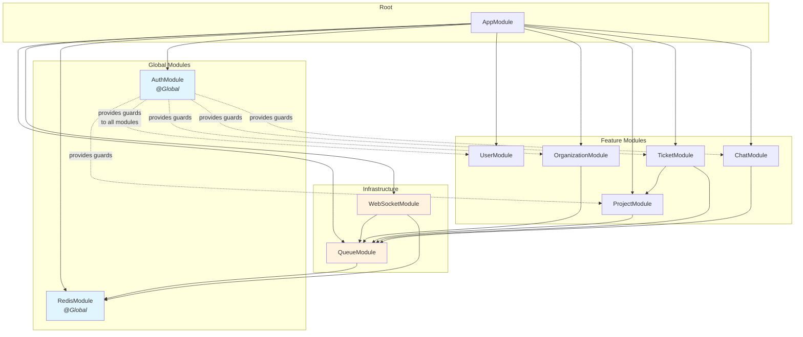
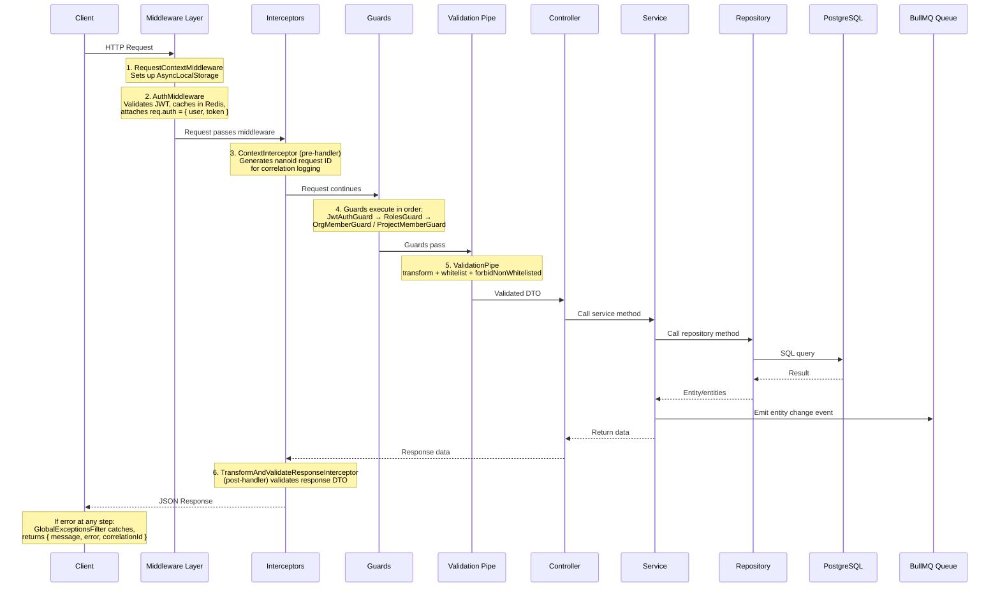
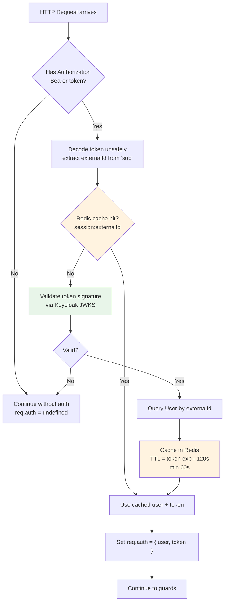
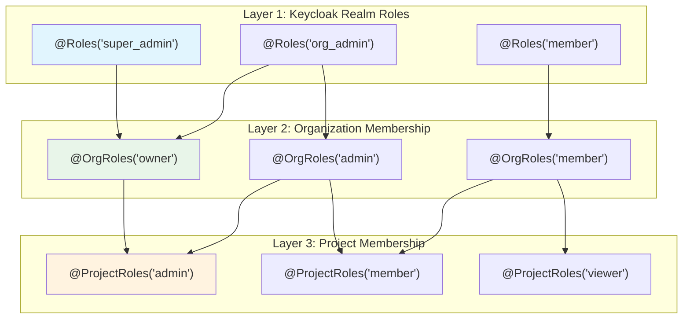
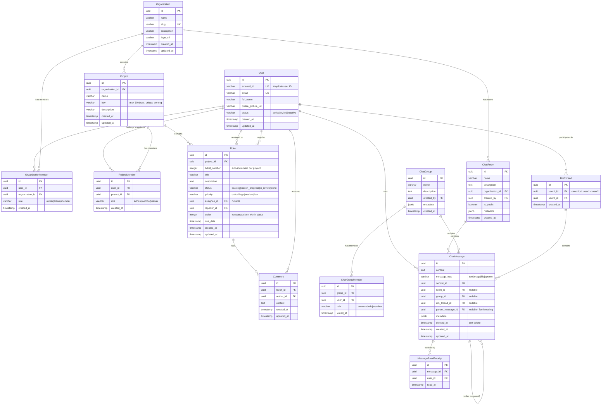
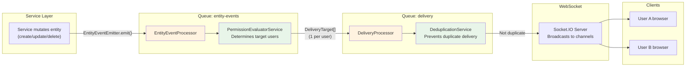
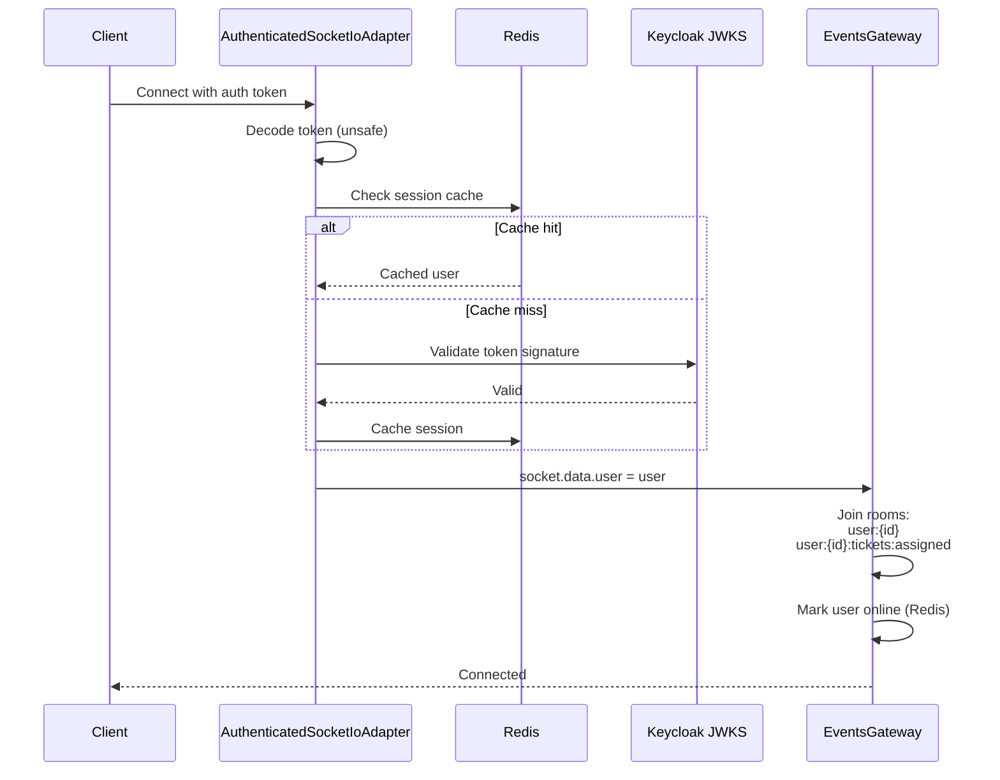
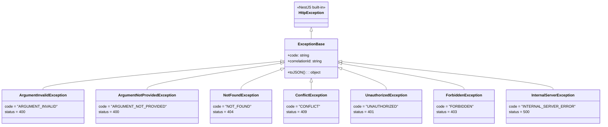

# Backend Architecture Guide

> **Estimated reading time: ~3.5 hours for full comprehension**
>
> This document explains every architectural decision, request flow, and module interaction
> in the backend. After reading it, you should be able to trace any request from HTTP entry
> to database query and back, understand the authorization model, and add new features confidently.

---

## Table of Contents

1. [Quick Start](#1-quick-start)
2. [Module Dependency Map](#2-module-dependency-map)
3. [Request Lifecycle](#3-request-lifecycle)
4. [Authentication & Authorization](#4-authentication--authorization)
5. [Database Layer](#5-database-layer)
6. [Event & Queue System](#6-event--queue-system)
7. [WebSocket Architecture](#7-websocket-architecture)
8. [Shared Libraries](#8-shared-libraries)
9. [Adding a New Module (Cookbook)](#9-adding-a-new-module-cookbook)
10. [Configuration](#10-configuration)

---

## 1. Quick Start

### Tech Stack

| Layer | Technology |
|-------|-----------|
| Framework | NestJS 11 |
| ORM | TypeORM 0.3 |
| Database | PostgreSQL 16 |
| Cache/Queues | Redis 7 (ioredis + BullMQ) |
| Auth | Keycloak (OpenID Connect, JWT) |
| Real-time | Socket.IO (via @nestjs/websockets) |
| Validation | class-validator + class-transformer |
| Error Tracking | Sentry |

### Key Commands

```bash
# Development
pnpm --filter ./services/backend start:dev       # Hot-reload dev server (port 3050)
pnpm --filter ./services/backend test:unit        # Run unit tests
pnpm --filter ./services/backend lint:check       # ESLint (zero warnings)
pnpm --filter ./services/backend type:check       # TypeScript type checking

# Single test
pnpm --filter ./services/backend test:unit -- organization.service.spec.ts

# Create migration
pnpm --filter ./services/backend typeorm:migration:create -- <module-name> <MigrationName>

# Create seed
pnpm --filter ./services/backend typeorm:seed:create -- <module-name> <SeedName>
```

### Directory Layout

```
src/
├── main.ts                          # App bootstrap, global pipes/filters
├── app.module.ts                    # Root module, wires everything together
├── app.controller.ts                # Health check endpoints
├── app.service.ts                   # Health check logic
├── config/                          # App + DB + Sentry configuration
├── database/                        # Database setup, migrations, utilities
├── libs/                            # Shared utilities (pagination, exceptions, context)
│   ├── base/                        # CustomUUIDPipe
│   ├── context/                     # AsyncLocalStorage request context
│   ├── dbMigrations/                # Migration/seed file generator
│   ├── exceptions/                  # Exception hierarchy + global filter
│   ├── interceptors/                # Request ID + response validation
│   ├── pagination/                  # Generic paginate() utility
│   └── utils/                       # Config validation, S3, naming strategy
└── modules/                         # Feature modules (vertical slices)
    ├── auth/                        # Authentication + authorization (GLOBAL)
    ├── redis/                       # Redis client wrapper (GLOBAL)
    ├── queue/                       # BullMQ event processing + delivery
    ├── websocket/                   # Socket.IO gateway + presence + typing
    ├── user/                        # User management
    ├── organization/                # Organizations + members
    ├── project/                     # Projects + members
    ├── ticket/                      # Tickets + comments (board)
    └── chat/                        # Chat rooms, DMs, messages
```

### Path Aliases

| Alias | Resolves To |
|-------|------------|
| `@src/*` | `src/*` |
| `@modules/*` | `src/modules/*` |
| `@config/*` | `src/config/*` |
| `@libs/*` | `src/libs/*` |

---

## 2. Module Dependency Map

### Module Graph



### Module Responsibilities

| Module | Responsibility | Global? | Key Exports |
|--------|---------------|---------|-------------|
| **AuthModule** | JWT validation, RBAC guards, Keycloak integration | Yes | All guards, decorators, KeycloakAdminService |
| **RedisModule** | Redis client wrapper for caching, queues, presence | Yes | RedisService |
| **QueueModule** | BullMQ event processing and WebSocket delivery | No | BullModule (queue injection), EntityEventEmitter |
| **WebSocketModule** | Socket.IO gateway, presence tracking, typing indicators | No | EventsGateway, PresenceManager, TypingManager |
| **UserModule** | User profile CRUD | No | UserRepository, UserService |
| **OrganizationModule** | Organization CRUD, member management | No | OrganizationRepository, OrganizationService |
| **ProjectModule** | Project CRUD, team management | No | ProjectRepository, ProjectService |
| **TicketModule** | Kanban board, ticket CRUD, comments | No | TicketRepository, TicketService |
| **ChatModule** | Chat rooms, DMs, messages, read receipts | No | ChatRepository, ChatService |

### Internal Module Structure

Every feature module follows the same vertical-slice pattern:

```
<module>/
├── <module>.module.ts               # NestJS module definition
├── presentation/                    # HTTP layer
│   ├── <module>.controller.ts       # Route handlers
│   └── dto/                         # Request/response DTOs
├── service/                         # Business logic
│   └── <module>.service.ts
├── repository/                      # Data access (TypeORM)
│   └── <module>.repository.ts
└── database/
    ├── models/                      # TypeORM entity definitions
    │   └── <entity>.model.ts
    └── migrations/                  # Schema migrations
        └── <timestamp>-<Name>.ts
```

---

## 3. Request Lifecycle

### Full Request Flow



### Middleware Chain (order matters)

| Order | Component | File | Purpose |
|-------|-----------|------|---------|
| 1 | `RequestContextMiddleware` | `libs/context/` | Creates AsyncLocalStorage context for request-scoped data |
| 2 | `AuthMiddleware` | `modules/auth/middleware/` | Validates JWT, caches session in Redis, sets `req.auth` |

### Global Interceptors (registered in `app.module.ts`)

| Order | Interceptor | Purpose |
|-------|------------|---------|
| 1 | `ContextInterceptor` | Generates `nanoid(6)` request ID for log correlation |
| 2 | `TransformAndValidateResponseInterceptor` | Validates outgoing response DTOs via class-validator |

### Global Pipes (registered in `main.ts`)

```typescript
app.useGlobalPipes(new ValidationPipe({
  transform: true,              // Auto-transform to DTO instances
  whitelist: true,              // Strip unknown properties
  forbidNonWhitelisted: true,   // Throw on unknown properties
}));
```

### Global Filters (registered in `main.ts`)

The `GlobalExceptionsFilter` catches all unhandled exceptions:
- **Custom exceptions** (`ExceptionBase` subclasses): Returns `.toJSON()` with correlation ID
- **class-validator errors** (400): Transforms to `{ message, error, subErrors, correlationId }`
- **Unknown errors**: Returns 500 with correlation ID
- All exceptions are captured by Sentry

---

## 4. Authentication & Authorization

### Token Validation Flow



### Three-Layer RBAC Model

The authorization system has three layers, each progressively more specific:



### Guard Execution Chain

Guards execute in the order they appear in `@UseGuards()`:

```typescript
// Example: Update an organization (requires org admin or owner)
@Patch(':id')
@UseGuards(JwtAuthGuard, OrgMemberGuard)  // ← Guards execute left to right
@OrgRoles('owner', 'admin')               // ← Metadata read by OrgMemberGuard
async updateOrganization(...) { ... }
```

| Guard | What it checks | Source | Attaches to request |
|-------|---------------|--------|-------------------|
| `JwtAuthGuard` | `req.auth.user` exists | AuthMiddleware | Nothing new |
| `RolesGuard` | `token.realm_access.roles` includes required role | JWT token | Nothing new |
| `OrgMemberGuard` | User is member of `:id` or `:orgId` org with required role | DB query | `req.orgMembership` |
| `ProjectMemberGuard` | User is member of `:id` or `:projectId` project with required role | DB query | `req.projectMembership` |

### Decorator Reference

| Decorator | Guard | Purpose | Example |
|-----------|-------|---------|---------|
| `@Roles(...roles)` | `RolesGuard` | Require Keycloak realm role | `@Roles('super_admin')` |
| `@OrgRoles(...roles)` | `OrgMemberGuard` | Require org membership role | `@OrgRoles('owner', 'admin')` |
| `@ProjectRoles(...roles)` | `ProjectMemberGuard` | Require project membership role | `@ProjectRoles('admin')` |
| `@CurrentUser()` | — | Extract user from request | `@CurrentUser() user: User` |

### How to Protect a New Endpoint

```typescript
// 1. Basic auth (any authenticated user):
@UseGuards(JwtAuthGuard)

// 2. Keycloak realm role:
@UseGuards(JwtAuthGuard, RolesGuard)
@Roles('super_admin')

// 3. Organization membership:
@UseGuards(JwtAuthGuard, OrgMemberGuard)
@OrgRoles('owner', 'admin')

// 4. Project membership:
@UseGuards(JwtAuthGuard, ProjectMemberGuard)
@ProjectRoles('admin', 'member')

// 5. Layered (org membership required before checking project):
@UseGuards(JwtAuthGuard, OrgMemberGuard, ProjectMemberGuard)
@OrgRoles('owner', 'admin')
@ProjectRoles('admin')
```

---

## 5. Database Layer

### Entity Relationship Diagram



### Repository Pattern

Each module has a dedicated repository that wraps TypeORM operations:

```
Controller → Service → Repository → DataSource → PostgreSQL
```

- **Repositories** encapsulate all SQL/TypeORM queries
- **Services** contain business logic and validation
- **Controllers** handle HTTP concerns only (DTOs, status codes)

### Naming Conventions

| Layer | Convention | Example |
|-------|-----------|---------|
| TypeScript property | camelCase | `profilePictureUrl` |
| Database column | snake_case | `profile_picture_url` |
| Entity file | `*.model.ts` | `user.model.ts` |
| Migration file | `<timestamp>-<Name>.ts` | `1707000000000-InitialSchema.ts` |

The `SnakeNamingStrategy` (in `libs/utils/snake-naming-strategy.ts`) automatically converts between conventions.

### Creating a Migration

```bash
# Generate migration scaffold (creates directory with .ts + up.sql + down.sql)
pnpm --filter ./services/backend typeorm:migration:create -- <module-name> <MigrationName>

# Example:
pnpm --filter ./services/backend typeorm:migration:create -- ticket AddDueDateIndex
```

This creates:

```
src/modules/ticket/database/migrations/
└── 1708000000000-AddDueDateIndex/
    ├── 1708000000000-AddDueDateIndex.ts   # Extends TypeOrmMigrationFromFile
    ├── up.sql                              # Write forward migration here
    └── down.sql                            # Write rollback migration here
```

**Migration TypeScript file** (auto-generated):
```typescript
import { TypeOrmMigrationFromFile } from '@libs/dbMigrations/TypeOrmMigrationFromFile';
import * as path from 'path';

export class AddDueDateIndex1708000000000 extends TypeOrmMigrationFromFile {
  constructor() {
    super(
      path.resolve(__dirname, 'up.sql'),
      path.resolve(__dirname, 'down.sql'),
    );
  }
}
```

**up.sql**:
```sql
CREATE INDEX idx_tickets_due_date ON tickets (due_date) WHERE due_date IS NOT NULL;
```

**down.sql**:
```sql
DROP INDEX IF EXISTS idx_tickets_due_date;
```

> **Note**: `TypeOrmMigrationFromFile` handles PostgreSQL dollar-quoted strings (`$$...$$`)
> and splits multi-statement SQL files correctly. Migrations run automatically on app startup
> when `DB_MIGRATIONS_RUN=true`.

### Alternative: Inline Migrations

For simple migrations, you can write SQL directly in the TypeScript file:

```typescript
export class AddDueDateIndex1708000000000 implements MigrationInterface {
  name = 'AddDueDateIndex1708000000000';

  async up(queryRunner: QueryRunner): Promise<void> {
    await queryRunner.query(`CREATE INDEX ... `);
  }

  async down(queryRunner: QueryRunner): Promise<void> {
    await queryRunner.query(`DROP INDEX ... `);
  }
}
```

---

## 6. Event & Queue System

### Overview

When any entity is created, updated, or deleted, the service emits an event to a BullMQ queue.
This event is processed asynchronously to determine which users should receive a real-time
notification, then delivered via WebSocket.

### Event Flow



### EntityChangeMessage Format

```typescript
interface EntityChangeMessage {
  messageId: string;      // UUID for deduplication
  type: EntityChangeType; // ENTITY_CREATED | ENTITY_UPDATED | ENTITY_DELETED
  entity: string;         // 'tickets' | 'projects' | 'organizations' | 'chat' | 'comments'
  id: string;             // Entity UUID
  data?: Record<string, unknown>;  // Full entity (omitted for lightweight invalidation)
  timestamp: string;      // ISO 8601
  parentId?: string;      // Parent entity ID (e.g., projectId for tickets)
  parentEntity?: string;  // Parent entity type (e.g., 'projects')
}
```

### Permission Evaluation Rules

| Entity | Who receives the event | Channels |
|--------|----------------------|----------|
| **Tickets** | All project members + assignee + reporter | `user:{id}`, `project:{projectId}:tickets`, `user:{id}:tickets:assigned` |
| **Projects** | All project members | `user:{id}`, `org:{orgId}`, `project:{projectId}` |
| **Organizations** | All org members | `user:{id}`, `org:{orgId}` |
| **Chat (room)** | Public room → all org members | `user:{id}`, `chat:room:{roomId}`, `org:{orgId}` |
| **Chat (group)** | Group members only | `user:{id}`, `chat:group:{groupId}` |
| **Chat (DM)** | Both participants | `user:{id}`, `chat:dm:{dmThreadId}` |

### Deduplication Strategy

- Redis set `msg:delivered:{userId}` tracks delivered message IDs
- TTL: 24 hours (auto-cleanup)
- Prevents duplicate delivery after WebSocket reconnections

### How to Emit Events from a New Service

```typescript
import { EntityEventEmitter } from '@modules/queue/entity-event.emitter';
import { EntityChangeType } from '@livonit/shared';

@Injectable()
export class MyService {
  constructor(private readonly events: EntityEventEmitter) {}

  async createSomething(data: CreateDto): Promise<Entity> {
    const entity = await this.repository.create(data);

    await this.events.emit({
      type: EntityChangeType.ENTITY_CREATED,
      entity: 'my_entities',
      id: entity.id,
      data: entity as unknown as Record<string, unknown>,
      parentId: entity.organizationId,    // optional
      parentEntity: 'organizations',       // optional
    });

    return entity;
  }
}
```

> **Note**: Your module must import `QueueModule` to get access to `EntityEventEmitter`.

---

## 7. WebSocket Architecture

### Connection Authentication



### Room/Channel Naming Convention

| Channel Pattern | Purpose | Joined when |
|----------------|---------|-------------|
| `user:{userId}` | Personal notifications | Auto on connect |
| `user:{userId}:tickets:assigned` | Ticket assignment alerts | Auto on connect |
| `org:{orgId}` | Organization-wide updates | Client sends `join_org` |
| `project:{projectId}` | Project updates | Client sends `join_project` |
| `project:{projectId}:tickets` | Project ticket changes | Client sends `join_project` |
| `chat:room:{roomId}` | Chat room messages | Client sends `join_chat_room` |
| `chat:group:{groupId}` | Chat group messages | Client sends `join_chat_group` |
| `chat:dm:{dmThreadId}` | DM thread messages | Client sends `join_chat_dm` |

### WebSocket Events (Client → Server)

| Event | Payload | Purpose |
|-------|---------|---------|
| `join_org` | `{ orgId }` | Subscribe to org updates |
| `leave_org` | `{ orgId }` | Unsubscribe from org |
| `join_project` | `{ projectId }` | Subscribe to project + tickets |
| `leave_project` | `{ projectId }` | Unsubscribe from project |
| `join_chat_room` | `{ roomId }` | Subscribe to chat room |
| `leave_chat_room` | `{ roomId }` | Unsubscribe from room |
| `join_chat_group` | `{ groupId }` | Subscribe to chat group |
| `join_chat_dm` | `{ dmThreadId }` | Subscribe to DM thread |
| `typing_start` | `{ context, contextId }` | Broadcast typing indicator |
| `typing_stop` | `{ context, contextId }` | Stop typing indicator |
| `get_presence` | `{ userIds }` | Request presence status |
| `message_read` | `{ messageId, context, contextId }` | Broadcast read receipt |

### WebSocket Events (Server → Client)

| Event | Payload | Purpose |
|-------|---------|---------|
| `entity_change` | `EntityChangeMessage` | Real-time entity update |
| `user_presence` | `{ userId, status, timestamp }` | Online/offline status |
| `user_typing` | `{ userId, context, contextId, typing }` | Typing indicator |
| `presence_status` | `UserPresence[]` | Bulk presence response |
| `read_receipt` | `{ messageId, userId, readAt }` | Message read confirmation |

### Presence Tracking

Uses Redis sorted sets with Unix timestamps as scores:
- **Online**: last seen < 60 seconds ago
- **Away**: last seen 60-300 seconds ago
- **Offline**: last seen > 300 seconds ago or removed from set

---

## 8. Shared Libraries

### Exception Hierarchy



All exceptions automatically include:
- **Correlation ID** from `RequestContextService` (for log tracing)
- **Stack traces** in development, hidden in production
- **Sentry capture** via `GlobalExceptionsFilter`

### Pagination Utility

```typescript
import { paginate, PaginationQuery, PaginatedResult } from '@libs/pagination';

// In a repository:
async findAll(query: PaginationQuery): Promise<PaginatedResult<Entity>> {
  return paginate(this.repository, query, {
    where: { isActive: true },
    relations: ['author'],
  });
}
```

Returns:
```json
{
  "data": [...],
  "meta": {
    "page": 1,
    "limit": 20,
    "total": 150,
    "totalPages": 8
  }
}
```

- Default: page=1, limit=20, max limit=100
- Sort with `-` prefix for DESC: `sort=-createdAt`

### Request Context

Uses Node.js `AsyncLocalStorage` to provide request-scoped data anywhere without dependency injection:

```typescript
import { RequestContextService } from '@libs/context';

// Get correlation ID (available in any service/util):
const requestId = RequestContextService.getRequestId();
```

### PostgreSQL Error Handling

```typescript
import { handlePostgresException } from '@libs/exceptions';

try {
  await repository.save(entity);
} catch (error) {
  handlePostgresException(error); // Throws appropriate custom exception
  throw error; // Re-throw if not a known PG error
}
```

Handles: unique violations (409), not-null violations (400), foreign key violations (404).

---

## 9. Adding a New Module (Cookbook)

### Step 1: Create the Entity Model

```typescript
// src/modules/my-feature/database/models/my-entity.model.ts
import { Entity, PrimaryGeneratedColumn, Column, CreateDateColumn, UpdateDateColumn } from 'typeorm';

@Entity('my_entities')
export class MyEntity {
  @PrimaryGeneratedColumn('uuid')
  id: string;

  @Column()
  name: string;

  @CreateDateColumn()
  createdAt: Date;

  @UpdateDateColumn()
  updatedAt: Date;
}
```

### Step 2: Create the Repository

```typescript
// src/modules/my-feature/repository/my-feature.repository.ts
import { Injectable } from '@nestjs/common';
import { InjectRepository } from '@nestjs/typeorm';
import { Repository } from 'typeorm';
import { MyEntity } from '../database/models/my-entity.model';

@Injectable()
export class MyFeatureRepository {
  constructor(
    @InjectRepository(MyEntity)
    private readonly repo: Repository<MyEntity>,
  ) {}

  async findById(id: string): Promise<MyEntity | null> {
    return this.repo.findOne({ where: { id } });
  }

  async create(data: Partial<MyEntity>): Promise<MyEntity> {
    const entity = this.repo.create(data);
    return this.repo.save(entity);
  }
}
```

### Step 3: Create the Service

```typescript
// src/modules/my-feature/service/my-feature.service.ts
import { Injectable } from '@nestjs/common';
import { EntityChangeType } from '@livonit/shared';
import { EntityEventEmitter } from '@modules/queue/entity-event.emitter';
import { NotFoundException } from '@libs/exceptions';
import { MyFeatureRepository } from '../repository/my-feature.repository';

@Injectable()
export class MyFeatureService {
  constructor(
    private readonly repository: MyFeatureRepository,
    private readonly events: EntityEventEmitter,
  ) {}

  async create(data: { name: string }): Promise<MyEntity> {
    const entity = await this.repository.create(data);

    await this.events.emit({
      type: EntityChangeType.ENTITY_CREATED,
      entity: 'my_entities',
      id: entity.id,
      data: entity as unknown as Record<string, unknown>,
    });

    return entity;
  }
}
```

### Step 4: Create the Controller

```typescript
// src/modules/my-feature/presentation/my-feature.controller.ts
import { Controller, Get, Post, Body, Param, UseGuards } from '@nestjs/common';
import { JwtAuthGuard } from '@modules/auth/guards/jwt-auth.guard';
import { CurrentUser } from '@modules/auth/decorators/current-user.decorator';
import { User } from '@modules/user/database/models/user.model';
import { MyFeatureService } from '../service/my-feature.service';

@Controller('my-features')
@UseGuards(JwtAuthGuard)
export class MyFeatureController {
  constructor(private readonly service: MyFeatureService) {}

  @Post()
  async create(@Body() dto: CreateDto, @CurrentUser() user: User) {
    return this.service.create(dto);
  }
}
```

### Step 5: Create the Module

```typescript
// src/modules/my-feature/my-feature.module.ts
import { Module } from '@nestjs/common';
import { TypeOrmModule } from '@nestjs/typeorm';
import { QueueModule } from '@modules/queue/queue.module';
import { MyEntity } from './database/models/my-entity.model';
import { MyFeatureRepository } from './repository/my-feature.repository';
import { MyFeatureService } from './service/my-feature.service';
import { MyFeatureController } from './presentation/my-feature.controller';

@Module({
  imports: [
    TypeOrmModule.forFeature([MyEntity]),
    QueueModule, // For EntityEventEmitter
  ],
  controllers: [MyFeatureController],
  providers: [MyFeatureRepository, MyFeatureService],
  exports: [MyFeatureRepository, MyFeatureService],
})
export class MyFeatureModule {}
```

### Step 6: Register in AppModule

```typescript
// src/app.module.ts — add to imports array
import { MyFeatureModule } from '@modules/my-feature/my-feature.module';

@Module({
  imports: [
    // ... existing modules
    MyFeatureModule,
  ],
})
export class AppModule {}
```

### Step 7: Create Migration

```bash
pnpm --filter ./services/backend typeorm:migration:create -- my-feature CreateMyEntitiesTable
```

---

## 10. Configuration

### Environment Variables

| Variable | Description | Default |
|----------|------------|---------|
| `NODE_ENV` | Environment (development/staging/production/testing) | development |
| `API_PORT` | HTTP server port | 3050 |
| `API_PREFIX` | Global route prefix | api/v1 |
| `CLIENT_URL` | Frontend URL (CORS origin) | http://localhost:2712 |
| `DB_TYPE` | Database type | postgres |
| `DB_HOST` | Database host | localhost |
| `DB_PORT` | Database port | 5432 |
| `DB_USER` | Database user | — |
| `DB_PASSWORD` | Database password | — |
| `DB_NAME` | Database name | — |
| `DB_SYNCHRONIZE` | TypeORM auto-sync (dev only) | false |
| `DB_LOGGING` | TypeORM query logging | false |
| `DB_MIGRATIONS_RUN` | Run migrations on startup | true |
| `REDIS_HOST` | Redis host | localhost |
| `REDIS_PORT` | Redis port | 6379 |
| `KEYCLOAK_BASE_URL` | Keycloak server URL | http://localhost:7080 |
| `KEYCLOAK_REALM` | Keycloak realm name | gira |
| `KEYCLOAK_CLIENT_ID` | Keycloak client ID | — |
| `KEYCLOAK_CLIENT_SECRET` | Keycloak client secret | — |
| `KEYCLOAK_ADMIN_USER` | Keycloak admin username | — |
| `KEYCLOAK_ADMIN_PASSWORD` | Keycloak admin password | — |
| `AWS_BUCKET_NAME` | S3 bucket for file storage | — |
| `AWS_REGION` | AWS region | — |
| `SENTRY_DSN` | Sentry error tracking DSN | — |

### Config Validation Pattern

All environment variables are validated at startup using class-validator:

```typescript
// src/config/app.config.ts
class AppConfigValidator {
  @IsEnum(Environment)
  @Expose()
  NODE_ENV: Environment;

  @IsNumber()
  @Expose()
  API_PORT: number;
  // ...
}

// Validated and picked via validateAndPickKeys() utility
export const appConfig = registerAs('app', () =>
  validateAndPickKeys(process.env, AppConfigValidator),
);
```

If any required variable is missing or invalid, the app fails fast at startup with a clear error message.

---

## API Reference

### Endpoints Summary

| Method | Path | Auth | Description |
|--------|------|------|-------------|
| `GET` | `/health` | None | Full health check |
| `GET` | `/health/ready` | None | Readiness probe |
| `GET` | `/users/me` | JWT | Current user profile |
| `PATCH` | `/users/me` | JWT | Update profile |
| `GET` | `/organizations` | JWT | List user's organizations |
| `POST` | `/organizations` | JWT + `super_admin` | Create organization |
| `GET` | `/organizations/:id` | JWT + OrgMember | Get organization |
| `PATCH` | `/organizations/:id` | JWT + OrgMember(owner/admin) | Update organization |
| `POST` | `/organizations/:id/members` | JWT + OrgMember(owner/admin) | Add org member |
| `DELETE` | `/organizations/:id/members/:userId` | JWT + OrgMember(owner/admin) | Remove org member |
| `PATCH` | `/organizations/:id/members/:userId` | JWT + OrgMember(owner/admin) | Update member role |
| `GET` | `/organizations/:orgId/projects` | JWT + OrgMember | List org projects |
| `POST` | `/organizations/:orgId/projects` | JWT + OrgMember(owner/admin) | Create project |
| `GET` | `/projects/:id` | JWT + ProjectMember | Get project |
| `PATCH` | `/projects/:id` | JWT + ProjectMember(admin) | Update project |
| `POST` | `/projects/:id/members` | JWT + ProjectMember(admin) | Add project member |
| `DELETE` | `/projects/:id/members/:userId` | JWT + ProjectMember(admin) | Remove project member |
| `GET` | `/projects/:projectId/board` | JWT + ProjectMember | Get kanban board |
| `GET` | `/projects/:projectId/tickets` | JWT + ProjectMember | List tickets (paginated) |
| `POST` | `/projects/:projectId/tickets` | JWT + ProjectMember | Create ticket |
| `GET` | `/tickets/:id` | JWT | Get ticket details |
| `PATCH` | `/tickets/:id` | JWT | Update ticket |
| `PATCH` | `/tickets/:id/status` | JWT | Move ticket (status + order) |
| `DELETE` | `/tickets/:id` | JWT + ProjectMember(admin) | Delete ticket |
| `POST` | `/tickets/:ticketId/comments` | JWT | Add comment |
| `PATCH` | `/comments/:id` | JWT (author only) | Update comment |
| `DELETE` | `/comments/:id` | JWT (author only) | Delete comment |

---

## Appendix: Database Index Optimization

### Overview

This section outlines the comprehensive database index optimization performed on the backend system. The optimization focused on addressing missing database indexes, particularly for foreign keys, to support the real-time notification system and improve overall query performance.

### Index Naming Conventions

**Standard Pattern**: `idx_{table_name}_{column_name(s)}`

**Specific Patterns**:
- Foreign Key Indexes: `idx_{table}_foreign_key_column` (e.g., `idx_user_roles_user_id`)
- Performance Indexes: `idx_{table}_search_column` (e.g., `idx_users_email`)
- Composite Indexes: `idx_{table}_{column1}_{column2}` (e.g., `idx_events_venue_start_time`)
- Unique/Special Purpose: `idx_{table}_{purpose}` (e.g., `idx_user_roles_user_role`)

### Index Categories and Rationale

**1. Foreign Key Indexes**
- **Purpose**: PostgreSQL doesn't automatically create indexes for foreign keys
- **Impact**: Critical for real-time notification system with frequent joins

**2. Query Performance Indexes**
- **Purpose**: Optimize WHERE clauses, ORDER BY, and search operations
- **Impact**: Dramatically improve user-facing search and filtering

**3. Composite Indexes**
- **Purpose**: Optimize multi-column filter queries
- **Impact**: Significant performance improvements for complex queries

### Migration Strategy

**Domain-Specific Migrations**:
- Independent rollback capability per domain
- Clear attribution and ownership
- Easier maintenance by domain experts

**Rollback Safety**:
- All DROP statements use IF EXISTS
- DOWN migrations drop in reverse creation order

### Maintenance Guidelines

**Monitoring**:
- Monitor via `pg_stat_user_indexes`
- Identify unused indexes for removal
- Track query performance improvements

**Future Considerations**:
- Review new foreign keys for indexing
- Monitor slow query logs
- Consider partial indexes for large sparse tables

**Naming Enforcement**:
- Follow established patterns
- Document rationale in migration comments
- Maintain domain organization
