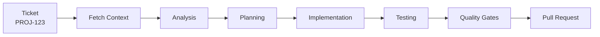

# User Guide

Complete workflows and best practices for using the AI Agentic Framework in your daily development.

---

## Table of Contents

1. [Getting Started](#getting-started)
2. [Core Workflows](#core-workflows)
3. [Daily Development](#daily-development)
4. [Commands Reference](#commands-reference)
5. [Best Practices](#best-practices)
6. [Team Collaboration](#team-collaboration)
7. [Troubleshooting](#troubleshooting)
8. [FAQ](#faq)

---

## Getting Started

### Invoking Skills

The framework works with two providers — skills are invoked the same way, but the prefix differs:

| Provider    | Prefix | Example                      | List active skills |
|-------------|--------|------------------------------|--------------------|
| Claude Code | `/`    | `/implement-ticket PROJ-123` | auto-discovered    |
| Codex CLI   | `$`    | `$implement-ticket PROJ-123` | `/skills`          |

All examples in this guide show both forms — use whichever matches your provider.

### First Time Setup

**1. Initialize Your Project**
```bash
cd /path/to/your-project
git clone https://github.com/thisisqubika/qubika-agentic-framework.git qubika-agentic-framework

# Auto-detects provider (defaults to claude); pass --provider codex to force Codex.
./qubika-agentic-framework/scripts/initialize-project.sh
```

This analyzes your codebase and generates (Claude layout shown — Codex writes to `.codex/` with `AGENTS.md`):
- `CLAUDE.md` (or `AGENTS.md`) - Quick reference guide
- `project-context/SKILL.md` - Deep context
- Stack-specific skills
- Custom AI agents

**Time**: ~10-15 minutes

---

## Core Workflows

### Workflow 1: Implementing a Feature

The most common workflow - transforming a ticket into a pull request.



**Step by Step**:

```bash
# Claude Code
/implement-ticket PROJ-123
# Codex CLI
$implement-ticket PROJ-123
```

**What happens**:

1. **Fetches ticket** from Jira/GitHub/Linear
2. **Analyzes requirements** and assesses risk
3. **Creates plan** (architect mode for high-risk, planner mode for low-risk)
4. **Implements code** following YOUR patterns
5. **Runs tests** using YOUR test framework
6. **Quality gates** (linting, type checking, coverage)
7. **Creates PR** with comprehensive description

**Time**: 5-15 minutes

**When to use**: Any feature ticket with clear requirements

---

### Workflow 2: Bug Fixes

Faster workflow for bug fixes with known root cause.

```bash
# Claude Code
/implement-ticket BUG-456
# Codex CLI
$implement-ticket BUG-456
```

**What's different**:
- Skips architecture planning
- Focuses on minimal changes
- Includes regression tests
- Faster execution

**Time**: 3-8 minutes

**When to use**: Bug fixes, small refactors, typo corrections

---

### Workflow 3: Code Review

Get AI review before human review.

```bash
# After implementing code
/code-quality-check
```

**Checks**:
- Linting errors
- Type errors
- Test coverage
- Security vulnerabilities
- Performance issues

**Time**: 1-3 minutes

**When to use**: Before creating PR, after manual code changes

---

### Workflow 4: Writing Tests

Generate tests for existing code.

```bash
# In Claude Code or Codex CLI (plain chat request, no skill prefix)
Generate comprehensive tests for src/auth/oauth.service.ts
```

**What gets generated**:
- Unit tests
- Integration tests
- Edge case coverage
- Mocking where appropriate

**Time**: 3-7 minutes

**When to use**: Legacy code, coverage gaps, new test requirements

---

## Daily Development

### Morning Routine

**1. Check what's available**

```bash
# Claude Code
claude code
# Codex CLI
codex
```

In Claude, type `/` to browse skills. In Codex, run `/skills` to list the active skills in the session.

**2. Review overnight PRs** (if applicable)

Check for PRs created by team members using the framework.

**3. Pick next ticket**

Choose from backlog based on priority.

---

### During Development

**Implementing Features**:

```bash
# Claude Code
/implement-ticket PROJ-123

# Codex CLI
$implement-ticket PROJ-123
```

Need to understand the ticket context first? Ask the CLI in plain text (`Summarise ticket PROJ-123`) before invoking the skill.

**Checking Quality**:

Quality gates (lint, typecheck, coverage, PR creation) run automatically inside `/implement-ticket`. For manual checks, use your project's native commands (`npm run lint`, `npx tsc --noEmit`, `gh pr create`, etc.).

**Getting Unstuck**:

```bash
# Claude Code — resume after a failure
/implement-ticket PROJ-123 --resume
# Codex CLI
$implement-ticket PROJ-123 --resume

# If tests fail repeatedly, inspect the artifacts:
#   .claude-temp/tickets/PROJ-123/artifacts/   (Claude)
#   .codex-temp/tickets/PROJ-123/artifacts/    (Codex)
```

---

### End of Day

**1. Review completed work**

`/implement-ticket` creates the PR as part of its run. Check `git log` and the PR description for what was shipped.

**2. Update ticket status**

Mark tickets as "In Review" or "Done".

---

## Skills Reference

> Prefix skills with `/` in Claude Code and `$` in Codex CLI. In Codex, run `/skills` to list the skills loaded in the current session.

### Project Setup

| Skill | Purpose | Time |
|-------|---------|------|
| `initialize-project.sh` (shell script) | One-time setup | 10-15 min |

### Feature Development

| Skill | Purpose | Time |
|-------|---------|------|
| `implement-ticket <ID>` | Full feature implementation (includes tests, quality gates, PR) | 5-15 min |
| `create-sdd-ticket` | Turn an idea or Jira ticket into a spec-driven ticket | 3-5 min |

**See all skills**:
- Claude Code — type `/` to browse.
- Codex CLI — run `/skills`.

---

## Best Practices

### Writing AI-Friendly Tickets

**DO**:
- ✅ Write clear acceptance criteria
- ✅ Include technical requirements
- ✅ Specify expected behavior
- ✅ Add examples or mockups
- ✅ Break large features into smaller tickets

**DON'T**:
- ❌ Use vague terms ("improve", "enhance", "optimize" without specifics)
- ❌ Leave requirements as "TBD"
- ❌ Omit technical context
- ❌ Create tickets >5 days of work

**Example Good Ticket**:
```
Title: Add OAuth login with Google

Acceptance Criteria:
- Users can click "Login with Google" button
- OAuth flow redirects to Google login
- After auth, user is redirected back with token
- Token is stored in localStorage
- User profile is fetched and displayed

Technical Requirements:
- Use existing auth service pattern
- Follow NestJS OAuth module conventions
- Store tokens securely (httpOnly cookies)
- Add E2E test for full flow
```

**Example Bad Ticket**:
```
Title: Improve login

Description: Make login better
```

**Learn more**: [Writing Good Tickets](./WRITING_GOOD_TICKETS.md)

---

### Code Quality Standards

**Before Creating PR**:

1. **Let `implement-ticket` run its built-in quality gates** (lint, typecheck, coverage). If you need to re-run any manually:
   ```bash
   npm run lint:fix
   npx tsc --noEmit
   ```

2. **Verify all tests pass**
   ```bash
   # Run tests manually to confirm
   npm test  # or pnpm test, pytest, go test, etc.
   ```

3. **Check coverage**
   ```bash
   # Coverage reports are in the output
   # Aim for 80%+ on new code
   ```

4. **Review generated code**
   - Does it follow project patterns?
   - Is naming consistent?
   - Are edge cases handled?

---

### Working with Monorepos

The framework automatically detects monorepo structure.

**Workspace Detection**:
- pnpm workspaces
- Lerna
- Yarn workspaces
- npm workspaces

**Example** (4 workspaces):
```
✓ services/backend (TypeScript, NestJS)
✓ services/frontend (TypeScript, React)
✓ services/auth (TypeScript, Docker)
✓ packages/shared (TypeScript, library)
```

**Implementation**: Automatically routes file changes to correct implementer based on workspace.

---

### Multi-Language Projects

For projects with multiple languages:

**Example** (TypeScript + Python):
```
Ticket affects:
- backend/auth.service.ts (TypeScript)
- scripts/migrate_users.py (Python)

Agents used:
- implementer-typescript → auth.service.ts
- implementer-python → migrate_users.py
- tester-unit-typescript → auth tests
- tester-unit-python → migration tests
```

**You don't need to do anything** - the framework handles routing automatically.

---

### Handling Failures

**Quality Gate Failures**:

If tests fail after 3 attempts:

1. **Review the error**
   - Check logs in Claude Code output
   - Understand the root cause

2. **Fix manually if needed**
   ```bash
   # Run tests to see failures
   npm test

   # Fix the issue, then resume:
   /implement-ticket PROJ-123 --resume    # Claude Code
   $implement-ticket PROJ-123 --resume    # Codex CLI
   ```

3. **Report patterns**
   - If same error happens repeatedly
   - Share with team to improve framework

**Implementation Failures**:

If implementation gets stuck:

1. **Check ticket quality**
   - Are requirements clear?
   - Is context sufficient?

2. **Fetch more context** — ask the CLI in plain text to summarise the ticket or inspect related files before re-invoking the skill.

3. **Try again with more detail**
   - Add clarifying comments to ticket
   - Include examples
   - Reference similar implementations

---

## Team Collaboration

### For Individual Developers

**Daily Usage**:
```bash
# Morning: Pick ticket
/implement-ticket PROJ-123    # Claude Code
$implement-ticket PROJ-123    # Codex CLI

# Afternoon: Review and merge
# Check PR, test locally, merge
```

**Benefits**:
- 70-80% time savings
- Consistent code quality
- Less context switching

---

### For Team Leads

**Monitoring**:
- Review PRs created by framework
- Check assumption logs for decisions
- Validate test coverage

**Best Practices**:
- Assign tickets with clear requirements
- Review high-risk tickets before merge
- Share learnings from framework usage

**Rolling Out**: See [Pilot Guide](./PILOT_GUIDE.md)

---

### For QA Engineers

**Integration**:
- Framework generates E2E tests automatically
- Tests follow project conventions
- Coverage reports included in PR

**Validation**:
```bash
# Run full test suite
npm test

# Check coverage
# Coverage reports in PR description
```

---

## Troubleshooting

### Common Issues

**Issue**: Initialization failed or incomplete

**Solution**: Re-run initialization:
```bash
cd /path/to/your-project
./qubika-agentic-framework/scripts/initialize-project.sh
```

Check logs for errors:
```bash
cat .claude-temp/initialization.log
```

---

**Issue**: Stack detection failed

**Solution**: Ensure you have standard config files:
- TypeScript: `package.json` + `tsconfig.json`
- Python: `requirements.txt` or `pyproject.toml`
- Go: `go.mod`
- Java: `pom.xml` or `build.gradle`

---

**Issue**: Tests failing consistently

**Solution**:
1. Run tests manually to understand failure
2. Check if baseline is clean (`npm test` on main branch)
3. Fix environment issues (DB, ports, env vars)
4. Resume implementation: `/implement-ticket PROJ-123 --resume` (Claude) / `$implement-ticket PROJ-123 --resume` (Codex)

---

**Issue**: Generated code doesn't match project style

**Solution**:
1. Re-run initialization (framework learns from more code over time)
2. Check if patterns are consistent in your codebase
3. Add style guide to project documentation

---

**Issue**: Wrong framework detected

**Solution**:
1. Check `project-context/SKILL.md` for detected stack
2. If wrong, ensure config files are correct
3. Remove conflicting dependencies
4. Re-run initialization: `./qubika-agentic-framework/scripts/initialize-project.sh`

---

### Getting Help

**Documentation**:
- [Architecture](./ARCHITECTURE.md) - How it works
- [API Reference](./API_REFERENCE.md) - Skills and agents
- [Writing Good Tickets](./WRITING_GOOD_TICKETS.md) - Ticket best practices

**Support**:
- GitHub Issues: https://github.com/thisisqubika/qubika-agentic-framework/issues
- Slack: #qubika-agentic-framework

---

## FAQ

**Q: How accurate is the framework?**

A: **95%+** on average. Implementation accuracy includes:
- Acceptance criteria met
- Tests passing
- Code following conventions
- No critical issues

---

**Q: Can I use this for large refactors?**

A: **Yes**, but break into smaller tickets:
- Each ticket = one module or component
- Clear acceptance criteria per ticket
- Test incrementally

---

**Q: What about code review?**

A: Framework generates PRs, but **human review is still required**:
- Review logic and edge cases
- Validate security concerns
- Check performance implications
- Ensure tests are meaningful

---

**Q: How does it handle different tech stacks?**

A: **Automatically**:
- Detects languages (TypeScript, Python, Go, Java, Scala, C#, Rust, Ruby, Swift, etc.)
- Identifies frameworks (React, Django, NestJS, Spring Boot, etc.)
- Adapts to YOUR patterns and conventions

---

**Q: Can I customize the framework?**

A: **Yes**:
- Add custom skills in `.claude/skills/`
- Create custom agents in `.claude/agents/`
- Modify prompts for your needs
- See [Contributing](../getting-started/CONTRIBUTING.md)

---

**Q: What if I don't like the generated code?**

A: **Options**:
1. Edit the code manually (it's just regular code)
2. Improve ticket description and try again
3. Add examples to project documentation
4. Share feedback to improve framework

---

**Q: How do I handle security-sensitive code?**

A: **Best practices**:
- Review security-related PRs thoroughly
- Use framework's security review skill
- Add security tests to requirements
- Never commit secrets (framework prevents this)

---

**Q: Can multiple developers use this simultaneously?**

A: **Yes**:
- Each developer runs their own instance
- PRs are created in separate branches
- No conflicts between developers
- See [Pilot Guide](./PILOT_GUIDE.md) for team rollout

---

**Q: What's the typical time savings?**

A: **70-80% reduction** in development time:
- Simple features: 60 min → 10 min
- Medium features: 4 hours → 45 min
- Complex features: 2 days → 4 hours

---

**Q: How do I track what the framework is doing?**

A: **Logs and artifacts**:
- Claude Code output shows progress
- PR description includes detailed steps
- Logs in `.claude/logs/` (if needed)
- All decisions are transparent

---

## Next Steps

1. **Complete Setup**: Run `./qubika-agentic-framework/scripts/initialize-project.sh`
2. **Try First Feature**: Pick a simple ticket
3. **Review Results**: Check generated code and tests
4. **Iterate**: Improve ticket quality, try more features
5. **Share Feedback**: Help improve the framework
6. **Roll Out to Team**: See [Pilot Guide](./PILOT_GUIDE.md)

---

**Ready to boost your productivity?** Run `./qubika-agentic-framework/scripts/initialize-project.sh` and let the framework learn your codebase.
