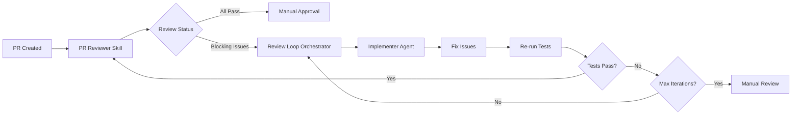

# PR Reviewer Skill V2

## ⚠️ Migration Notice

> **Review loop orchestration has been migrated to the TypeScript orchestration module.**
>
> ### New Approach
>
> ```bash
> cd orchestration
> npm run review-loop -- --ticket PROJ-123
> ```
>
> ### Orchestration Implementation
>
> - **Review Loop Service**: `orchestration/src/services/implement-ticket/review-loop.service.ts`
> - **PR Review Integration**: Part of `implement-ticket` Phase 9 workflow
>
> **References to `utils/review-loop-orchestrator.js` below are deprecated.**

---

Conduct comprehensive, professional code reviews for GitHub Pull Requests using industry-standard criteria and automated tooling. Integrates with implement-ticket Phase 9 review loop for automated fix iteration.

## Contents

- [What's New in V2](#whats-new-in-v2)
- [Integration with implement-ticket V2](#integration-with-implement-ticket-v2)
- [Purpose](#purpose)
- [When to Use](#when-to-use)
- [Review Process Workflow](#review-process-workflow)
- [Phase 9 Integration: Review Loop](#phase-9-integration-review-loop)
- [Reference Documentation](#reference-documentation)
- [Scripts Reference](#scripts-reference)
- [Best Practices](#best-practices)
- [Quick Reference Commands](#quick-reference-commands)
- [Tips for Effective Reviews](#tips-for-effective-reviews)
- [Resources](#resources)

## What's New in V2

### Major Changes

1. **Structured JSON Output** - Review results output as machine-readable JSON with issue categorization (blocking, major, minor)
2. **Actionable Fix Suggestions** - Each finding includes specific fix instructions for automated remediation
3. **Iteration Tracking** - Support for review loop iterations with attempt counting (max 3)
4. **Artifact Integration** - Reads from standardized artifact directories (`.claude/artifacts/{JIRA_KEY}/`)
5. **Review Loop Orchestration** - Integrates with `review-loop-orchestrator` for automated fix-and-retry cycles
6. **Auto-fix Generation** - Generates detailed fix instructions that can be executed by implementer agent

### Backward Compatibility

V2 maintains full backward compatibility with V1:

- All existing scripts (`fetch_pr_data.py`, `generate_review_files.py`) work unchanged
- Slash commands (`/send`, `/send-decline`, `/show`) still available
- Can be used standalone or as part of implement-ticket Phase 9

## Integration with implement-ticket V2

This skill integrates with the 10-phase implement-ticket workflow at **Phase 9: Review Loop**.

```
Phase 8: PR Creation → Phase 9: Review Loop (THIS SKILL) → Phase 10: Cleanup
```

### Workflow Integration



### Artifact Sources

The skill reads artifacts from the standardized directory structure:

```
.claude/artifacts/{JIRA_KEY}/
├── pr/
│   ├── pr-url.txt                         # Phase 8 (create-pr)
│   ├── pr-number.txt                      # Phase 8
│   └── review/                            # THIS SKILL (Phase 9)
│       ├── review-results.json            # Structured review output
│       ├── review.md                      # Detailed internal review
│       ├── human.md                       # Clean review for posting
│       ├── inline.md                      # Inline comment commands
│       └── iteration-{N}.json             # Review iteration tracking
├── implementations/
│   └── implementation-log.md              # Read for context
├── tests/
│   └── test-results.json                  # Check test status
└── decisions/
    └── {JIRA_KEY}.md                      # Autonomous decisions
```

### Review Loop Orchestration

Phase 9 orchestrates automated fix iterations:

1. **PR Reviewer** analyzes PR and outputs `review-results.json`
2. **Review Loop Orchestrator** reads results and decides:
   - ✅ **All Pass** → Proceed to manual approval
   - ⚠️ **Minor Issues Only** → Post review, proceed to manual approval
   - 🚫 **Blocking Issues** → Trigger fix iteration
3. **Implementer Agent** reads fix instructions from `review-results.json` and applies fixes
4. **Test Orchestrator** re-runs affected tests
5. **PR Reviewer** re-analyzes PR (iteration N+1)
6. Repeat until:
   - All blocking issues resolved
   - Max iterations reached (3)
   - Manual intervention requested

## Purpose

This skill performs code reviews by:

1. **Automating data collection** - Fetching all PR-related information (metadata, diff, comments, commits, issues)
2. **Organizing review workspace** - Creating structured directory with all artifacts
3. **Applying systematic criteria** - Reviewing against comprehensive quality checklist
4. **Outputting structured results** - JSON with categorized findings and fix suggestions
5. **Facilitating inline feedback** - Optionally adding comments directly to PR code
6. **Ensuring completeness** - Checking functionality, security, testing, maintainability
7. **Enabling automated fixes** - Providing actionable fix instructions for review loop

## When to Use

Activate this skill when:

- A GitHub PR URL is provided with a review request
- Receiving "review this PR" or "code review" requests
- Checking PR quality before merging
- Providing systematic feedback on proposed changes
- GitHub PR review is mentioned in any context
- **Automated PR review** in implement-ticket Phase 9

## Review Process Workflow

### Two Usage Modes

#### Mode A: Standalone Review (Manual)

**IMPORTANT**: Uses a **two-stage approval process**. Nothing is posted to GitHub until explicit approval with `/send` or `/send-decline`.

1. **Fetch PR data** - Collect all information
2. **Generate review files** - Create detailed, human, and inline comment files
3. **Review and edit** - Examine files, make changes as needed (use `/show`)
4. **Approve and post** - Use `/send` (approve) or `/send-decline` (request changes)

#### Mode B: Automated Review (Phase 9)

1. **Read PR URL** from `.claude/artifacts/{JIRA_KEY}/pr/pr-url.txt`
2. **Fetch PR data** using `fetch_pr_data.py`
3. **Analyze against criteria** with artifact context
4. **Output structured JSON** to `review-results.json`
5. **Trigger review loop** if blocking issues found
6. **Track iterations** in `iteration-{N}.json`

### Step 1: Fetch PR Data

Use `fetch_pr_data.py` to automatically collect all PR information:

```bash
python scripts/fetch_pr_data.py <pr_url> [--output-dir <dir>] [--no-clone]
```

**For Phase 9 integration:**

```bash
# Read PR URL from artifact
PR_URL=$(cat .claude/artifacts/$JIRA_KEY/pr/pr-url.txt)
REVIEW_DIR=".claude/artifacts/$JIRA_KEY/pr/review"

# Fetch PR data into review directory
python scripts/fetch_pr_data.py "$PR_URL" --output-dir "$REVIEW_DIR"
```

**Actions performed:**

- Parse PR URL to extract owner, repo, and PR number
- Create directory structure: `<output-dir>/PRs/<repo-name>/<PR-NUMBER>/`
- Fetch PR metadata (title, author, state, branches, labels)
- Download PR diff and commit history
- Retrieve all PR comments and reviews
- Extract ticket references (JIRA, GitHub issues)
- Optionally clone source branch and generate git diff

**Example:**

```bash
python scripts/fetch_pr_data.py https://github.com/facebook/react/pull/28476

# Custom output directory
python scripts/fetch_pr_data.py https://github.com/owner/repo/pull/123 --output-dir /tmp/reviews

# Skip cloning (faster, no git diff)
python scripts/fetch_pr_data.py https://github.com/owner/repo/pull/123 --no-clone
```

**Output structure:**

```
<output-dir>/PRs/<repo-name>/<PR-NUMBER>/
├── metadata.json           # PR metadata (title, author, branches)
├── diff.patch             # PR diff from gh CLI
├── git_diff.patch         # Git diff (if cloned)
├── comments.json          # Review comments on code
├── commits.json           # Commit history
├── related_issues.json    # Linked GitHub issues
├── ticket_numbers.json    # Extracted ticket references
├── SUMMARY.txt            # Human-readable summary
└── source/                # Cloned repository (if not --no-clone)
```

### Step 2: Analyze PR Data

After fetching, analyze collected data against review criteria:

1. Read `SUMMARY.txt` - High-level overview
2. Review `metadata.json` - PR context, labels, assignees
3. Examine `diff.patch` - Code changes
4. Check `comments.json` - Existing feedback
5. Review `commits.json` - Commit quality and messages
6. Check `related_issues.json` - Linked tickets/issues
7. **Read artifact context** - Implementation log, test results, decisions
8. Apply review criteria - Evaluate against comprehensive checklist
9. **Categorize findings** - Blocking, major, minor
10. **Generate fix instructions** - Actionable steps for each issue

Use the Read tool to examine files:

```
Read /tmp/PRs/<repo-name>/<PR-NUMBER>/SUMMARY.txt
Read /tmp/PRs/<repo-name>/<PR-NUMBER>/metadata.json
Read /tmp/PRs/<repo-name>/<PR-NUMBER>/diff.patch

# For Phase 9: Read artifact context
Read .claude/artifacts/{JIRA_KEY}/implementations/implementation-log.md
Read .claude/artifacts/{JIRA_KEY}/tests/test-results.json
Read .claude/artifacts/{JIRA_KEY}/decisions/{JIRA_KEY}.md
```

### Step 3: Generate Review Files

#### Mode A: Standalone (Manual Review)

Use `generate_review_files.py` to create structured review documents:

```bash
python scripts/generate_review_files.py <pr_review_dir> --findings <findings_json> [--metadata <metadata_json>]
```

Creates three files in `pr_review_dir/pr/`:

1. **`pr/review.md`** - Detailed internal review with emojis and line numbers
2. **`pr/human.md`** - Clean review for posting (no emojis, em-dashes, line numbers)
3. **`pr/inline.md`** - Proposed inline comments with code snippets

After reviewing and editing `pr/human.md`, post the review manually with `gh`:

- Approve and post: `gh pr comment <PR> --repo <OWNER>/<REPO> --body-file pr/human.md && gh pr review <PR> --repo <OWNER>/<REPO> --approve`
- Request changes and post: `gh pr comment <PR> --repo <OWNER>/<REPO> --body-file pr/human.md && gh pr review <PR> --repo <OWNER>/<REPO> --request-changes`

#### Mode B: Automated (Phase 9 Integration)

Output structured JSON to `review-results.json`:

```bash
# Write review results for orchestrator
cat > .claude/artifacts/$JIRA_KEY/pr/review/review-results.json << 'EOF'
{
  "jiraKey": "PROJ-123",
  "prUrl": "https://github.com/owner/repo/pull/456",
  "prNumber": 456,
  "repository": "owner/repo",
  "reviewIteration": 1,
  "timestamp": "2025-01-15T10:30:00Z",
  "overallStatus": "CHANGES_REQUESTED",
  "summary": "Found 2 blocking issues, 3 major issues, 5 minor issues",

  "findings": {
    "blocking": [
      {
        "id": "SEC-001",
        "category": "Security",
        "severity": "blocking",
        "issue": "SQL injection vulnerability in user query",
        "file": "src/modules/user/repository/user.repository.ts",
        "line": 45,
        "details": "Using string concatenation for SQL query construction allows SQL injection attacks",
        "codeSnippet": "const query = `SELECT * FROM users WHERE id = ${userId}`;",
        "fixInstructions": {
          "action": "replace",
          "file": "src/modules/user/repository/user.repository.ts",
          "line": 45,
          "oldCode": "const query = `SELECT * FROM users WHERE id = ${userId}`;",
          "newCode": "const query = this.repository.createQueryBuilder('user').where('user.id = :id', { id: userId });",
          "explanation": "Use TypeORM query builder with parameterized queries to prevent SQL injection"
        },
        "testSuggestion": "Add test case for user input with SQL injection attempt (e.g., `1 OR 1=1`)",
        "references": ["https://owasp.org/www-community/attacks/SQL_Injection"]
      }
    ],

    "major": [
      {
        "id": "TEST-001",
        "category": "Testing",
        "severity": "major",
        "issue": "Missing error handling test cases",
        "file": "src/modules/user/service/user.service.spec.ts",
        "line": null,
        "details": "No tests for error scenarios (user not found, database connection failure)",
        "codeSnippet": null,
        "fixInstructions": {
          "action": "add",
          "file": "src/modules/user/service/user.service.spec.ts",
          "insertAfterLine": 50,
          "newCode": "it('@new should throw NotFoundException when user not found', async () => {\n  jest.spyOn(repository, 'findOne').mockResolvedValue(null);\n  await expect(service.findById('invalid-id')).rejects.toThrow(NotFoundException);\n});",
          "explanation": "Add test for error path when user is not found"
        },
        "testSuggestion": "Add tests for: user not found, database error, invalid input",
        "references": []
      }
    ],

    "minor": [
      {
        "id": "STYLE-001",
        "category": "Code Style",
        "severity": "minor",
        "issue": "Inconsistent error message format",
        "file": "src/modules/user/service/user.service.ts",
        "line": 78,
        "details": "Error messages use different formats across the service",
        "codeSnippet": "throw new Error('user not found');",
        "fixInstructions": {
          "action": "replace",
          "file": "src/modules/user/service/user.service.ts",
          "line": 78,
          "oldCode": "throw new Error('user not found');",
          "newCode": "throw new NotFoundException(`User with ID ${userId} not found`);",
          "explanation": "Use custom exception class with consistent message format"
        },
        "testSuggestion": null,
        "references": []
      }
    ]
  },

  "metrics": {
    "totalFindings": 10,
    "blockingCount": 2,
    "majorCount": 3,
    "minorCount": 5,
    "filesReviewed": 8,
    "linesChanged": 245
  },

  "recommendations": [
    "Run security scan with npm audit",
    "Increase test coverage for error paths",
    "Consider adding JSDoc comments for complex functions"
  ],

  "nextSteps": {
    "action": "TRIGGER_REVIEW_LOOP",
    "reason": "Blocking issues found that can be auto-fixed",
    "maxIterations": 3,
    "currentIteration": 1
  }
}
EOF
```

**Review Results JSON Schema:**

```typescript
interface ReviewResults {
  jiraKey: string;
  prUrl: string;
  prNumber: number;
  repository: string;
  reviewIteration: number;
  timestamp: string;
  overallStatus: 'APPROVED' | 'CHANGES_REQUESTED' | 'COMMENTED';
  summary: string;

  findings: {
    blocking: Finding[]; // Must fix before merge
    major: Finding[]; // Should fix
    minor: Finding[]; // Nice to have
  };

  metrics: {
    totalFindings: number;
    blockingCount: number;
    majorCount: number;
    minorCount: number;
    filesReviewed: number;
    linesChanged: number;
  };

  recommendations: string[];

  nextSteps: {
    action: 'APPROVE' | 'TRIGGER_REVIEW_LOOP' | 'MANUAL_REVIEW';
    reason: string;
    maxIterations?: number;
    currentIteration?: number;
  };
}

interface Finding {
  id: string; // Unique identifier (e.g., "SEC-001")
  category: string; // "Security" | "Testing" | "Performance" | "Code Style" | etc.
  severity: 'blocking' | 'major' | 'minor';
  issue: string; // Brief description
  file: string; // Absolute or relative path
  line: number | null; // Line number (null if file-level)
  details: string; // Detailed explanation
  codeSnippet: string | null; // Current code
  fixInstructions: FixInstruction;
  testSuggestion: string | null;
  references: string[]; // URLs to documentation
}

interface FixInstruction {
  action: 'replace' | 'add' | 'delete' | 'refactor';
  file: string;
  line?: number;
  insertAfterLine?: number;
  oldCode?: string;
  newCode?: string;
  explanation: string;
}
```

### Step 4: Review and Edit Files (Standalone Mode Only)

**Use `/show` to open the review directory in VS Code.**

Actions available:

- Read `pr/review.md` - Detailed analysis
- Edit `pr/human.md` - Modify before posting
- Review `pr/inline.md` - Check proposed comments
- Adjust any content as needed

**NOTHING is posted until explicit approval in Step 5.**

### Step 5: Approve and Post (Standalone Mode Only)

Post the review when ready:

**Option A: Approve the PR**

```
/send
```

- Posts `pr/human.md` as comment
- Approves the PR
- Confirms action

**Option B: Request Changes**

```
/send-decline
```

- Posts `pr/human.md` as comment
- Requests changes on the PR
- Confirms action

**Posting inline comments** (optional, after /send or /send-decline):
Review `pr/inline.md` and run the provided commands for specific code comments.

### Step 6: Apply Review Criteria

Reference `references/review_criteria.md` for comprehensive checklist. Review against these categories:

| Category      | Key Questions                                    | Severity Guide                                           |
| ------------- | ------------------------------------------------ | -------------------------------------------------------- |
| Functionality | Does code solve the problem? Bugs? Edge cases?   | Blocking: Logic errors, Bugs; Major: Missing edge cases  |
| Readability   | Clear code? Meaningful names? DRY?               | Minor: Unclear naming; Major: Code duplication           |
| Style         | Follows linter rules? Consistent with codebase?  | Minor: Style inconsistencies                             |
| Performance   | Efficient algorithms? Scalable?                  | Major: O(n²) when O(n) possible; Blocking: Memory leaks  |
| Security      | Vulnerabilities addressed? Secrets protected?    | Blocking: SQL injection, XSS, hardcoded secrets          |
| Testing       | Tests exist? Cover happy paths and edge cases?   | Major: Missing tests; Blocking: Tests fail               |
| PR Quality    | Focused scope? Clean commits? Clear description? | Minor: Commit message formatting; Major: Unfocused scope |

**Priority markers for findings:**

- **Blocking**: Must be fixed before merge (security issues, failing tests, logic errors)
- **Major**: Should be addressed (missing tests, performance issues, code duplication)
- **Minor**: Nice to have, optional (style issues, documentation improvements)

**For detailed criteria:** Read `references/review_criteria.md`

## Phase 9 Integration: Review Loop

### Orchestration Flow

Phase 9 uses `review-loop-orchestrator.js` to manage automated fix iterations.

#### Phase 9 Execution

```bash
#!/bin/bash
# Phase 9: Review Loop (called by implement-ticket)

JIRA_KEY="$1"
ARTIFACTS_DIR=".claude/artifacts/$JIRA_KEY"
UTILS_DIR="$HOME/.claude/utils"

echo "🔍 Phase 9: Starting PR Review Loop..."

# 1. Read PR URL
PR_URL=$(cat "$ARTIFACTS_DIR/pr/pr-url.txt")
echo "📋 Reviewing PR: $PR_URL"

# 2. Run PR Reviewer skill
claude-code /pr-reviewer --pr-url "$PR_URL" --jira-key "$JIRA_KEY" --mode automated

# 3. Check review results
REVIEW_RESULTS="$ARTIFACTS_DIR/pr/review/review-results.json"

if [[ ! -f "$REVIEW_RESULTS" ]]; then
    echo "❌ Review results not found"
    exit 1
fi

# 4. Trigger review loop orchestrator
node "$UTILS_DIR/review-loop-orchestrator.js" "$JIRA_KEY"

echo "✅ Phase 9 complete"
```

#### Review Loop Orchestrator

The `review-loop-orchestrator.js` utility:

1. **Reads review results** from `review-results.json`
2. **Decides next action**:
   - `APPROVE` → Proceed to Phase 10 (cleanup)
   - `TRIGGER_REVIEW_LOOP` → Start fix iteration
   - `MANUAL_REVIEW` → Stop and notify
3. **Spawns implementer agent** with fix instructions
4. **Re-runs tests** after fixes applied
5. **Re-triggers PR reviewer** for iteration N+1
6. **Tracks iterations** in `iteration-{N}.json`
7. **Stops after max iterations** (default: 3)

**Iteration Tracking:**

```json
// .claude/artifacts/{JIRA_KEY}/pr/review/iteration-1.json
{
  "iteration": 1,
  "timestamp": "2025-01-15T10:30:00Z",
  "reviewResults": {
    "blockingCount": 2,
    "majorCount": 3,
    "minorCount": 5
  },
  "fixesApplied": [
    {
      "findingId": "SEC-001",
      "file": "src/modules/user/repository/user.repository.ts",
      "line": 45,
      "status": "applied",
      "commitSha": "abc123"
    }
  ],
  "testsRun": true,
  "testsPassed": false,
  "nextIteration": 2
}
```

### Max Iterations Logic

```javascript
const MAX_ITERATIONS = 3;

function shouldContinueLoop(reviewResults, iteration) {
  if (iteration >= MAX_ITERATIONS) {
    console.log(
      `⚠️  Max iterations (${MAX_ITERATIONS}) reached. Stopping review loop.`,
    );
    return false;
  }

  if (reviewResults.findings.blocking.length === 0) {
    console.log('✅ No blocking issues found. Review loop complete.');
    return false;
  }

  console.log(
    `🔄 Iteration ${iteration}: ${reviewResults.findings.blocking.length} blocking issues remain. Continuing...`,
  );
  return true;
}
```

## Reference Documentation

This skill includes comprehensive reference guides:

| Reference                       | Purpose                                                                |
| ------------------------------- | ---------------------------------------------------------------------- |
| `references/review_criteria.md` | Complete checklist covering functionality, security, testing, and more |
| `references/gh_cli_guide.md`    | Quick reference for GitHub CLI commands                                |
| `references/scenarios.md`       | Detailed workflows for common review scenarios                         |
| `references/troubleshooting.md` | Common issues and solutions                                            |

## Scripts Reference

### `scripts/fetch_pr_data.py`

Automated PR data fetching and organization.

```bash
python scripts/fetch_pr_data.py <pr_url> [options]

Options:
  --output-dir DIR    Base output directory (default: /tmp)
  --no-clone         Skip cloning repository
```

### `scripts/generate_review_files.py`

Generate structured review files from analysis findings.

```bash
python scripts/generate_review_files.py <pr_review_dir> --findings <findings_json> [--metadata <metadata_json>]
```

**Creates:**

- `pr/review.md` - Detailed internal review
- `pr/human.md` - Clean review for posting
- `pr/inline.md` - Proposed inline comments with commands
- `REVIEW_READY.txt` - Summary of next steps and `gh` commands for posting

### `scripts/add_inline_comment.py`

Add inline code review comments to specific lines in PR.

```bash
python scripts/add_inline_comment.py <owner> <repo> <pr_number> <commit_id> <file_path> <line> "<comment>" [options]

Options:
  --side RIGHT|LEFT       Side of diff (default: RIGHT)
  --start-line N         Starting line for multi-line comment
  --start-side RIGHT|LEFT Starting side for multi-line comment
```

## Best Practices

### Communication

- Frame feedback as suggestions, not criticism
- Explain why an issue matters, not just what is wrong
- Acknowledge excellent practices
- Prioritize blockers first, style issues last

### Review Efficiency

- Use scripts to automate data fetching and comment posting
- Reference `review_criteria.md` as checklist
- Focus: Critical issues > Important > Nice-to-have
- Review promptly (within 24 hours if possible)

### Inline Comments

- Reference exact lines and files
- Provide better alternatives
- Test inline comments on test PRs first
- Use sparingly to avoid overwhelming

### PR Size Handling

- Large PRs (>400 lines): Suggest splitting
- Review in logical chunks
- Focus on architecture for large changes

### Automated Fixes (Phase 9)

- **Provide specific fix instructions** - Include exact old/new code
- **Verify fixes are testable** - Include test suggestions
- **Categorize severity correctly** - Blocking issues halt merge
- **Reference documentation** - Link to OWASP, framework docs
- **Track iteration progress** - Monitor convergence or divergence

**For detailed scenarios:** Read `references/scenarios.md`

## Quick Reference Commands

```bash
# Fetch PR data
python scripts/fetch_pr_data.py https://github.com/owner/repo/pull/123

# Fetch into artifact directory (Phase 9)
python scripts/fetch_pr_data.py "$PR_URL" --output-dir ".claude/artifacts/$JIRA_KEY/pr/review"

# Add inline comment
python scripts/add_inline_comment.py owner repo 123 latest "src/app.py" 42 "Comment"

# View PR in browser
gh pr view 123 --repo owner/repo --web

# Check PR status
gh pr checks 123 --repo owner/repo

# View existing comments
gh api /repos/owner/repo/pulls/123/comments --jq '.[] | {path, line, body}'

# Trigger review loop (Phase 9)
node ~/.claude/utils/review-loop-orchestrator.js PROJ-123
```

## Tips for Effective Reviews

1. Start with context: Read PR description, linked issues, commit messages
2. Understand intent: Identify the problem being solved
3. Check tests first: Verify tests demonstrate the fix/feature
4. Look for patterns: Repeated issues suggest architecture problems
5. Consider alternatives: Evaluate simpler approaches
6. Think about maintenance: Assess future modification ease
7. Remember humans: Maintain kindness, respect, and constructive tone
8. **Provide actionable fixes**: Include specific code changes for automation
9. **Categorize severity**: Use blocking/major/minor correctly
10. **Track iterations**: Monitor review loop progress and convergence

**For troubleshooting:** Read `references/troubleshooting.md`

## Resources

- **Review Criteria**: `references/review_criteria.md`
- **gh CLI Guide**: `references/gh_cli_guide.md`
- **Scenarios**: `references/scenarios.md`
- **Troubleshooting**: `references/troubleshooting.md`
- **GitHub PR Review Docs**: https://docs.github.com/en/pull-requests/collaborating-with-pull-requests/reviewing-changes-in-pull-requests
- **Google Engineering Practices**: https://google.github.io/eng-practices/review/
- **OWASP Top 10**: https://owasp.org/www-project-top-ten/
