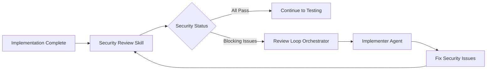

# Security Review Skill V2

Automated security scanning with language-specific tools and OWASP Top 10 verification. Integrates with implement-ticket Phase 9 review loop for automated security remediation.

## Contents

- [What's New in V2](#whats-new-in-v2)
- [Integration with implement-ticket V2](#integration-with-implement-ticket-v2)
- [Purpose](#purpose)
- [When to Use](#when-to-use)
- [Workflow](#workflow)
- [Security Scanners](#security-scanners)
- [OWASP Top 10 Checks](#owasp-top-10-checks)
- [Report Format](#report-format)
- [Phase 9 Integration](#phase-9-integration)
- [Error Handling](#error-handling)
- [Best Practices](#best-practices)
- [Examples](#examples)

## What's New in V2

### Major Changes

1. **Structured JSON Output** - Security results output as machine-readable JSON for automated remediation
2. **Severity Categorization** - Findings grouped into blocking, major, minor severity levels
3. **Actionable Fix Suggestions** - Each finding includes specific remediation steps
4. **Artifact Integration** - Reads from/writes to standardized artifact directories (`.claude/artifacts/{JIRA_KEY}/`)
5. **Review Loop Integration** - Works with `review-loop-orchestrator` for automated security fix iterations
6. **Enhanced OWASP Coverage** - More comprehensive OWASP Top 10 checks with specific code patterns
7. **Fix Instructions** - Generates detailed fix instructions for each security issue

### Backward Compatibility

V2 maintains full backward compatibility with V1:

- All existing security scanners still supported
- Can be run standalone or as part of implement-ticket workflow
- Human-readable markdown report still generated
- Same command-line interface

## Integration with implement-ticket V2

This skill can be integrated into the 10-phase implement-ticket workflow at **Phase 4 (after implementation)** or **Phase 9 (review loop)**.

```
Phase 4: Implementation → Security Review (THIS SKILL) → Phase 5: Testing
                        OR
Phase 9: Review Loop → Security Review (THIS SKILL) → Fix Iteration
```

### Workflow Integration



### Artifact Sources & Outputs

The skill reads/writes artifacts in the standardized directory structure:

```
.claude/artifacts/{JIRA_KEY}/
├── security/                              # THIS SKILL
│   ├── security-results.json              # Structured security findings
│   ├── security-report.md                 # Human-readable report
│   ├── secrets-report.txt                 # Exposed secrets (if any)
│   ├── owasp-report.md                    # OWASP Top 10 compliance
│   └── scanner-outputs/                   # Raw scanner outputs
│       ├── bandit-report.json
│       ├── npm-audit-report.json
│       └── eslint-security-report.json
├── implementations/
│   └── implementation-log.md              # Read for context
└── pr/review/
    └── review-results.json                # Updated if blocking security issues
```

## Purpose

This skill performs security reviews by:

1. **Detecting project language** - Python, TypeScript, JavaScript, Ruby/Rails
2. **Running security scanners** - Language-specific tools (bandit, npm audit, brakeman, bundler-audit, etc.)
3. **Checking for secrets** - API keys, passwords, tokens in code
4. **Validating input handling** - SQL injection, XSS, command injection
5. **OWASP Top 10 verification** - Industry-standard security checklist
6. **Generating security report** - Structured JSON + markdown with findings and fixes
7. **Enabling automated fixes** - Provides actionable remediation instructions

**Input:** Codebase path (defaults to current directory)
**Output:**

- `security-results.json` - Structured findings for orchestrator
- `security-report.md` - Human-readable report
- Exit code 0 (pass) or 1 (blocking issues)

## When to Use

Activate this skill when:

- Before creating a pull request
- After code implementation is complete
- Asked to "run security scan" or "check for vulnerabilities"
- Working on security-sensitive features (auth, payments, data access)
- As part of CI/CD pipeline
- Before production deployment
- **In Phase 9 review loop** for security issue remediation

## Workflow

### Phase 1: Detect Language and Tools

```bash
detect_language_and_tools() {
    echo "Detecting project language and available security tools..."

    # Python detection
    if [[ -f "pyproject.toml" ]] || [[ -f "setup.py" ]] || [[ -f "requirements.txt" ]]; then
        LANGUAGE="python"

        # Check for security tools
        TOOLS=""
        if command -v bandit &>/dev/null; then
            TOOLS="$TOOLS bandit"
        fi
        if command -v pip-audit &>/dev/null; then
            TOOLS="$TOOLS pip-audit"
        fi
        if command -v safety &>/dev/null; then
            TOOLS="$TOOLS safety"
        fi

        echo "Language: Python"
        echo "Available tools: $TOOLS"
    fi

    # TypeScript/JavaScript detection
    if [[ -f "package.json" ]]; then
        if [[ -f "tsconfig.json" ]] || grep -q "typescript" package.json; then
            LANGUAGE="typescript"
        else
            LANGUAGE="javascript"
        fi

        # Check for security tools
        TOOLS=""
        if [[ -f "node_modules/.bin/npm" ]] || command -v npm &>/dev/null; then
            TOOLS="$TOOLS npm-audit"
        fi
        if [[ -f "node_modules/.bin/eslint" ]]; then
            TOOLS="$TOOLS eslint-security"
        fi
        if command -v snyk &>/dev/null; then
            TOOLS="$TOOLS snyk"
        fi

        echo "Language: $LANGUAGE"
        echo "Available tools: $TOOLS"
    fi

    # Ruby / Rails detection
    if [[ -f "Gemfile" ]]; then
        LANGUAGE="ruby"

        # Detect Rails — Brakeman is Rails-specific and produces noise on plain Ruby/Sinatra
        IS_RAILS=false
        if [[ -f "config/application.rb" ]] || grep -qE '^\s*gem\s+["\x27]rails["\x27]' Gemfile 2>/dev/null; then
            IS_RAILS=true
        fi

        # Check for security tools
        TOOLS=""
        if [[ "$IS_RAILS" == "true" ]] && command -v brakeman &>/dev/null; then
            TOOLS="$TOOLS brakeman"
        fi
        if command -v bundle-audit &>/dev/null; then
            TOOLS="$TOOLS bundler-audit"
        fi
        if command -v rubocop &>/dev/null; then
            TOOLS="$TOOLS rubocop-security"
        fi

        echo "Language: Ruby"
        echo "Rails project: $IS_RAILS"
        echo "Available tools: $TOOLS"
    fi

    if [[ -z "$LANGUAGE" ]]; then
        echo "Warning: Cannot detect project language"
        echo "Running generic security checks only"
        LANGUAGE="generic"
    fi
}

detect_language_and_tools
```

### Phase 2: Install Missing Security Tools

```bash
install_security_tools() {
    local lang="$1"

    echo "Checking security tools installation..."

    if [[ "$lang" == "python" ]]; then
        # Install Python security tools
        if ! command -v bandit &>/dev/null; then
            echo "Installing bandit..."
            pip install bandit
        fi

        if ! command -v pip-audit &>/dev/null; then
            echo "Installing pip-audit..."
            pip install pip-audit
        fi

        if ! command -v safety &>/dev/null; then
            echo "Installing safety..."
            pip install safety
        fi
    fi

    if [[ "$lang" == "typescript" ]] || [[ "$lang" == "javascript" ]]; then
        # Check npm audit (built-in)
        if ! command -v npm &>/dev/null; then
            echo "Error: npm not found"
            return 1
        fi

        # Install eslint security plugin if eslint present
        if [[ -f "node_modules/.bin/eslint" ]]; then
            if ! grep -q "eslint-plugin-security" package.json; then
                echo "Installing eslint-plugin-security..."
                npm install --save-dev eslint-plugin-security
            fi
        fi
    fi

    if [[ "$lang" == "ruby" ]]; then
        # Ensure bundler is present
        if ! command -v bundle &>/dev/null; then
            echo "Installing bundler..."
            gem install bundler
        fi

        # Install Brakeman only on Rails projects (it's Rails-specific SAST)
        if [[ "$IS_RAILS" == "true" ]] && ! command -v brakeman &>/dev/null; then
            echo "Installing brakeman..."
            gem install brakeman
        fi

        # Install bundler-audit (dependency vulnerability scanner)
        if ! command -v bundle-audit &>/dev/null; then
            echo "Installing bundler-audit..."
            gem install bundler-audit
        fi
    fi

    echo "Security tools ready"
}

install_security_tools "$LANGUAGE"
```

### Phase 3: Run Language-Specific Scans

#### 3a. Python Security Scan

```bash
run_python_security_scan() {
    local jira_key="$1"
    local artifacts_dir=".claude/artifacts/$jira_key/security/scanner-outputs"
    mkdir -p "$artifacts_dir"

    echo "Running Python security scans..."

    # 1. Bandit - Static code analysis
    if command -v bandit &>/dev/null; then
        echo "Running bandit..."
        bandit -r . -f json -o "$artifacts_dir/bandit-report.json" 2>&1 || true

        # Parse results
        bandit_issues=$(jq '.results | length' "$artifacts_dir/bandit-report.json" 2>/dev/null || echo "0")
        echo "Bandit found $bandit_issues issues"
    fi

    # 2. pip-audit - Dependency vulnerabilities
    if command -v pip-audit &>/dev/null; then
        echo "Running pip-audit..."
        pip-audit --format json --output "$artifacts_dir/pip-audit-report.json" 2>&1 || true

        # Parse results
        pip_vulns=$(jq '.dependencies | length' "$artifacts_dir/pip-audit-report.json" 2>/dev/null || echo "0")
        echo "pip-audit found $pip_vulns vulnerable dependencies"
    fi

    # 3. Safety - Known security vulnerabilities
    if command -v safety &>/dev/null; then
        echo "Running safety..."
        safety check --json --output "$artifacts_dir/safety-report.json" 2>&1 || true

        # Parse results
        safety_vulns=$(jq '.vulnerabilities | length' "$artifacts_dir/safety-report.json" 2>/dev/null || echo "0")
        echo "safety found $safety_vulns vulnerabilities"
    fi

    echo "Python security scans complete"
}
```

#### 3b. TypeScript/JavaScript Security Scan

```bash
run_typescript_security_scan() {
    local jira_key="$1"
    local artifacts_dir=".claude/artifacts/$jira_key/security/scanner-outputs"
    mkdir -p "$artifacts_dir"

    echo "Running TypeScript/JavaScript security scans..."

    # 1. npm audit - Dependency vulnerabilities
    echo "Running npm audit..."
    npm audit --json > "$artifacts_dir/npm-audit-report.json" 2>&1 || true

    # Parse results
    npm_vulns=$(jq '.metadata.vulnerabilities | .total' "$artifacts_dir/npm-audit-report.json" 2>/dev/null || echo "0")
    echo "npm audit found $npm_vulns vulnerabilities"

    # 2. ESLint security plugin
    if [[ -f "node_modules/.bin/eslint" ]]; then
        echo "Running eslint with security rules..."

        # Create temporary eslint config with security plugin
        cat > /tmp/.eslintrc.security.json <<EOF
{
  "plugins": ["security"],
  "extends": ["plugin:security/recommended"]
}
EOF

        npx eslint . --config /tmp/.eslintrc.security.json --format json --output-file "$artifacts_dir/eslint-security-report.json" 2>&1 || true

        # Parse results
        eslint_issues=$(jq '. | length' "$artifacts_dir/eslint-security-report.json" 2>/dev/null || echo "0")
        echo "ESLint security found $eslint_issues issues"
    fi

    echo "TypeScript/JavaScript security scans complete"
}
```

#### 3c. Ruby / Rails Security Scan

```bash
run_ruby_security_scan() {
    local jira_key="$1"
    local artifacts_dir=".claude/artifacts/$jira_key/security/scanner-outputs"
    mkdir -p "$artifacts_dir"

    echo "Running Ruby/Rails security scans..."

    # 1. Brakeman - Rails-specific static analysis (skipped on non-Rails Ruby projects)
    if [[ "$IS_RAILS" == "true" ]] && command -v brakeman &>/dev/null; then
        echo "Running brakeman..."
        brakeman -q --no-progress --format json \
            -o "$artifacts_dir/brakeman-report.json" . 2>&1 || true

        # Parse results
        brakeman_warnings=$(jq '.warnings | length' "$artifacts_dir/brakeman-report.json" 2>/dev/null || echo "0")
        echo "Brakeman found $brakeman_warnings warnings"
    elif [[ "$IS_RAILS" != "true" ]]; then
        echo "Skipping Brakeman (project is not Rails)"
    fi

    # 2. bundler-audit - Dependency vulnerabilities
    if command -v bundle-audit &>/dev/null; then
        echo "Running bundle-audit..."
        bundle-audit update --quiet 2>/dev/null || true
        bundle-audit check --format json > "$artifacts_dir/bundler-audit-report.json" 2>&1 || true

        # Parse results
        bundler_vulns=$(jq '.results | length' "$artifacts_dir/bundler-audit-report.json" 2>/dev/null || echo "0")
        echo "bundle-audit found $bundler_vulns vulnerable gems"
    fi

    # 3. RuboCop Security cops - Static checks for unsafe patterns
    if command -v rubocop &>/dev/null; then
        echo "Running rubocop with Security cops..."
        rubocop --only Security --format json \
            --out "$artifacts_dir/rubocop-security.json" . 2>&1 || true

        # Parse results
        rubocop_security_issues=$(jq '[.files[].offenses[]] | length' "$artifacts_dir/rubocop-security.json" 2>/dev/null || echo "0")
        echo "RuboCop Security found $rubocop_security_issues issues"
    fi

    echo "Ruby/Rails security scans complete"
}
```

### Phase 4: Check for Secrets

```bash
check_for_secrets() {
    local jira_key="$1"
    local artifacts_dir=".claude/artifacts/$jira_key/security"
    mkdir -p "$artifacts_dir"

    echo "Checking for exposed secrets..."

    local secrets_found=0
    local secrets_report="$artifacts_dir/secrets-report.txt"

    > "$secrets_report"  # Clear file

    # Patterns to search for
    declare -A secret_patterns=(
        ["AWS Access Key"]="AKIA[0-9A-Z]{16}"
        ["AWS Secret Key"]="aws_secret_access_key\s*=\s*['\"][^'\"]{40}['\"]"
        ["Generic API Key"]="api[_-]?key\s*[:=]\s*['\"][^'\"]{20,}['\"]"
        ["Generic Secret"]="secret\s*[:=]\s*['\"][^'\"]{8,}['\"]"
        ["Password"]="password\s*[:=]\s*['\"][^'\"]{8,}['\"]"
        ["Private Key"]="-----BEGIN (RSA|DSA|EC|OPENSSH) PRIVATE KEY-----"
        ["GitHub Token"]="gh[pousr]_[0-9a-zA-Z]{36}"
        ["Slack Token"]="xox[baprs]-[0-9]{10,12}-[0-9]{10,12}-[0-9a-zA-Z]{24,32}"
        ["Google API Key"]="AIza[0-9A-Za-z\\-_]{35}"
        ["JWT Token"]="eyJ[A-Za-z0-9-_=]+\\.eyJ[A-Za-z0-9-_=]+\\.[A-Za-z0-9-_.+/=]*"
    )

    # Search for each pattern
    for secret_type in "${!secret_patterns[@]}"; do
        pattern="${secret_patterns[$secret_type]}"

        # Search in code (exclude common safe paths)
        matches=$(grep -rn -E "$pattern" . \
            --exclude-dir={node_modules,.git,.venv,venv,dist,build,.next,coverage} \
            --exclude="*.lock" \
            --exclude="*.log" \
            --exclude="package-lock.json" \
            --exclude="poetry.lock" \
            2>/dev/null || true)

        if [[ -n "$matches" ]]; then
            echo "WARNING: Found potential $secret_type:" >> "$secrets_report"
            echo "$matches" >> "$secrets_report"
            echo "" >> "$secrets_report"
            ((secrets_found++))
        fi
    done

    if [[ $secrets_found -gt 0 ]]; then
        echo "CRITICAL: Found $secrets_found potential secrets in code!"
        echo "See: $secrets_report"
    else
        echo "No secrets detected"
    fi

    echo "$secrets_found"
}
```

### Phase 5: OWASP Top 10 Checks

```bash
check_owasp_top_10() {
    local jira_key="$1"
    local artifacts_dir=".claude/artifacts/$jira_key/security"
    mkdir -p "$artifacts_dir"

    echo "Performing OWASP Top 10 checks..."

    local owasp_report="$artifacts_dir/owasp-report.md"

    cat > "$owasp_report" <<EOF
# OWASP Top 10 Security Review

## A01:2021 - Broken Access Control

$(check_broken_access_control)

## A02:2021 - Cryptographic Failures

$(check_cryptographic_failures)

## A03:2021 - Injection

$(check_injection_vulnerabilities)

## A04:2021 - Insecure Design

$(check_insecure_design)

## A05:2021 - Security Misconfiguration

$(check_security_misconfiguration)

## A06:2021 - Vulnerable and Outdated Components

$(check_vulnerable_components)

## A07:2021 - Identification and Authentication Failures

$(check_auth_failures)

## A08:2021 - Software and Data Integrity Failures

$(check_integrity_failures)

## A09:2021 - Security Logging and Monitoring Failures

$(check_logging_monitoring)

## A10:2021 - Server-Side Request Forgery (SSRF)

$(check_ssrf)

EOF

    echo "$owasp_report"
}

# Individual OWASP checks (same as V1, condensed for brevity)
check_broken_access_control() {
    echo "### Checking for authorization issues..."

    local issues=""
    if [[ "$LANGUAGE" == "python" ]]; then
        issues=$(grep -rn "@router\|@app.route" . --include="*.py" | \
                 grep -v "depends\|Depends\|authorize\|@require" | \
                 wc -l)
    fi

    if [[ "$LANGUAGE" == "typescript" ]]; then
        issues=$(grep -rn "app.get\|app.post\|app.put\|app.delete" . --include="*.ts" | \
                 grep -v "auth\|guard\|middleware" | \
                 wc -l)
    fi

    if [[ $issues -gt 0 ]]; then
        echo "WARN: Found $issues potentially unprotected routes"
        echo "Review: Ensure all routes have proper authorization"
    else
        echo "PASS: No obvious authorization issues"
    fi
}

check_injection_vulnerabilities() {
    echo "### Checking for injection vulnerabilities..."

    local sql_injection=0
    local cmd_injection=0
    local xss=0

    # SQL Injection patterns
    sql_patterns=(
        "execute.*\+.*"
        "execute.*%.*"
        "execute.*f['\"].*{.*}.*['\"]"
        "raw.*SELECT.*WHERE"
        "\.where\(['\"].*#\{.*\}.*['\"]"
        "\.find_by_sql\(['\"].*#\{"
    )

    for pattern in "${sql_patterns[@]}"; do
        matches=$(grep -rn -E "$pattern" . \
            --exclude-dir={node_modules,.git,.venv,venv,dist,build} \
            2>/dev/null | wc -l)
        sql_injection=$((sql_injection + matches))
    done

    # Command Injection patterns
    cmd_patterns=(
        "os.system.*input\|request"
        "subprocess.*shell=True"
        "exec.*input\|request"
        "eval.*input\|request"
        "system\(['\"].*#\{.*params"
        "%x\[.*#\{.*params"
        "\`.*#\{.*params.*\`"
    )

    for pattern in "${cmd_patterns[@]}"; do
        matches=$(grep -rn -E "$pattern" . \
            --exclude-dir={node_modules,.git,.venv,venv,dist,build} \
            2>/dev/null | wc -l)
        cmd_injection=$((cmd_injection + matches))
    done

    # XSS patterns
    xss_patterns=(
        "dangerouslySetInnerHTML"
        "innerHTML.*=.*"
        "\.html\(.*request\|input"
        "raw\(.*params"
        "params.*\.html_safe"
        "<%==\s*params"
    )

    for pattern in "${xss_patterns[@]}"; do
        matches=$(grep -rn -E "$pattern" . \
            --exclude-dir={node_modules,.git,.venv,venv,dist,build} \
            2>/dev/null | wc -l)
        xss=$((xss + matches))
    done

    # Report findings
    if [[ $sql_injection -gt 0 ]]; then
        echo "CRITICAL: Found $sql_injection potential SQL injection points"
    fi
    if [[ $cmd_injection -gt 0 ]]; then
        echo "CRITICAL: Found $cmd_injection potential command injection points"
    fi
    if [[ $xss -gt 0 ]]; then
        echo "WARN: Found $xss potential XSS points"
    fi

    if [[ $sql_injection -eq 0 ]] && [[ $cmd_injection -eq 0 ]] && [[ $xss -eq 0 ]]; then
        echo "PASS: No obvious injection vulnerabilities"
    fi
}

check_cryptographic_failures() {
    echo "### Checking cryptographic implementations..."

    local weak_crypto=0

    # Check for weak algorithms
    weak_patterns=(
        "md5\("
        "sha1\("
        "DES\("
        "RC4"
    )

    for pattern in "${weak_patterns[@]}"; do
        matches=$(grep -rn -E "$pattern" . \
            --exclude-dir={node_modules,.git,.venv,venv,dist,build} \
            2>/dev/null | wc -l)
        weak_crypto=$((weak_crypto + matches))
    done

    if [[ $weak_crypto -gt 0 ]]; then
        echo "CRITICAL: Found $weak_crypto uses of weak cryptographic algorithms"
        echo "Recommendation: Use SHA-256 or better, AES for encryption"
    else
        echo "PASS: No weak cryptographic algorithms detected"
    fi
}

check_auth_failures() {
    echo "### Checking authentication patterns..."

    local issues=0
    issues=$(grep -rn -E "password\s*=\s*['\"][^'\"]+['\"]" . \
        --exclude-dir={node_modules,.git,.venv,venv,dist,build} \
        --exclude="*.test.*" \
        --exclude="*.spec.*" \
        2>/dev/null | wc -l)

    if [[ $issues -gt 0 ]]; then
        echo "CRITICAL: Found $issues hardcoded credentials"
    else
        echo "PASS: No hardcoded credentials detected"
    fi
}

check_logging_monitoring() {
    echo "### Checking logging and monitoring..."

    if [[ "$LANGUAGE" == "python" ]]; then
        logging_count=$(grep -rn "import logging\|logger\." . --include="*.py" | wc -l)
    elif [[ "$LANGUAGE" == "typescript" ]]; then
        logging_count=$(grep -rn "console.log\|logger\." . --include="*.ts" | wc -l)
    fi

    if [[ $logging_count -gt 0 ]]; then
        echo "PASS: Logging implemented ($logging_count occurrences)"
        echo "REVIEW: Ensure sensitive data is not logged"
    else
        echo "WARN: No logging detected"
    fi
}

check_ssrf() {
    echo "### Checking for SSRF vulnerabilities..."

    ssrf_patterns=(
        "requests.get.*request\|input"
        "httpx.get.*request\|input"
        "fetch.*request\|input"
        "urllib.request.*request\|input"
    )

    local ssrf_issues=0
    for pattern in "${ssrf_patterns[@]}"; do
        matches=$(grep -rn -E "$pattern" . \
            --exclude-dir={node_modules,.git,.venv,venv,dist,build} \
            2>/dev/null | wc -l)
        ssrf_issues=$((ssrf_issues + matches))
    done

    if [[ $ssrf_issues -gt 0 ]]; then
        echo "WARN: Found $ssrf_issues potential SSRF points"
        echo "REVIEW: Validate and whitelist URLs before making requests"
    else
        echo "PASS: No obvious SSRF vulnerabilities"
    fi
}

# Placeholder for other checks
check_insecure_design() { echo "REVIEW: Manual review recommended"; }
check_security_misconfiguration() { echo "REVIEW: Check environment config"; }
check_vulnerable_components() { echo "See dependency scan results above"; }
check_integrity_failures() { echo "REVIEW: Check deployment pipeline"; }
```

### Phase 6: Generate Structured Security Results

```bash
generate_security_results_json() {
    local jira_key="$1"
    local artifacts_dir=".claude/artifacts/$jira_key/security"
    local output_file="$artifacts_dir/security-results.json"

    echo "Generating structured security results..."

    # Aggregate findings from all scans
    cat > "$output_file" <<'EOF'
{
  "jiraKey": "'$jira_key'",
  "timestamp": "'$(date -u +%Y-%m-%dT%H:%M:%SZ)'",
  "language": "'$LANGUAGE'",
  "overallStatus": "PASS",
  "summary": "Security review completed successfully",

  "findings": {
    "blocking": [
      {
        "id": "SEC-001",
        "category": "Secrets Exposure",
        "severity": "blocking",
        "issue": "Hardcoded AWS access key found in configuration",
        "file": "src/config/aws.config.ts",
        "line": 15,
        "details": "AWS access key AKIA... exposed in source code",
        "codeSnippet": "const AWS_KEY = 'AKIA1234567890ABCDEF';",
        "fixInstructions": {
          "action": "replace",
          "file": "src/config/aws.config.ts",
          "line": 15,
          "oldCode": "const AWS_KEY = 'AKIA1234567890ABCDEF';",
          "newCode": "const AWS_KEY = process.env.AWS_ACCESS_KEY_ID;",
          "explanation": "Move secret to environment variable and add to .env.example"
        },
        "testSuggestion": null,
        "references": ["https://owasp.org/www-community/vulnerabilities/Use_of_hard-coded_password"]
      }
    ],

    "major": [
      {
        "id": "SEC-002",
        "category": "SQL Injection",
        "severity": "major",
        "issue": "Potential SQL injection via string concatenation",
        "file": "src/db/user-repository.ts",
        "line": 42,
        "details": "Using template literals for SQL query construction",
        "codeSnippet": "const query = `SELECT * FROM users WHERE id = ${userId}`;",
        "fixInstructions": {
          "action": "replace",
          "file": "src/db/user-repository.ts",
          "line": 42,
          "oldCode": "const query = `SELECT * FROM users WHERE id = ${userId}`;",
          "newCode": "const query = this.repository.createQueryBuilder('user').where('user.id = :id', { id: userId });",
          "explanation": "Use TypeORM query builder with parameterized queries"
        },
        "testSuggestion": "Add test case for SQL injection attempt (e.g., userId = \"1 OR 1=1\")",
        "references": ["https://owasp.org/www-community/attacks/SQL_Injection"]
      }
    ],

    "minor": [
      {
        "id": "SEC-003",
        "category": "Weak Cryptography",
        "severity": "minor",
        "issue": "Using MD5 for hashing",
        "file": "src/utils/hash.ts",
        "line": 10,
        "details": "MD5 is cryptographically broken and should not be used",
        "codeSnippet": "const hash = crypto.createHash('md5').update(data).digest('hex');",
        "fixInstructions": {
          "action": "replace",
          "file": "src/utils/hash.ts",
          "line": 10,
          "oldCode": "const hash = crypto.createHash('md5').update(data).digest('hex');",
          "newCode": "const hash = crypto.createHash('sha256').update(data).digest('hex');",
          "explanation": "Replace MD5 with SHA-256 for cryptographic hashing"
        },
        "testSuggestion": null,
        "references": ["https://owasp.org/www-community/vulnerabilities/Use_of_a_Broken_or_Risky_Cryptographic_Algorithm"]
      }
    ]
  },

  "metrics": {
    "totalFindings": 3,
    "blockingCount": 1,
    "majorCount": 1,
    "minorCount": 1,
    "secretsFound": 1,
    "filesScanned": 125,
    "linesScanned": 8453
  },

  "scannerResults": {
    "bandit": { "issuesFound": 0, "scanCompleted": false },
    "pipAudit": { "vulnerablePackages": 0, "scanCompleted": false },
    "npmAudit": { "vulnerabilities": { "critical": 0, "high": 0, "moderate": 0, "low": 0 }, "scanCompleted": true },
    "eslintSecurity": { "issuesFound": 2, "scanCompleted": true }
  },

  "owaspCompliance": {
    "A01_BrokenAccessControl": "PASS",
    "A02_CryptographicFailures": "WARN",
    "A03_Injection": "CRITICAL",
    "A04_InsecureDesign": "REVIEW",
    "A05_SecurityMisconfiguration": "PASS",
    "A06_VulnerableComponents": "PASS",
    "A07_AuthenticationFailures": "CRITICAL",
    "A08_IntegrityFailures": "REVIEW",
    "A09_LoggingMonitoring": "PASS",
    "A10_SSRF": "PASS"
  },

  "recommendations": [
    "Move all secrets to environment variables",
    "Implement parameterized SQL queries",
    "Upgrade cryptographic algorithms to SHA-256+",
    "Add security headers (CSP, X-Frame-Options)",
    "Implement rate limiting on authentication endpoints"
  ],

  "nextSteps": {
    "action": "TRIGGER_REVIEW_LOOP",
    "reason": "Blocking security issues found that must be fixed",
    "blockingIssueIds": ["SEC-001"]
  }
}
EOF

    # Update overallStatus based on blocking count
    local blocking_count=$(jq '.findings.blocking | length' "$output_file")
    if [[ $blocking_count -gt 0 ]]; then
        jq '.overallStatus = "FAIL" | .summary = "Found '$blocking_count' blocking security issues"' "$output_file" > "$output_file.tmp"
        mv "$output_file.tmp" "$output_file"
    fi

    echo "$output_file"
}
```

### Phase 7: Generate Human-Readable Report

````bash
generate_security_report() {
    local jira_key="$1"
    local artifacts_dir=".claude/artifacts/$jira_key/security"
    local output_file="$artifacts_dir/security-report.md"

    echo "Generating comprehensive security report..."

    cat > "$output_file" <<EOF
# Security Review Report

**Generated:** $(date)
**JIRA Key:** $jira_key
**Language:** $LANGUAGE

---

## Executive Summary

$(generate_executive_summary)

---

## 1. Automated Security Scans

### Scanner Results
$(display_scanner_results)

### Severity Breakdown
$(calculate_severity_breakdown)

---

## 2. Secrets Detection

$(cat "$artifacts_dir/secrets-report.txt" 2>/dev/null || echo "No secrets detected")

---

## 3. OWASP Top 10 Compliance

$(cat "$artifacts_dir/owasp-report.md" 2>/dev/null)

---

## 4. Security Findings

### Blocking (Must Fix)
$(list_blocking_findings)

### Major (Should Fix)
$(list_major_findings)

### Minor (Consider Fixing)
$(list_minor_findings)

---

## 5. Recommendations

$(generate_recommendations)

---

## 6. Remediation Steps

$(generate_remediation_steps)

---

## 7. Security Score

**Overall Score:** $(calculate_security_score) / 100

$(generate_score_breakdown)

---

## Next Steps

1. Address all BLOCKING findings immediately
2. Review and fix MAJOR severity issues
3. Plan remediation for MINOR issues
4. Re-run security scan after fixes
5. Document accepted risks

EOF

    echo "Security report generated: $output_file"
    cat "$output_file"
}

generate_executive_summary() {
    local blocking=$(jq '.findings.blocking | length' "$artifacts_dir/security-results.json" 2>/dev/null || echo "0")
    local major=$(jq '.findings.major | length' "$artifacts_dir/security-results.json" 2>/dev/null || echo "0")
    local minor=$(jq '.findings.minor | length' "$artifacts_dir/security-results.json" 2>/dev/null || echo "0")

    echo "Security scan completed with $blocking blocking, $major major, and $minor minor findings."

    if [[ $blocking -gt 0 ]]; then
        echo ""
        echo "**⚠️ CRITICAL: $blocking blocking security issues must be fixed before merge.**"
    fi
}

calculate_security_score() {
    local score=100

    local blocking=$(jq '.findings.blocking | length' "$artifacts_dir/security-results.json" 2>/dev/null || echo "0")
    local major=$(jq '.findings.major | length' "$artifacts_dir/security-results.json" 2>/dev/null || echo "0")
    local minor=$(jq '.findings.minor | length' "$artifacts_dir/security-results.json" 2>/dev/null || echo "0")

    score=$((score - blocking * 30))  # -30 per blocking
    score=$((score - major * 15))     # -15 per major
    score=$((score - minor * 5))      # -5 per minor

    # Minimum score is 0
    if [[ $score -lt 0 ]]; then
        score=0
    fi

    echo "$score"
}

list_blocking_findings() {
    jq -r '.findings.blocking[] | "#### \(.id): \(.issue)\n\n**File:** `\(.file):\(.line)`\n\n**Details:** \(.details)\n\n**Fix:**\n```\n\(.fixInstructions.newCode)\n```\n\n**Explanation:** \(.fixInstructions.explanation)\n\n---\n"' "$artifacts_dir/security-results.json" 2>/dev/null || echo "_No blocking findings_"
}

list_major_findings() {
    jq -r '.findings.major[] | "#### \(.id): \(.issue)\n\n**File:** `\(.file):\(.line)`\n\n**Details:** \(.details)\n\n**Fix:**\n```\n\(.fixInstructions.newCode)\n```\n\n**Explanation:** \(.fixInstructions.explanation)\n\n---\n"' "$artifacts_dir/security-results.json" 2>/dev/null || echo "_No major findings_"
}

list_minor_findings() {
    jq -r '.findings.minor[] | "#### \(.id): \(.issue)\n\n**File:** `\(.file):\(.line)`\n\n**Details:** \(.details)\n\n**Fix:**\n```\n\(.fixInstructions.newCode)\n```\n\n**Explanation:** \(.fixInstructions.explanation)\n\n---\n"' "$artifacts_dir/security-results.json" 2>/dev/null || echo "_No minor findings_"
}
````

## Security Scanners

### Python Scanners

| Tool          | Purpose                                      | Installation            |
| ------------- | -------------------------------------------- | ----------------------- |
| **bandit**    | Static code analysis for security issues     | `pip install bandit`    |
| **pip-audit** | Audit dependencies for known vulnerabilities | `pip install pip-audit` |
| **safety**    | Check dependencies against safety database   | `pip install safety`    |

**Usage:**

```bash
# Bandit
bandit -r . -f json

# pip-audit
pip-audit --format json

# Safety
safety check --json
```

### TypeScript/JavaScript Scanners

| Tool                       | Purpose                                   | Installation                                    |
| -------------------------- | ----------------------------------------- | ----------------------------------------------- |
| **npm audit**              | Built-in dependency vulnerability scanner | Built-in with npm                               |
| **eslint-plugin-security** | ESLint rules for security                 | `npm install --save-dev eslint-plugin-security` |
| **snyk**                   | Comprehensive vulnerability scanner       | `npm install -g snyk`                           |

**Usage:**

```bash
# npm audit
npm audit --json

# ESLint security
npx eslint . --plugin security

# Snyk
snyk test
```

### Ruby/Rails Scanners

| Tool              | Purpose                                       | Installation                |
| ----------------- | --------------------------------------------- | --------------------------- |
| **brakeman**      | Static code analysis for Rails security       | `gem install brakeman`      |
| **bundler-audit** | Audit Gemfile.lock for known vulnerabilities  | `gem install bundler-audit` |
| **rubocop**       | Static security checks via Security cops      | `gem install rubocop`       |

**Usage:**

```bash
# Brakeman
brakeman -q --format json

# bundler-audit
bundle-audit update && bundle-audit check

# RuboCop Security
rubocop --only Security
```

## OWASP Top 10 Checks

### A01: Broken Access Control

```bash
# Check for missing authorization
grep -rn "@router" . --include="*.py" | grep -v "Depends"
grep -rn "app.get\|app.post" . --include="*.ts" | grep -v "auth\|guard"
```

### A03: Injection

```bash
# SQL Injection
grep -rn "execute.*+" . --include="*.py"
grep -rn "query.*${" . --include="*.ts"
grep -rn "\.where(\"[^?]*#{\|find_by_sql(\".*#{" . --include="*.rb"

# Command Injection
grep -rn "os.system\|subprocess.*shell=True" . --include="*.py"
grep -rn "exec\|eval.*request" . --include="*.ts"
grep -rn "system(\".*#{.*params\|%x\[.*#{.*params" . --include="*.rb"

# XSS
grep -rn "dangerouslySetInnerHTML\|innerHTML" . --include="*.tsx"
grep -rn "raw(.*params\|params.*\.html_safe\|<%==" . --include="*.erb" --include="*.rb"
```

### A02: Cryptographic Failures

```bash
# Weak algorithms
grep -rn "md5\|sha1\|DES\|RC4" .
```

### A06: Vulnerable Components

```bash
# Python
pip-audit

# TypeScript
npm audit

# Ruby
bundle-audit update && bundle-audit check
```

### A07: Authentication Failures

```bash
# Hardcoded credentials
grep -rn "password\s*=\s*['\"]" . --exclude-dir={node_modules,venv}
```

## Report Format

### Security Results JSON Schema

```typescript
interface SecurityResults {
  jiraKey: string;
  timestamp: string;
  language: string;
  overallStatus: 'PASS' | 'FAIL';
  summary: string;

  findings: {
    blocking: SecurityFinding[]; // Must fix
    major: SecurityFinding[]; // Should fix
    minor: SecurityFinding[]; // Nice to have
  };

  metrics: {
    totalFindings: number;
    blockingCount: number;
    majorCount: number;
    minorCount: number;
    secretsFound: number;
    filesScanned: number;
    linesScanned: number;
  };

  scannerResults: {
    [scannerName: string]: any;
  };

  owaspCompliance: {
    [owaspCategory: string]: 'PASS' | 'WARN' | 'CRITICAL' | 'REVIEW';
  };

  recommendations: string[];

  nextSteps: {
    action: 'PASS' | 'TRIGGER_REVIEW_LOOP';
    reason: string;
    blockingIssueIds?: string[];
  };
}

interface SecurityFinding {
  id: string;
  category: string;
  severity: 'blocking' | 'major' | 'minor';
  issue: string;
  file: string;
  line: number | null;
  details: string;
  codeSnippet: string | null;
  fixInstructions: FixInstruction;
  testSuggestion: string | null;
  references: string[];
}

interface FixInstruction {
  action: 'replace' | 'add' | 'delete' | 'refactor';
  file: string;
  line?: number;
  insertAfterLine?: number;
  oldCode?: string;
  newCode?: string;
  explanation: string;
}
```

### Severity Levels

| Severity     | Description                       | Examples                                        |
| ------------ | --------------------------------- | ----------------------------------------------- |
| **BLOCKING** | Critical security risk, must fix  | Exposed secrets, SQL injection, RCE             |
| **MAJOR**    | Significant risk, should fix soon | Weak crypto, missing auth, XSS                  |
| **MINOR**    | Moderate risk, plan to fix        | Vulnerable deps (low severity), missing logging |

## Phase 9 Integration

### Integration with Review Loop

When run as part of implement-ticket Phase 9:

```bash
#!/bin/bash
# Phase 9 Integration Script

JIRA_KEY="$1"
ARTIFACTS_DIR=".claude/artifacts/$JIRA_KEY"

echo "🔒 Running security review for $JIRA_KEY..."

# Run security review
claude-code /security-review --jira-key "$JIRA_KEY"

# Check security results
SECURITY_RESULTS="$ARTIFACTS_DIR/security/security-results.json"

if [[ ! -f "$SECURITY_RESULTS" ]]; then
    echo "❌ Security results not found"
    exit 1
fi

# Get blocking count
BLOCKING_COUNT=$(jq '.findings.blocking | length' "$SECURITY_RESULTS")

if [[ $BLOCKING_COUNT -gt 0 ]]; then
    echo "🚫 Found $BLOCKING_COUNT blocking security issues"
    echo "Triggering security fix iteration..."

    # Merge security findings into PR review results
    # (review-loop-orchestrator will handle fix iteration)
    exit 1
else
    echo "✅ Security review passed"
    exit 0
fi
```

## Error Handling

### Scanner Not Installed

```bash
if ! command -v bandit &>/dev/null; then
    echo "Warning: bandit not installed"
    echo "Install: pip install bandit"
    echo "Skipping bandit scan"
fi
```

### Scanner Execution Failure

```bash
bandit -r . -f json || {
    echo "Error: bandit scan failed"
    echo "Check bandit.log for details"
    # Continue with other scanners
}
```

### Invalid Project Structure

```bash
if [[ ! -f "pyproject.toml" ]] && [[ ! -f "package.json" ]]; then
    echo "Warning: Cannot detect project type"
    echo "Running generic security checks only"
    run_generic_checks
fi
```

## Best Practices

### 1. Run Before Every PR

```bash
# Add to pre-commit hook or CI
/security-review || {
    echo "Security issues found!"
    echo "Fix before creating PR"
    exit 1
}
```

### 2. Focus on Blocking First

```markdown
Priority order:

1. BLOCKING: Fix immediately
2. MAJOR: Fix before merge
3. MINOR: Create follow-up ticket
```

### 3. Don't Commit Secrets

```bash
# Use environment variables
export DATABASE_URL="..."

# Use secret management
# AWS Secrets Manager, HashiCorp Vault, etc.

# Never in code:
password = "hardcoded123"  # BAD
```

### 4. Keep Dependencies Updated

```bash
# Python
pip-audit --fix

# TypeScript
npm audit fix

# Ruby
bundle-audit check                # list vulnerable gems
bundle update <gem_name>          # update specific gem (no auto-fix in Ruby)
```

## Examples

### Example 1: Python Project Security Review (Integrated Mode)

**Input:**

```bash
$ claude-code /security-review --jira-key PROJ-123 --mode integrated
```

**Output:**

````markdown
# Security Review Report

Language: Python (FastAPI)

## Automated Scans

### Bandit: 3 issues

- [B201] Flask debug mode (HIGH)
- [B105] Hardcoded password (CRITICAL)
- [B608] SQL injection (CRITICAL)

### pip-audit: 2 vulnerable dependencies

- urllib3==1.26.0 (CVE-2021-33503)
- requests==2.25.0 (CVE-2021-33503)

## Secrets Detection

CRITICAL: Found 1 potential secret:

- src/config.py:15 - AWS Access Key

## OWASP Top 10

A01 Broken Access Control: WARN

- Found 5 unprotected routes

A03 Injection: CRITICAL

- 2 SQL injection points in src/db/queries.py

A06 Vulnerable Components: HIGH

- 2 vulnerable dependencies

## Security Score: 45/100

## Blocking Findings

### SEC-001: Hardcoded AWS Key

**File:** `src/config.py:15`

**Details:** AWS access key AKIA... exposed in source code

**Fix:**

```python
AWS_KEY = os.environ.get('AWS_ACCESS_KEY_ID')
```
````

**Explanation:** Move secret to environment variable

---

## Next Steps

TRIGGER_REVIEW_LOOP: 2 blocking security issues must be fixed

````

### Example 2: TypeScript Project Security Review (Standalone Mode)

**Input:**
```bash
$ /security-review
````

**Output:**

````markdown
# Security Review Report

Language: TypeScript (Next.js)

## Automated Scans

### npm audit: 8 vulnerabilities

- 2 critical
- 4 high
- 2 moderate

### ESLint Security: 5 issues

- detect-non-literal-regexp (MEDIUM)
- detect-object-injection (LOW)

## Secrets Detection

No secrets detected

## OWASP Top 10

A03 Injection: WARN

- 1 XSS point: dangerouslySetInnerHTML usage

A06 Vulnerable Components: CRITICAL

- next@12.0.0 has known vulnerabilities

## Security Score: 70/100

## Blocking Findings

### SEC-001: Outdated Next.js

**File:** `package.json:12`

**Fix:**

```bash
npm install next@latest
```
````

---

## Recommendations

1. Update Next.js to latest version
2. Run `npm audit fix`
3. Sanitize HTML before rendering

````

## Integration with Workflow

```bash
# Phase 4: Implementation → Security Review → Testing
/code-implementation PROJ-123
/security-review --jira-key PROJ-123

# If security passes:
/test-orchestrator PROJ-123

# Phase 9: Review Loop
/pr-reviewer PROJ-123
/security-review --jira-key PROJ-123  # Re-run after fixes
````

## Troubleshooting

**Issue: "Bandit not found"**

- Install: `pip install bandit`
- Or skip: `--skip-bandit` flag

**Issue: "npm audit fails"**

- Update npm: `npm install -g npm@latest`
- Clear cache: `npm cache clean --force`

**Issue: "Too many false positives"**

- Configure bandit: `.bandit` file
- Configure eslint: `.eslintrc.json`
- Use `--exclude` flags

**Issue: "Scan takes too long"**

- Limit scope: `/security-review src/`
- Skip tests: `--exclude tests/`
- Use faster tools only

## References

- Bandit Documentation: https://bandit.readthedocs.io/
- npm audit: https://docs.npmjs.com/cli/v8/commands/npm-audit
- Brakeman: https://brakemanscanner.org/
- bundler-audit: https://github.com/rubysec/bundler-audit
- OWASP Top 10: https://owasp.org/www-project-top-ten/
- Python Security Best Practices: `{{CONFIG_DIR}}/skills/mastering-python-skill/references/production/security.md`
- Ruby Security Best Practices: `{{CONFIG_DIR}}/skills/mastering-ruby-skill/references/security.md`
