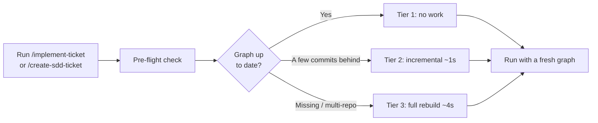

# Code Graph & LLM Wiki

Our AI agents no longer *explore* your codebase every time they work — they already know it. The framework builds a structural map and a living knowledge base of your project, so every task starts grounded, accurate, and cheaper.

---

## What's New

### 🧠 Code Graph

A per-project map of the codebase — functions, files, dependencies, call paths — built **deterministically** with Tree-sitter parsers. No AI guessing: the same source always produces the same graph.

Every agent (planner, implementer, reviewer) queries the graph **first** instead of blindly searching files. It lives at `.code-review-graph/graph.db` and is **per-developer** (not committed) — each machine builds its own from local source.

### 📚 LLM Wiki

An auto-generated, always-fresh knowledge base of the project — architecture, services, conventions, and flows — under `docs/llm-wiki/`. Agents **read the wiki first** instead of re-analyzing the repo on every ticket, and the wiki refreshes incrementally as the code evolves.

Unlike the graph, the wiki **is committed**, so the whole team shares one knowledge base.

### 🔗 Multi-Repo Support

The framework natively understands **multi-repo workspaces** — a single project made of multiple Git repositories (e.g. 10 microservices, each in its own repo, sitting side by side). One graph DB and one wiki at the workspace root index every child repo together.

> The code graph and wiki are generated by `/initialize-project` alongside the rest of the `.claude/` config. See the [Project Structure reference](../reference/project-structure.md) for where everything lands.

---

## Why It Matters

- ✅ **Faster delivery** — Agent exploration is enhanced and jumps faster to implementation. Every ticket starts with full project context already loaded.
- ✅ **Lower cost per task** — Less token spend, fewer wasted LLM calls.
- ✅ **Higher accuracy** — Decisions are grounded in real code structure, not pattern-matched guesses. Fewer hallucinations, fewer rework cycles.
- ✅ **Onboarding for humans *and* AIs** — New developers (and new agents) read the same wiki. Knowledge stops living in senior engineers' heads.
- ✅ **Scales to any codebase** — From a single service to multi-repo microservice estates. The bigger and messier the project, the more value the graph + wiki create.

---

## Code Graph vs LLM Wiki

| | 🧠 Code Graph | 📚 LLM Wiki |
| --- | --- | --- |
| **Built by** | Tree-sitter parsers (deterministic) | LLM synthesis + surgical edits |
| **Contains** | Functions, files, dependencies, call paths | Architecture, services, conventions, flows |
| **Stored at** | `.code-review-graph/graph.db` | `docs/llm-wiki/` |
| **Committed?** | ❌ Per-developer, rebuilt locally | ✅ Shared with the team |
| **Refreshed** | Automatically, before every QAF flow | On demand, or after `/implement-ticket` |
| **Speed** | Near-instant (seconds) | Heavier — incremental, only changed pages |

---

## How It Stays Fresh

A common question: *"What if 3 devs use QAF and 2 don't on the same project? Do the wiki and graph still update?"*

Yes — and the two halves stay fresh through different mechanisms.

### Graph — automatic, every run

QAF flows (`/implement-ticket`, `/create-sdd-ticket`) run a **pre-flight check** (`scripts/ensure-context.sh`) before executing. It compares the graph's recorded Git `HEAD` against the current one and rebuilds only what changed:

| Tier | When | Cost |
| --- | --- | --- |
| **1 — hot** | Graph already at current `HEAD` | No work (`<100ms`) |
| **2 — incremental** | A few commits behind | ~1s (diffs changed files) |
| **3 — full rebuild** | First run, or any multi-repo workspace | ~4s (≈10s worst case) |

**Takeaway**: you always run against a fresh graph — even if teammates committed without using QAF. The build is near-instant, so there is nothing to coordinate.

### Wiki — on demand or automatic after tickets

The wiki is more demanding to produce, so it refreshes through the `/wiki-refresh` skill:

- **Manually** — run `/wiki-refresh` any time.
- **Automatically** — after `/implement-ticket` (Phase 8.5 runs `/wiki-refresh --commit --ticket <ID>`).

`/wiki-refresh` diffs each repo since its last recorded commit (tracked in `docs/llm-wiki/.state.json`) and makes **surgical, incremental edits** to only the pages whose facts actually drifted. It is conservative by design — it skips internal refactors, renames, new tests, and bug fixes that don't change a public contract; *"no change"* is a perfectly valid outcome.

Because the wiki is committed, the entire team benefits the moment **any** QAF user implements a ticket — the refreshed pages land in the repo for everyone.

---

## How Agents Use It

The discipline is **wiki-first, graph-second**:

1. Read the router (`docs/llm-wiki/CLAUDE.md`) — a decision table pointing to the right page.
2. Read the index (`docs/llm-wiki/wiki/index.md`) and pick the 1–3 pages whose summaries match the task.
3. Read those page bodies for grounded, high-level context.
4. Make **targeted** graph queries only for what the wiki can't answer — blast radius, callers, affected tests.

This is what lets a task start *already grounded* instead of beginning with a blind sweep of the repo.

---

## Related

- [Implement Ticket Workflow](../workflows/implement-ticket.md) — runs the pre-flight check and auto-refreshes the wiki.
- [Initialize Project Workflow](../workflows/initialize-project.md) — first builds the graph and generates the wiki.
- [Skills Reference](../reference/skills-catalog.md) — including `/wiki-refresh`.
