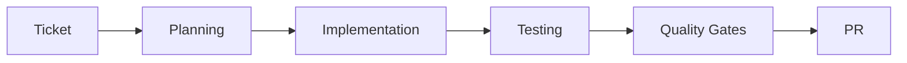

# Quickstart Guide

Get up and running with AI-powered development workflows.

---

## Overview

Automate the full cycle: **Idea → Ticket → Implementation → Pull Request**

**Prerequisites**:
- Node.js v20+ (v22 recommended)
- Git repository
- Claude Code CLI **or** Codex CLI installed

### Invoking Skills

The framework exposes its workflows as user-invokable skills. The prefix
differs per provider — the arguments and behavior are identical:

| Provider     | Invoke a skill     | List available skills |
| ------------ | ------------------ | --------------------- |
| Claude Code  | `/skill [args]`    | Auto-discovered       |
| Codex CLI    | `$skill [args]`    | `/skills`             |

In Codex, run `/skills` to see the skills currently active in the session —
useful when troubleshooting why a skill isn't firing.

---

## Step 1: Setup

### Clone and Initialize

```bash
# Navigate to your project
cd your-project-directory

# Clone framework
git clone https://github.com/thisisqubika/qubika-agentic-framework.git

# Run automated initialization
./qubika-agentic-framework/scripts/initialize-project.sh
```

### Verify

```bash
cd ..  # Back to project root
ls .claude/

# Should see:
# CLAUDE.md             - Project AI guide (or AGENTS.md in Codex)
# skills/               - AI knowledge (now the invocation surface)
# agents/               - AI agents
# scripts/              - preflight automation (code graph + MCP bootstrap)
# framework-config.json - detected stack + framework config

# Also created at the project root:
# docs/llm-wiki/        - generated LLM wiki
# .mcp.json             - code_graph MCP server (.codex/config.toml in Codex)
```

---

## Step 2: Your First Automation

### Option A: Full Cycle (Idea → Ticket → PR)

**Create ticket**:

```bash
# Claude Code
/create-sdd-ticket --from-input "Add dark mode toggle to settings page" --save-to-markdown .claude-temp/tickets/dark-mode/ticket.md

# Codex CLI
$create-sdd-ticket --from-input "Add dark mode toggle to settings page" --save-to-markdown .codex-temp/tickets/dark-mode/ticket.md
```

**What happens**:
- Analyzes codebase for UI patterns
- Asks clarifying questions
- Generates complete ticket with acceptance criteria

**Implement**:

```bash
# Claude Code
/implement-ticket --from-jira PROJ-123

# Codex CLI
$implement-ticket --from-jira PROJ-123
```

**What happens**:
- Creates implementation plan
- Generates code with tests
- Runs quality checks
- Creates pull request

**Result**: Production-ready PR with working code, tests, and documentation.

### Option B: Just Implementation (Ticket → PR)

```bash
# Claude Code
/implement-ticket --from-jira PROJ-456          # Jira ticket
/implement-ticket --from-markdown ./specs/feature.md  # Markdown spec

# Codex CLI
$implement-ticket --from-jira PROJ-456
$implement-ticket --from-markdown ./specs/feature.md
```

---

## Step 3: Review Results

### Generated Pull Request

```markdown
# Add Dark Mode Toggle

## Summary
- Added toggle component
- Implemented theme switching with persistence
- Updated components to respect theme

## Changes
- src/components/settings/DarkModeToggle.tsx
- src/contexts/ThemeContext.tsx
- tests/components/settings/DarkModeToggle.test.tsx

## Quality Gates
✅ TypeScript compilation
✅ Linting
✅ All tests passing
✅ 80%+ coverage
```

### Check Files

```bash
git status
npm test -- --coverage
ls src/**/*.test.tsx
```

---

## Step 4: Understanding

### Framework Analysis

During initialization:
1. Detected tech stack (TypeScript, React, Jest, etc.)
2. Analyzed code patterns (component structure, testing)
3. Generated project-specific AI config in `.claude/`

### AI-Powered Implementation



**Phases**:
1. Planning - Analyze requirements, create plan
2. Implementation - Generate code following patterns
3. Testing - Unit, integration, E2E tests
4. Quality - Linting, type checking, coverage
5. PR - Commit, push, create pull request

### Generated Files

Initialization writes more than just `.claude/` — it also generates the LLM wiki (`docs/llm-wiki/`), the code graph (`.code-review-graph/`), and the MCP config (`.mcp.json`) at your project root.

For the complete, annotated tree of everything that gets generated — and what to commit — see the [Project Structure reference](/docs/reference/project-structure).

---

## Next Steps

### Try More Workflows

```bash
# Claude Code
/create-sdd-ticket --from-input "Add CSV export" --save-to-markdown ./specs/export.md
/create-sdd-ticket --from-input "Add search filtering" --save-to-markdown ./specs/search.md
/implement-ticket --from-markdown ./specs/export.md
/implement-ticket --from-markdown ./specs/search.md

# Codex CLI
$create-sdd-ticket --from-input "Add CSV export" --save-to-markdown ./specs/export.md
$create-sdd-ticket --from-input "Add search filtering" --save-to-markdown ./specs/search.md
$implement-ticket --from-markdown ./specs/export.md
$implement-ticket --from-markdown ./specs/search.md
```

### Explore Advanced Features

- Custom model tiers, chosen at setup time (`MODEL_TIER=fast|standard|advanced ./scripts/initialize-project.sh`)
- Visual regression testing (automatic for UI changes)
- Skip options (`--skip-tests`, `--skip-visual`, `--skip-pr`)

### Read Documentation

- [Implement Ticket Workflow](/docs/workflows/implement-ticket)
- [Create SDD Ticket Workflow](/docs/workflows/create-sdd-ticket)
- [Troubleshooting](/docs/getting-started/troubleshooting)

---

**Need Help?**

- Check artifacts: `.claude-temp/tickets/[TICKET-ID]/artifacts/` (`.codex-temp/` on Codex)
- Inspect preflight markers there: `.preflight-ok` / `.preflight-failed` (carries `{ reason, git_head, ran_at }`)
- Review logs in console output

---

**Ready to automate development?** Start with a well-defined ticket.
