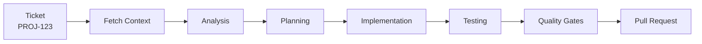

# User Guide

Complete workflows and best practices for using the AI Agentic Framework in your daily development.

---

## Table of Contents

1. [Getting Started](#getting-started)
2. [Core Workflows](#core-workflows)
3. [Skills Reference](#skills-reference)
4. [Best Practices](#best-practices)
5. [Team Collaboration](#team-collaboration)
6. [Troubleshooting](#troubleshooting)
7. [FAQ](#faq)

---

## Getting Started

### Invoking Skills

The framework works with two providers — skills are invoked the same way, but the prefix differs:

| Provider   | Prefix | Example                              | List active skills |
|------------|--------|--------------------------------------|--------------------|
| Claude Code | `/`    | `/implement-ticket --from-jira PROJ-123` | auto-discovered    |
| Codex CLI   | `$`    | `$implement-ticket --from-jira PROJ-123` | `/skills`          |

All examples in this guide show both forms. Pick whichever matches your provider.

### First Time Setup

**1. Initialize Your Project**
```bash
cd /path/to/your-project
git clone https://github.com/thisisqubika/qubika-agentic-framework.git qubika-agentic-framework

# Auto-detects provider (defaults to claude); pass --provider codex to force Codex.
./qubika-agentic-framework/scripts/initialize-project.sh
```

This analyzes your codebase and generates (Claude layout shown — Codex writes to `.codex/` with `AGENTS.md`):
- `CLAUDE.md` (or `AGENTS.md`) - Quick reference guide
- Convention skills (`code-conventions`, `multi-file-workflows`, `testing-conventions`) - generated from your code
- Stack-specific skills
- Custom AI agents
- The LLM wiki, code graph, and MCP config at your project root

See the [Project Structure reference](/docs/reference/project-structure) for the complete tree.

**Time**: ~10-15 minutes

---

## Core Workflows

### Workflow 1: Implementing a Feature

The most common workflow - transforming a ticket into a pull request.



**Step by Step**:

```bash
# Claude Code
/implement-ticket --from-jira PROJ-123
# Codex CLI
$implement-ticket --from-jira PROJ-123
```

> You can also implement from a plain description (`--from-input "..."`) or a local SDD markdown
> file (`--from-markdown ./specs/feature.md`).

**What happens**:

1. **Fetches ticket** from Jira/GitHub/Linear
2. **Analyzes requirements** and assesses risk
3. **Creates plan** (architect mode for high-risk, planner mode for low-risk)
4. **Implements code** following YOUR patterns
5. **Runs tests** using YOUR test framework
6. **Quality gates** (linting, type checking, coverage)
7. **Creates PR** with comprehensive description

**Time**: 5-15 minutes

**When to use**: Any feature ticket with clear requirements

---

### Workflow 2: Reviewing a PR

Run an AI review on a pull request before (or alongside) human review.

```bash
# Claude Code
/pr-reviewer --pr-url https://github.com/org/repo/pull/123
# Codex CLI
$pr-reviewer --pr-url https://github.com/org/repo/pull/123
```

**What it checks** (specialist agents):
- Bug / logic issues
- Security vulnerabilities
- Test coverage and quality
- Performance
- Project conventions

**Multi-repo**: pass `--repos <abs1>,<abs2>` to review across repos, then `--aggregate` for a
cross-repo summary.

**When to use**: On any open PR, before requesting human review

---

### Workflow 3: Applying PR Feedback

Apply reviewer feedback (a `CHANGES_REQUESTED` review) to the existing branch — no new PR is opened.

```bash
# Claude Code
/apply-pr-feedback --pr-number 123 --branch feature/oauth-login --from-jira PROJ-123
# Codex CLI
$apply-pr-feedback --pr-number 123 --branch feature/oauth-login --from-jira PROJ-123
```

By default it applies the most recent `CHANGES_REQUESTED` review; pass `--review-id <ID>` to target a
specific one. `--from-jira` is optional but recommended so the changes stay anchored to the ticket.

**When to use**: After a reviewer (human or `pr-reviewer`) requests changes on your PR

---

## Skills Reference

> Prefix skills with `/` in Claude Code and `$` in Codex CLI. In Codex, run `/skills` to list the
> skills loaded in the current session.

### Project Setup

| Skill | Purpose | Time |
|-------|---------|------|
| `initialize-project.sh` (shell script) | One-time setup | 10-15 min |

### Feature Development

| Skill | Purpose |
|-------|---------|
| `implement-ticket --from-jira <ID>` | Full feature/bug implementation (tests, quality gates, PR) |
| `create-sdd-ticket --from-input "..."` | Turn an idea or Jira ticket into a spec-driven ticket |
| `pr-reviewer --pr-url <URL>` | AI review of a pull request (bugs, security, tests, perf, conventions) |
| `apply-pr-feedback --pr-number <N> --branch <branch>` | Apply requested-change feedback to an existing PR branch |

### QA

| Skill | Purpose |
|-------|---------|
| `generate-test-cases --from-jira <ID>` | Generate QA test cases and publish to Qase / Jira / TestRail / Xray / markdown |

**See all skills**:
- Claude Code — type `/` to browse.
- Codex CLI — run `/skills`.

---

## Best Practices

### Writing AI-Friendly Tickets

**DO**:
- ✅ Write clear acceptance criteria
- ✅ Include technical requirements
- ✅ Specify expected behavior
- ✅ Add examples or mockups
- ✅ Break large features into smaller tickets

**DON'T**:
- ❌ Use vague terms ("improve", "enhance", "optimize" without specifics)
- ❌ Leave requirements as "TBD"
- ❌ Omit technical context
- ❌ Create tickets >5 days of work

**Example Good Ticket**:
```
Title: Add OAuth login with Google

Acceptance Criteria:
- Users can click "Login with Google" button
- OAuth flow redirects to Google login
- After auth, user is redirected back with token
- Token is stored in localStorage
- User profile is fetched and displayed

Technical Requirements:
- Use existing auth service pattern
- Follow NestJS OAuth module conventions
- Store tokens securely (httpOnly cookies)
- Add E2E test for full flow
```

**Example Bad Ticket**:
```
Title: Improve login

Description: Make login better
```

**Learn more**: [Writing Good Tickets](/docs/guides/writing-good-tickets)

---

### Code Quality Standards

**Before Creating PR**:

1. **Let `implement-ticket` run its built-in quality gates** (lint, typecheck, coverage). If you need to re-run any manually:
   ```bash
   npm run lint:fix
   npx tsc --noEmit
   ```

2. **Verify all tests pass**
   ```bash
   # Run tests manually to confirm
   npm test  # or pnpm test, pytest, go test, etc.
   ```

3. **Check coverage**
   ```bash
   # Coverage reports are in the output
   # Aim for 80%+ on new code
   ```

4. **Review generated code**
   - Does it follow project patterns?
   - Is naming consistent?
   - Are edge cases handled?

---

### Working with Monorepos

The framework automatically detects monorepo structure.

**Workspace Detection**:
- pnpm workspaces
- Lerna
- Yarn workspaces
- npm workspaces

**Example** (4 workspaces):
```
✓ services/backend (TypeScript, NestJS)
✓ services/frontend (TypeScript, React)
✓ services/auth (TypeScript, Docker)
✓ packages/shared (TypeScript, library)
```

**Implementation**: Automatically routes file changes to correct implementer based on workspace.

---

### Multi-Language Projects

For projects with multiple languages:

**Example** (TypeScript + Python):
```
Ticket affects:
- backend/auth.service.ts (TypeScript)
- scripts/migrate_users.py (Python)

Agents used:
- implementer-typescript → auth.service.ts
- implementer-python → migrate_users.py
- tester-unit-typescript → auth tests
- tester-unit-python → migration tests
```

**You don't need to do anything** - the framework handles routing automatically.

---

### Handling Failures

**Quality Gate Failures**:

If tests fail after 3 attempts:

1. **Review the error**
   - Check logs in Claude Code output
   - Understand the root cause

2. **Fix manually if needed**
   ```bash
   # Run tests to see failures
   npm test

   # Fix the issue, then re-run the same command — implement-ticket resumes
   # from its last completed phase via preflight markers:
   /implement-ticket --from-jira PROJ-123    # Claude Code
   $implement-ticket --from-jira PROJ-123    # Codex CLI
   ```

3. **Report patterns**
   - If same error happens repeatedly
   - Share with team to improve framework

**Implementation Failures**:

If implementation gets stuck:

1. **Check ticket quality**
   - Are requirements clear?
   - Is context sufficient?

2. **Fetch more context** — ask the CLI in plain text to summarise the ticket or inspect related files before re-invoking the skill.

3. **Try again with more detail**
   - Add clarifying comments to ticket
   - Include examples
   - Reference similar implementations

---

## Team Collaboration

### For Individual Developers

**Daily Usage**:
```bash
# Morning: Pick ticket
/implement-ticket --from-jira PROJ-123    # Claude Code
$implement-ticket --from-jira PROJ-123    # Codex CLI

# Afternoon: Review and merge
# Check PR, test locally, merge
```

**Benefits**:
- Consistent code quality
- Less context switching

---

### For Team Leads

**Monitoring**:
- Review PRs created by framework
- Check assumption logs for decisions
- Validate test coverage

**Best Practices**:
- Assign tickets with clear requirements
- Review high-risk tickets before merge
- Share learnings from framework usage

**Rolling Out**: See [Pilot Guide](/docs/guides/pilot-guide)

---

### For QA Engineers

**Integration**:
- Framework generates E2E tests automatically
- Tests follow project conventions
- Coverage reports included in PR

**Validation**:
```bash
# Run full test suite
npm test

# Check coverage
# Coverage reports in PR description
```

---

## Troubleshooting

Common issues — installation and initialization failures, failing tests, authentication, MCP
connection problems, performance, and getting help — are covered in the dedicated
**[Troubleshooting Guide](/docs/getting-started/troubleshooting)**.

---

## FAQ

**Q: Can I use this for large refactors?**

A: **Yes**, but break into smaller tickets:
- Each ticket = one module or component
- Clear acceptance criteria per ticket
- Test incrementally

---

**Q: What about code review?**

A: Framework generates PRs, but **human review is still required**:
- Review logic and edge cases
- Validate security concerns
- Check performance implications
- Ensure tests are meaningful

---

**Q: How does it handle different tech stacks?**

A: **Automatically**:
- Detects languages (TypeScript, Python, Go, Java, Rust, Ruby, etc.)
- Identifies frameworks (React, Django, NestJS, Spring Boot, etc.)
- Adapts to YOUR patterns and conventions

---

**Q: Can I customize the framework?**

A: **Yes**:
- Add custom skills in `.claude/skills/`
- Create custom agents in `.claude/agents/`
- Modify prompts for your needs
- See [Adding Skills](/docs/guides/adding-skills)

---

**Q: What if I don't like the generated code?**

A: **Options**:
1. Edit the code manually (it's just regular code)
2. Improve ticket description and try again
3. Add examples to project documentation
4. Share feedback to improve framework

---

**Q: How do I handle security-sensitive code?**

A: **Best practices**:
- Review security-related PRs thoroughly
- Use the `security-review` skill
- Add security tests to requirements
- Never commit secrets (framework prevents this)

---

**Q: Can multiple developers use this simultaneously?**

A: **Yes**:
- Each developer runs their own instance
- PRs are created in separate branches
- No conflicts between developers
- See [Pilot Guide](/docs/guides/pilot-guide) for team rollout

---

**Q: How do I track what the framework is doing?**

A: **Logs and artifacts**:
- Claude Code output shows progress
- PR description includes detailed steps
- Per-phase artifacts in `.claude-temp/tickets/<ID>/artifacts/` (`.codex-temp/` for Codex)
- All decisions are transparent

---

## Next Steps

1. **Complete Setup**: Run `./qubika-agentic-framework/scripts/initialize-project.sh`
2. **Try First Feature**: Pick a simple ticket
3. **Review Results**: Check generated code and tests
4. **Iterate**: Improve ticket quality, try more features
5. **Share Feedback**: Help improve the framework
6. **Roll Out to Team**: See [Pilot Guide](/docs/guides/pilot-guide)

---

**Ready to boost your productivity?** Run `./qubika-agentic-framework/scripts/initialize-project.sh` and let the framework learn your codebase.
